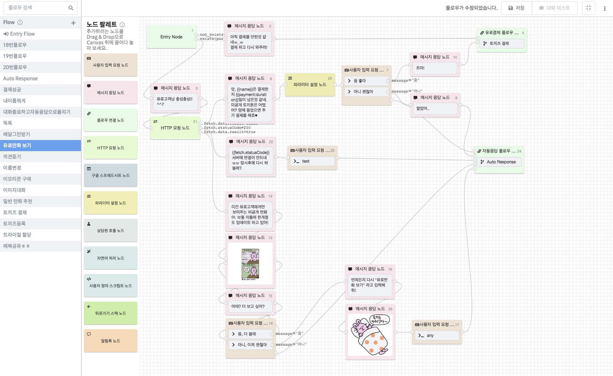

# CLOSER 사용 설명서

브랜드를 알리고, 구매전환률을 높이고, 고객 문의에 24시간 쉬지 않고 답변하는 챗봇을 코딩없이 만들어 보세요!

CLOSER는 플로우차트 그리듯 쉽고 빠르게 챗봇을 만들수 있는 [**CLOSER Bot Builder**](builder/about.md)와, 자동화된 대화에 상담원이 직접 참여해 고객 응대의 완성도를 높일 수 있는 실시간 채팅상담 솔루션 [**CLOSER Chat**](chat/about/)을 제공합니다. 





* CLOSER 사용자 가이드는 오픈소스로 공개되어 있습니다.  만약 특정 항목의 변경 전 히스토리가 필요하시다면 아래 주소를 방문해 보세요. [https://github.com/sini-company/closer.gitbook.io](https://github.com/sini-company/closer.gitbook.io) 
* 항목 중 👩🏻‍🔬 표시가 되어 있는 항목들은 **현재 실험 중인 기능 \(베타\)** 으로,  추후 기능이 크게 변경되거나 삭제될 가능성이 있습니다. 
* 부족한 내용이나 건의사항이 있으시다면 언제든 [support@closer.ai](mailto:support@closer.ai)로 메일 보내주세요.

