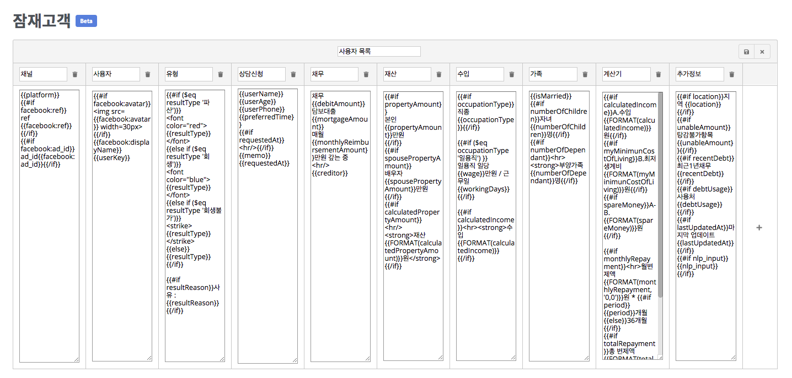
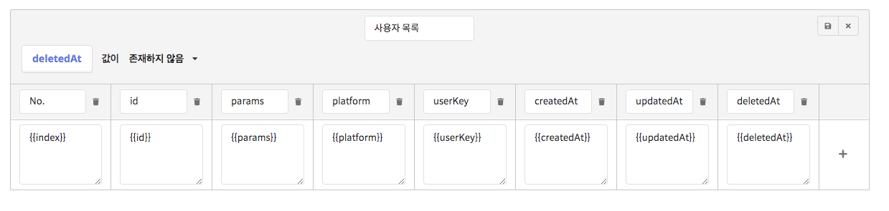

# 잠재고객 👩🏻‍🔬

잠재고객 페이지에서는 여러분의 챗봇을 이용한 사용자들을 분석하는 기능을 제공합니다.  
현재는 테이블 편집 기능을 제한적으로 제공하고 있지만, 추후 검색이나 필터링 등 더 많은 기능이 제공될 예정입니다. 

* **내려받기**: 현재 보이는 데이터를 csv 형식으로 다운로드합니다. \(전체 데이터는 제공되지 않습니다.\)
* **편집하기**: 테이블 레이아웃을 편집합니다.
* **공유하기**: CLOSER 외부에서 접근 가능한 공유 링크를 생성합니다. \(유료 기능\)

## 편집 모드

편집 모드에서는 현재 다음과 같은 기능이 제공됩니다. \(추후 더 많은 기능이 추가될 예정입니다.\) 

* 테이블 이름 변경
* 행 추가/제거 
* 행 위치 변경 \(머릿말의 빈 부분을 클릭하고 드래그&드롭\)
* [템플릿 문법](chatbot/advanced/template-syntax/) / HTML 태그를 이용한 스타일링
* [검색 조건 설정](audience.md#search)


위 예제는 **봇 생성 &gt; 잠재고객 확보** 챗봇 생성을 통해 확인하실 수 있습니다.


### 검색 조건 설정

잠재고객 테이블에서 표시되는 항목들이 너무 많은 경우, 조회할 항목들의 검색 조건을 설정할 수 있습니다.  
위 예시는 **대화를 종료하지 않은** **고객**\(`deletedAt`이 존재하지 않는 고객\)을 대상으로 조회 범위를 제한한 모습을 나타내며, 여기에는 기존 입력한 파라미터를 이용하실 수도 있습니다.

### 템플릿에 사용 가능한 값 \(field\)

<table>
  <thead>
    <tr>
      <th style="text-align:left">key</th>
      <th style="text-align:left">type</th>
      <th style="text-align:left">description</th>
    </tr>
  </thead>
  <tbody>
    <tr>
      <td style="text-align:left">id</td>
      <td style="text-align:left">string</td>
      <td style="text-align:left">
        
&#xACE0;&#xAC1D; ID

        
(e.g. <code>4d4a0dc8-8aaf-46cb-8ee9-ef2bc6de6c5b</code>)

      </td>
    </tr>
    <tr>
      <td style="text-align:left">botId</td>
      <td style="text-align:left">string</td>
      <td style="text-align:left">
        
&#xCC57;&#xBD07;&#xC758; ID

        
(e.g. <code>Bd80zx</code>)

      </td>
    </tr>
    <tr>
      <td style="text-align:left">platform</td>
      <td style="text-align:left">string</td>
      <td style="text-align:left">
        
&#xBA54;&#xC2DC;&#xC9D5; &#xCC44;&#xB110;

        
(e.g. <code>kakao</code>)

      </td>
    </tr>
    <tr>
      <td style="text-align:left">userKey</td>
      <td style="text-align:left">string</td>
      <td style="text-align:left">&#xBA54;&#xC2DC;&#xC9D5; &#xCC44;&#xB110;&#xC5D0;&#xC11C; &#xC81C;&#xACF5;&#xD558;&#xB294;
        &#xACE0;&#xAC1D; &#xC2DD;&#xBCC4;&#xC790;</td>
    </tr>
    <tr>
      <td style="text-align:left">params</td>
      <td style="text-align:left">object</td>
      <td style="text-align:left">&#xCC57;&#xBD07;&#xC5D0; &#xBCF4;&#xAD00;&#xB41C; &#xD30C;&#xB77C;&#xBBF8;&#xD130;</td>
    </tr>
    <tr>
      <td style="text-align:left">createdAt</td>
      <td style="text-align:left">date</td>
      <td style="text-align:left">&#xACE0;&#xAC1D; &#xC0DD;&#xC131; &#xC2DC;&#xAC04; (&#xCD5C;&#xCD08; &#xB300;&#xD654;
        &#xB0A0;&#xC9DC;)</td>
    </tr>
    <tr>
      <td style="text-align:left">updatedAt</td>
      <td style="text-align:left">date</td>
      <td style="text-align:left">&#xACE0;&#xAC1D; &#xC218;&#xC815; &#xC2DC;&#xAC04; (&#xB9C8;&#xC9C0;&#xB9C9;
        &#xB300;&#xD654; &#xB0A0;&#xC9DC;)</td>
    </tr>
    <tr>
      <td style="text-align:left">deletedAt</td>
      <td style="text-align:left">date</td>
      <td style="text-align:left">&#xACE0;&#xAC1D; &#xC0AD;&#xC81C; &#xC2DC;&#xAC04; (&#xCE5C;&#xAD6C; &#xC81C;&#xAC70;
        / &#xB300;&#xD654;&#xBC29; &#xB098;&#xAC10; &#xB0A0;&#xC9DC;)</td>
    </tr>
  </tbody>
</table>


`id`와 `userKey`는 모두 고객 식별자에 해당하지만, `id`는 CLOSER에서 관리하는 값이며 `userKey`는 메시징 채널\(`platform`\)에서 제공하는 값입니다.



연동한 메시징 채널이 여러개인 경우 서로 다른 `platform`에서 동일한 `userKey`가 존재할 수 있습니다.  
때문에 메시징 채널별로 고객을 식별할 경우 고유 식별자로 `id`를 사용하는 것을 권장합니다.


