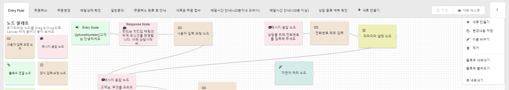

# 플로우\(Flow\)

노드와 엣지로 설계된 대화 구성 단위입니다.

각 대화 플로우를 기능단위로 잘 분리해 두면, 반복되는 작업들을 모듈화 하여 재사용성을 높이고 유지보수가 용이해 집니다.

즉, 반복되는 작업을 계속하지 않고 구조를 유지하는 장점을 가질 수 있습니다.

## 플로우 목록

캔버스 상단에 현재 편집중인 봇의 플로우 목록이 나타납니다. 클릭하면 해당 플로우를 수정할 수 있습니다.

* 우측 상단 저장 버튼을 누르면 수정한 플로우가 저장 됩니다. 
* 대화 테스트 버튼을 누르면 현재 설계한 봇을 바로 테스트해 볼 수 있습니다.
* 가장 우측의 드롭다운 메뉴\(\)에서는 플로우와 봇에 대한 여러 기능들을 제공합니다.

## 플로우 새로 만들기

상단의 새로만들기 버튼을 누르고 이름을 입력하면 새로운 플로우가 만들어 집니다.

플로우를 만들어 플로우 연결 노드를 이용하여 서로 연결해서 자연스러운 대화를 설계해 보세요.

## 플로우 삭제

제거 버튼을 누른 뒤, 안내에 따라 플로우 이름을 입력하면 삭제 됩니다.

## 플로우 이름 바꾸기

이름 바꾸기 버튼을 누르고 새로운 이름을 입력하면 이름이 변경됩니다.

## 플로우 내보내기 / 불러오기

플로우 내보내기 버튼을 누르면 해당 플로우가 json 파일로 다운로드 됩니다.

언제든 플로우 불러오기 버튼을 눌러 해당 파일을 선택하면 플로우가 추가 됩니다.

## 플로우 활용하기

플로우 연결 노드를 활용해 특정 플로우로 진입할 수 있고, CLOSER Chat에서는 상담원이 사용자를 특정 플로우로 이동시킬 수 있습니다.

플로우를 체계적으로 설계하면 목적에 맞는 플로우를 원활하게 사용할 수 있습니다.

