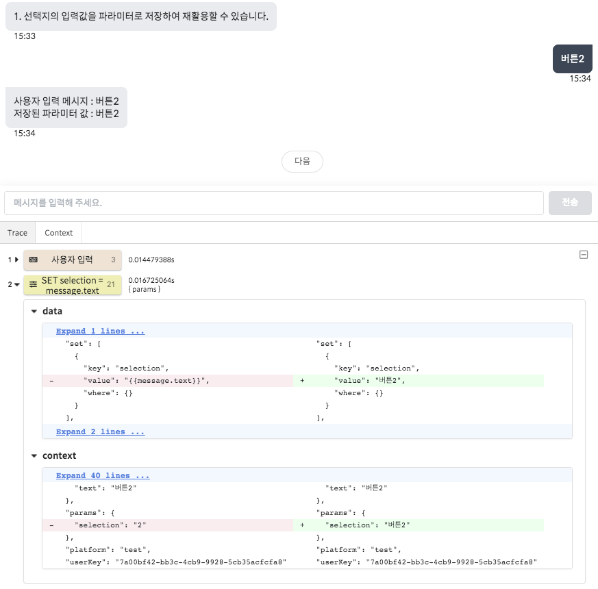

# 개발자 도구 \(Inspector\)

개발자 도구는 **대화 테스트 창 우측 상단**에 위치한 버튼\(\) 을 눌러 접근할 수 있으며, 노드의 실행 결과나 반환된 컨텍스트 등을 실시간으로 확인할 수 있는 등 챗봇 시나리오를 분석하는 데 유용한 도구 모음들을 제공합니다.

각 기능에 대해 자세한 설명은 아래 항목들을 참고해주세요.

## 기능 소개

### 노드 추적 도구 \(Trace\)

추적 도구에서는 답변 생성에 사용된 노드들을 확인할 수 있고, 각 노드의 [템플릿](template-syntax.md) 결과 혹은 [컨텍스트](context.md)의 변경도 함께 추적할 수 있습니다. \(위 예시는 파라미터 설정 노드의 템플릿 결과와 컨텍스트 변경사항을 보여줍니다.\)

노드 추적 도구에서 각 노드마다 표시되는 값들은 다음과 같습니다.

* 각 노드별 수행 시간 \(execution time\)
* 각 노드별 data 템플릿 적용 결과
* 각 노드별 context 변경점 \(변경된 값 텍스트로 표시\)
* 노드에서 반환한 메시지 \(존재 시 아이콘으로 표시\)

### 컨텍스트 분석 도구 \(Context\)

컨텍스트 분석 도구에서는 매 상호작용마다 반환되는 사용자의 컨텍스트 정보를 실시간으로 확인하고, 특정 반환값을 특정하여 조회할 수 있는 기능을 제공합니다. 주로 파라미터의 변화를 실시간으로 확인하거나, 다음 시나리오를 작성하기 전 이용할 값을 조회하고자 할 때 유용합니다.

컨텍스트 반환 값에 대해서는 다음 페이지를 참고해주세요.




컨텍스트 분석 도구에서는 **문서화되지 않은 값**들도 다수 존재합니다.  
이는 주로 시스템에서 사용되는 값으로, 별도로 안내되어 있지 않는 이상 해당 값을 이용하는 것은 권장하지 않습니다. \(추후 변경될 소지가 있음\)

만일 문서화되지 않은 값들이 프로덕션에서 필요한 경우, 사용하기 전에 먼저 support@closer.ai 로 문의해주세요.


