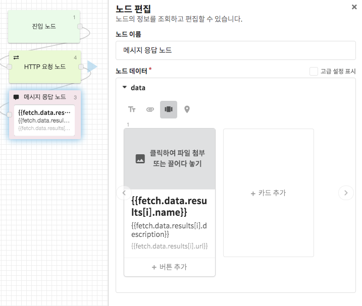

# 템플릿 문법 \(Template Syntax\)

## 템플릿이란?

템플릿\(Template\)이란 형판\(形板\)을 의미합니다.  
CLOSER에서 템플릿이란 미리 데이터가 들어갈 형판을 만들어 둔 뒤 챗봇 시나리오에서 생성된 데이터를 답변 생성 시점에 주입하는 기능을 의미합니다.

간단한 인삿말을 예로 들어 보겠습니다. 

1. `안녕하세요 고객님? 좋은 하루 되세요.`
2. `안녕하세요 {{name}}님? 좋은 하루 되세요.`

1은 정적인 텍스트로만 답변을 작성한 예시이며, 2는 템플릿 기능을 이용해 답변을 작성한 예시입니다.  
위 예시와 같이, 템플릿과 파라미터를 적절히 이용하면 고객 개개인에 따라 맞춤형 답변을 작성하는 것이 가능해집니다.

* 템플릿에 사용되는 데이터들은 챗봇이 시나리오를 진행하면서 생성되며, 이 값은 [컨텍스트 \(Context\)](./#context) 라고 부릅니다.
* 템플릿에 사용할 수 있는 표현식들은 [경로 접근식](./#path-expression), [조건부 표현식](./#conditional-expression), [반복자 표현식](./#array-to-cards) 등이 있습니다. 

템플릿 기능에 대한 자세한 사용 방법은 아래에서 더 자세히 알아보세요.


CLOSER에서는 [템플릿 엔진](https://en.wikipedia.org/wiki/Template_processor)으로 Handlebars \(v4.0.12\) 를 이용하고 있습니다.   
동작 원리를 더 자세히 알고 싶으시다면 Handlebars documentation을 참고해 주세요.

\(영문\) [https://handlebarsjs.com/](https://handlebarsjs.com/)



Handlebars 템플릿 문법을 즉석에서 테스트 해 보세요!  
\(영문\) [http://tryhandlebarsjs.com/](http://tryhandlebarsjs.com/)


## 템플릿 사용 방법 <a id="basic"></a>

기본적인 템플릿 문법은 중괄호 2개\(`{{ }}`\)로 감싸진 구문으로 작성됩니다.   
템플릿 문법에서 사용되는 데이터는 컨텍스트\(Context\)에 담겨서 제공됩니다. 자세한 내용은 아래를 참고해 주세요.

### 컨텍스트 \(Context\)

CLOSER에서는 사용자의 입력이나 다른 노드의 반환값들이 담겨있는 컨텍스트\(Context\)라는 객체를 제공합니다.  
이에 대해서는 이전 페이지를 참고해주세요.



템플릿 문법에서는 컨텍스트에 담겨있는 값들이 이용됩니다. 예를 들어 카카오톡에서 유입된 사용자에게 `{{platform}}에서 오셨군요`라는 값을 이용하면 `kakao에서 오셨군요` 라는 결과가 나타납니다.

파라미터의 경우는 조금 더 편리한 방법을 지원합니다.  `name` 이라는 파라미터를 사용하려는 경우 원래대로라면`{{params.name}}` 라는 식을 통해 접근해야 하지만, 사용자의 편의를 위해 `{{name}}` 이라고 작성하셔도 동일한 효과를 획득할 수 있습니다.


컨텍스트에 이미 존재하는 예약어와 파라미터의 키 값이 겹치는 경우에는 컨텍스트의 값이 먼저 이용됩니다. 따라서`platform`이라는 파라미터를 따로 생성하신 경우엔 `{{params.platform}}`접근식을 통해 이용해 주세요.  



### 경로 접근식 \(Path Expression\) <a id="path-expression"></a>

이용하고자 하는 값이 객체나 배열 안에 있는 값일 경우에 JavaScript의 [속성 접근자\(Property Accessor\)](https://developer.mozilla.org/ko/docs/Web/JavaScript/Reference/Operators/Property_Accessors) 문법을 이용할 수 있습니다.

* **템플릿**

  ```text
  {{poets[0]}}과 {{poets[1]}}과 {{novel.author}}
  ```

* **컨텍스트**

  ```javascript
  {
    params: {
      poets: ['김소월', '유치환', '김수영'],
      novel: {
        author: '김동인',
        title: '감자'
      }
    }
  }
  ```

* **결과**

  ```text
  김소월과 유치환과 김동인
  ```


배열의 경우 Javascript의 속성 접근자 외에도 Handlebars의 속성 접근자를 사용할 수도 있습니다.

* Javascript 방식: `path.to.array[i]`
* Handlebars 방식: `path.to.array.[i]`



### 조건부 표현식 \(Conditional Expression\)

템플릿에 사용하는 데이터가 존재하지 않는 경우 템플릿 반환값에는 실제 값 대신 공백이 주입됩니다. 이 때 조건부 표현식을 이용하면 값이 존재할 때와 존재하지 않을 때를 구분하여 표시하는 것이 가능해 집니다.

컨텍스트 값이 다음과 같은 상황을 가정해 봅시다.

```text
{
  params: { 
    phoneNumber: '010-1234-5678',
    seats: 5
  }
}
```

조건부 표현식을 사용하지 않은 경우 다음과 같은 결과를 반환합니다.

* 템플릿

  ```text
  인원수 {{seats}}, 요청사항 {{memo}}, 전화번호 {{phoneNumber}}
  입력하신 정보가 맞으신가요?
  ```

* 결과

  ```text
  인원수 5명, 요청사항 , 전화번호 010-1234-5678
  입력하신 정보가 맞으신가요?
  ```

조건부 표현식을 사용하면 요청사항이 없는 경우를 다음과 같이 처리할 수 있습니다.

* 템플릿

  ```text
  인원수 {{seats}}, {{#if memo}}요청사항 {{memo}}, {{/if}}전화번호 {{phoneNumber}}
  ```

* 결과

  ```text
  인원수 5명, 전화번호 010-1234-5678
  입력하신 정보가 맞으신가요?
  ```


조건부 표현식은 Handlebars의 `if`, `with`, `unless` block helper 기능을 통해 제공됩니다.   
더 자세한 사항은 Handlebars의 Builtin Helpers 도움말을 참고해 주세요. 

\(영문\) [https://handlebarsjs.com/guide/](https://handlebarsjs.com/guide/)


#### 논리 연산자

CLOSER에서는 조건부 표현식에서 더 자세한 조건을 지정할 수 있도록 다음과 같은 논리 연산자 표현식을 지원합니다. 자세한 내용은 다음 표를 참고하세요.

| 논리 연산 | 템플릿 표현식 \(Handlbars Expression\) |  실제 동작 \(Javascript 기준\) |
| :--- | :--- | :--- |
| `$eq` | `{{ #if ($eq a b) }}` | if \(a === b\) |
| `$ne` | `{{ #if ($ne a b) }}` | if \(a !== b\) |
| `$lt` | `{{ #if ($lt a b) }}` | if \(a &lt; b\) |
| `$lte` | `{{ #if ($lte a b) }}` | if \(a &lt;= b\) |
| `$gt` | `{{ #if ($gt a b) }}` | if \(a &gt; b\) |
| `$gte` | `{{ #if ($gte a b) }}` | if \(a &gt;= b\) |
| `$and` | `{{ #if ($and a b [...args]) }}` | if \(a && b \[ && ...args \]\)  |
| `$or` | `{{ #if ($or a b [...args]) }}` | if \(a \|\| b \[ \|\| ...args \]\) |


### 반복자 표현식 \(Iterator Expression\) <a id="iterator-expression"></a>

#### 배열 접근 반복자 표현식 <a id="iterator-expression-array-access"></a>

객체\(Object\)나 배열\(Array\)안에 있는 값들을 차례차례 이용하고자 할 때 반복자 표현식을 이용할 수 있습니다.  
다음 예시를 참고해주세요.

* **컨텍스**

  ```javascript
  {
    carts: [
      { name: '사과', quantity: 1 },
      { name: '포도',  quantity: 2 },
      { name: '복숭아', quantity: 4 },
      { name: '망고', quantity: 4 }
    ]
  }
  ```

* **템플릿**

  ```text
  장바구니 목록입니다.

  {{#each carts}}
    {{name}} {{quantity}} 개
  {{/each}}

  결제를 진행하시겠습니까?
  ```

* **결과**

  ```text
  장바구니 목록입니다.

  사과 1개
  포도 2개
  복숭아 4개
  망고 4

  결제를 진행하시겠습니까?
  ```


반복자 표현식은 Handlebars의 `each` block helper 기능을 통해 제공됩니다.  
더 자세한 사항은 Handlebars의 Builtin Helpers 도움말을 참고해 주세요.

\(영문\)[ https://handlebarsjs.com/guide/ ](https://handlebarsjs.com/guide/)[  ](https://handlebarsjs.com/guide/)


#### 배열 확장 반복자 표현식 \(CLOSER 한정\) <a id="iterator-expression-array-expansion"></a>

만일 컨텍스트\(Context\)에서 사용하고자 하는 값\(Target value\)이 배열\(Array\)형태이고, CLOSER 봇 빌더에서 입력하려는 데이터 또한 배열 형태\(위 예시에서 cards는 하나 이상의 값을 입력할 수 있습니다.\) 일 때, 해당 값에 해당하는 숫자만큼 카드를 생성하기 위해서는 어떻게 해야 할까요?

이러한 상황을 쉽게 해결하기 위하여 **배열 확장 반복자 표현식**을 사용합니다. 아래 예시를 참고해주세요.

* **컨텍스트**

  ```javascript
  {
    carts: [
      { name: '사과', quantity: 1 },
      { name: '포도',  quantity: 2 },
      { name: '복숭아', quantity: 4 },
      { name: '망고', quantity: 4 }
    ]
  }
  ```

* **템플릿**

  ```javascript
  {
    message: {
      type: 'cards',
      cards: [
        {
          title: '{{carts[i].name}}',
          description: '{{carts[i].description}} 개'
        }
      ]
    }
  }
  ```

* **결과**

  ```javascript
  {
    message: {
      type: 'cards',
      cards: [
        {
          title: '사과'',
          description: '1 '
        },
        {
          title: '포도',
          description: '2 개'
        },
        {
          title: '복숭'
          description: '4 '
        },
        {
          title: '망고',
          description: '4 개'
        }
      ]
    }
  }
  ```

배열 확장 반복자 표현식은 범위 지정 방식과 범위 미지정 방식 두 가지가 있습니다. 

* **범위 미지정 방식: `{{target_array[i].property}}`**
  * target\_array의 길이\(length\)에 맞게 부모 배열에서 자신의 값을 복제합니다.
  * 이 때 복제되는 항목들의 최대 갯수는 10개로 제한됩니다. 10개 이상의 값을 확장하려면 범위 지정 방식을 이용해주세요.
* **범위 지정 방식: `{{target_array[0..5].property}}`**
  * target\_array의 0번째 항목부터 5번째 항목까지의 값에 대해서만 자신의 값을 복제합니다.
  * 만일 target\_array의 값이 지정한 범위보다 적을 경우에는 초과하는 항목은 무시됩니다.


이 방식은 handlebars에서 제공하는 표현식이 아닌 CLOSER에서 자체적으로 제공하는 표현식으로, Handlebar playground 등에서는 동작하지 않습니다.


배열 확장 반복자 표현식의 실제 예제를 알아보시려면 아래의 [스타워즈 우주선 목록 예제](https://guide.closer.ai/builder/chatbot/advanced/template-syntax#example-1)를 참고해주세요.


### 도우미 함수 \(Helper Functions\)

CLOSER 템플릿 엔진에서는 Handlebars에서 제공하는 문법 외에도 CLOSER가 제공하는 함수들을 이용할 수 있습니다.  
자세한 사항은 도우미 함수 문서를 참고해주세요. 




## 템플릿 오류 <a id="syntax-error"></a>

템플릿 문법에 오류가 발생한 경우 노드의 기능이 제대로 동작하지 않을 수 있습니다. 때문에 템플릿 사용시에는 각별한 주의가 필요합니다. 

* **템플릿**

  ```text
  {{#if}}if를 닫지 않음
  ```

* **결과** 

  ```text
  Parse error on line 1:
  {{#if}}if를 닫지 않음
  ----------------^
  Expecting 'OPEN_INVERSE_CHAIN', 'INVERSE', 'OPEN_ENDBLOCK', got 'EOF'
  ```


템플릿에 오류가 발생한 경우에는 봇에서 설정한 **시스템 오류 메시지 응답**이 반환됩니다.


### 자주 실수하는 표현

1. 여는 괄호 / 닫는 괄호 쌍이 일치하지 않음
   * `{{ ... }}`: ✅
   * `{{ ... }}}`, `{{{ ... }}`, `{{ ... }`: ❌
2. 경로 접근식에 콤마를 사용함
   * `{{path.to.property}}`: ✅ 
   * `{{path,to,property}}`: ❌
3. 조건부 표현식 \(Handlebar Block Expression\) 사용 시 여는 표현과 닫는 표현 쌍이 존재하지 않음
   * `{{#if}}...{{/if}}`: ✅ 
   * `{{if}}...{{/if}}`: ❌
   * `{{#if}}...{{if}}`: ❌
4. JSON Body에 템플릿 문법을 사용할 때 닫는 괄호와 템플릿 문법이 겹치는 경우  \(HTTP 요청 노드 등의 body 작성시 자주 발생합니다.\)
   * `{ "string": "{{params.string}}", "number": {{params.number}} }` : ✅ 
   * `{ "string": "{{params.string}}", "number": {{params.number}}}` : ❌

## 실제 사용 예제

### 스타워즈 우주선 목록  <a id="example-1"></a>

[SWAPI](https://swapi.dev/)를 통해 스타워즈 우주선 목록 배열을 가져온 이후 우주선 갯수만큼 확장되는 카드 메시지를 생성해 보겠습니다.



1. HTTP 요청 노드를 통해 [https://swapi.dev/api/starships](https://swapi.dev/api/starships) 에 GET 요청을 보냅니다.  이 때 요청 결과는 `fetch` 컨텍스트에 담겨서 반환됩니다. \(`{{fetch.data.results}}` 값을 통해 배열 형태의 우주선 목록을 획득할 수 있습니다.\) 
2. 메시지 응답 노드에서 카드를 하나 만든 이후 제목에 `{{fetch.data.results[i].name}}`, 설명에 `{{fetch.data.results[i].description}}` 를 작성해 주세요.  추후 `fetch.data.results` 의 크기만큼 카드가 동적으로 생성됩니다.  \(이 기능은는 [반복자 표현식 &gt; 배열 확장 반복자 표현식](./#iterator-expression-array-expansion)을 참고하세요.\)

* **실행 컨텍스트**

  ```javascript
  // GET https://swapi.dev/api/starships
  {
    fetch: {
      data: {
        count: 37,
        next: 'https://swapi.dev/api/starships/?page=2',
        previous: null,
          results: [
            {
              name: 'Executor',
              model: 'Executor-class star dreadnought',
              manufacturer: 'Kuat Drive Yards, Fondor Shipyards',
              url: 'https://swapi.dev/api/starships/15/',
              // ...
            },
            {
              name: 'Sentinel-class landing craft',   
              // ...
            },
            // ...
          ]
        }
      }
    }
  ```

* **메시지 응답 결과**


### Handlebars 템플릿 예제 <a id="example-2"></a>

#### if-else, unless 구문

* **템플릿**

  ```text
  {{#if monkey}}원숭이 엉덩이는 빨개{{/if}}
  {{#if red}}빨간 건 사과{{/if}}
  {{#if apple}}
    {{apple}}는 맛있어
  {{else}}
    맛있으면 {{banana}}
  {{/if}}
  {{banana}}는 길어
  ```

  **입력받은 파라미터**

  ```javascript
  { monkey: '원숭이', apple: '사과', banana: '바나나' }
  ```

* **결과**

  ```javascript
  원숭이 엉덩이는 빨개

  사과는 맛있어
  바나나는 길어
  ```

#### each, with 구문

* **템플릿**

  ```text
  {{#with novel}}
    {{author}}은 <{{title}}>를 썼다.
  {{/with}}
  ```

* **입력받은 파라미터**

  ```text
  {
    poets: ['김소월', '유치환', '김수영'],
    novel: {
      title: '감자',
      author: '김동인'
    }
  }
  ```

* **결과**

  ```text
  김동인은 <감자>를 썼다.
  ```


