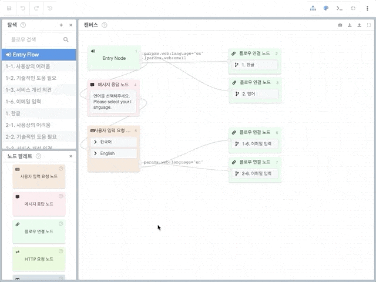
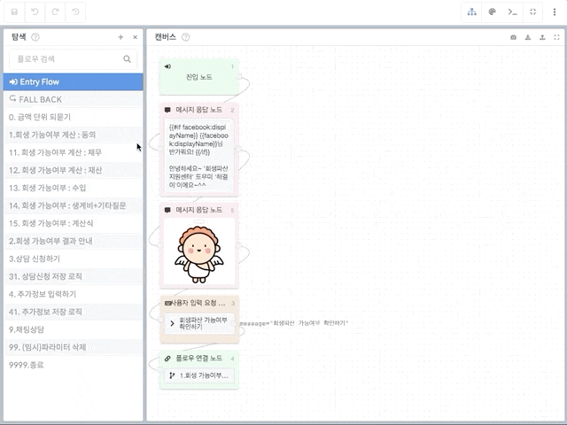
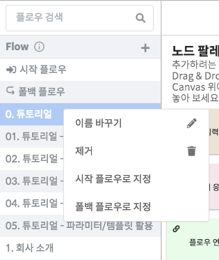
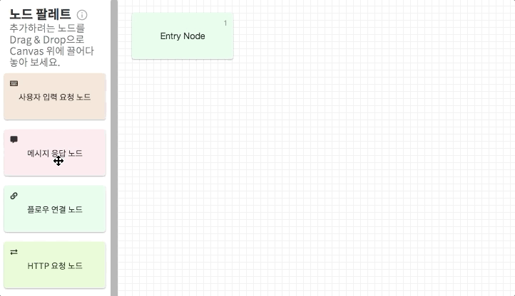
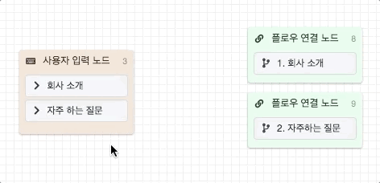
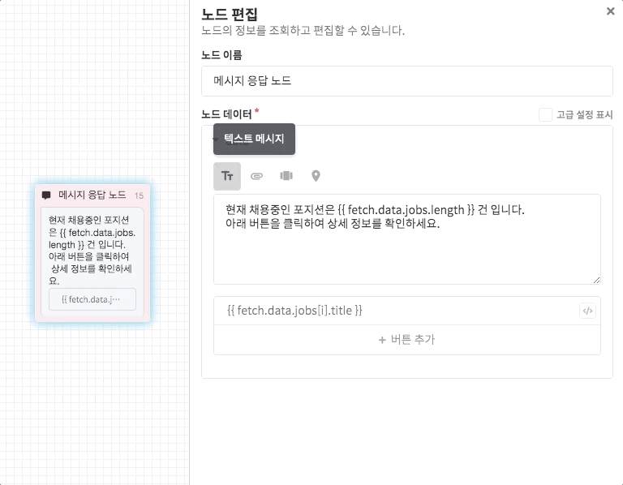
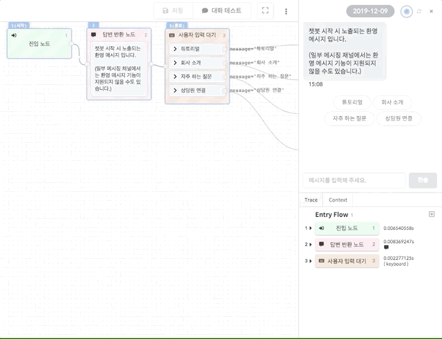

# 시나리오 편집도구 \(Editor\)

앞으로 CLOSER에서 가장 많이 접하게 될 챗봇 시나리오 편집도구는 위와 같은 화면으로 구성됩니다.

각각의 창들은 상단 제목 바를 드래그하여 원하는 위치로 설정 가능하며, 패널의 크기 또한 자유롭게 설정 가능합니다.   
이제 편집기가 어떤 요소들로 구성되어있는지 알아봅시다.

## 편집도구 살펴보기

### ① 플로우 탐색기 

* 챗봇 플로우들의 목록을 확인하고, 편집할 플로우를 선택하거나 제거할 수 있습니다.
* 상단 툴바의 + 버튼을 통해 새로운 플로우를 추가할 수 있습니다.
* 플로우는 이름순으로 오름차순 정렬됩니다.
* 특정 플로우 위에서 **마우스 오른쪽 버튼**을 클릭하면 컨텍스트 메뉴를 확인할 수 있습니다.  컨텍스트 메뉴에서는 플로우 이름 변경이나 제거, 진입 플로우나 폴백 플로우 설정 등을 수행할 수 있습니다. 
* 플로우 목록 상단의 검색 도구에서는 전체 시나리오 데이터에서 원하는 노드를 찾을 수 있습니다.

### **②** 노드 팔레트 

* 플로우를 작성할 때 이용할 수 있는 노드들이 표시되는 공간입니다.
* 추가하려는 노드를 캔버스 위에 끌어다가 놓으면 \(Drag & Drop\) 캔버스 위에 새로운 노드가 생성됩니다. 
* 각 노드의 기능에 대한 설명은 [노드\(Node\) &gt; 노드별 기능 안내 ](../node/#types) 항목을 참고해주세요.

### ③ 캔버스 

* 플로우를 시각적으로 확인하고 관리할 수 있는 공간입니다.
* 대화 미리보기가 활성화된 경우 현재 미리보기 맥락에서 답변 생성에 사용된 노드들이 표시됩니다. 
* 더 자세한 캔버스 사용법에 대해서는 [노드](../node/) 항목을 참고해주세요.



* 캔버스 창의 제목 표시줄에는 편집 시에 유용하게 사용 가능한 도구 모음이 제공됩니다. \(   \)
  * 캡쳐 도구: 현재 표시되는 캔버스 상태를 캡쳐하여 png 형식의 이미지 파일로 내보냅니다.
  * 내보내기: 현재 표시되는 플로우를 json 파일로 내보냅니다.
  * 불러오기: json파일을 불러옵니다. \(새로운 플로우로 추가하거나, 현재 플로우로 덮어쓸 수 있습니다.\)
  * 창 넓히기: 캔버스 창을 넓게 펼칩니다. \(캔버스 창의 비율을 70% 비율로 확대합니다\)


현재 캡쳐 도구는 외부 호스팅 이미지가 사용된 경우 불러들이지 못하는 현상이 존재합니다.  
\(CLOSER를 통해 업로드하지 않은 이미지\)


### ④ 노드 편집 

* 캔버스에서 선택한 노드의 데이터를 수정할 수 있는 공간입니다.
* 각 노드의 데이터에 대한 설명은 [노드\(Node\) &gt; 노드별 기능 안내 ](../node/#types) 항목을 참고해주세요.

### ⑤ 대화 미리보기  

* 작성한 시나리오가 제대로 진행되는지 즉석에서 확인해볼 수 있는 공간입니다.
* 대화 미리보기가 활성화 되어있는 동안에는 **답변 생성에 사용된 노드들이 캔버스 위에 표시**됩니다.
* 시나리오의 문제점이나 개선점을 쉽게 파악할 수 있도록 다양한 기능을 갖춘 [개발자 도구](../advanced/inspector.md)를 제공합니다.
* 더 자세한 내용은 대화 미리보기 항목을 참고해주세요.



### ⑥ 편집 도구모음 

* 편집중인 수정사항과 관련된 도구모음을 제공합니다.
* 현재 저장, 실행 취소, 다시 실행, 그리고 변경사항 초기화 기능이 제공됩니다.

### ⑦ 레이아웃 도구모음 

* 편집기 레이아웃과 관련된 도구모음을 제공합니다.
* 각각의 버튼은 탐색기, 팔레트, 미리보기 창을 키거나 끄는 데 사용되며, 전체화면 버튼을 누르면 편집기를 제외한 모든  레이아웃 요소를 숨깁니다. 

### ⑧ 기타 

* 우측의 드롭다운 메뉴\(\)에서는 현재 수정중인 봇에 대한 여러 기능들을 제공합니다.
* 현재 플로우 내보내기 및 불러오기, 변경사항 초기화, 봇 내보내기 기능이 제공됩니다.

