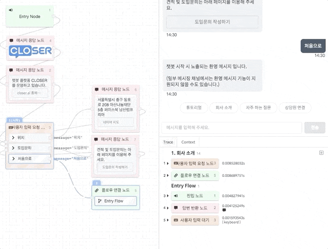
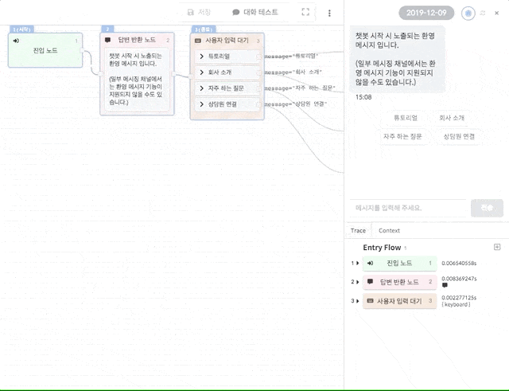

# 대화 미리보기 \(Preview\)

대화 미리보기 공간은 작성하신 시나리오가 의도한대로 동작하는지 확인해볼 수 있는 공간입니다.   
여기서는 대화 미리보기 시 사용할 수 있는 기능에 대해 알아봅니다.  

### 이전 위치로 돌아가기

* 봇 메시지 위에 마우스 커서를 올려놓으면 돌아가기\(\) 버튼이 나타나며,  해당 버튼을 누르면 해당 메시지가 반환되는 위치에서부터 시나리오를 다시 테스트하실 수 있습니다.

### 개발자 도구 \(분석 도구\)

개발자 도구는 미리보기중인 대화의 맥락을 분석하는 데 유용한 기능들을 제공합니다. 이에 대해서는 고급 사용자용 &gt; 개발자 도구 항목을 참고해주세요.



