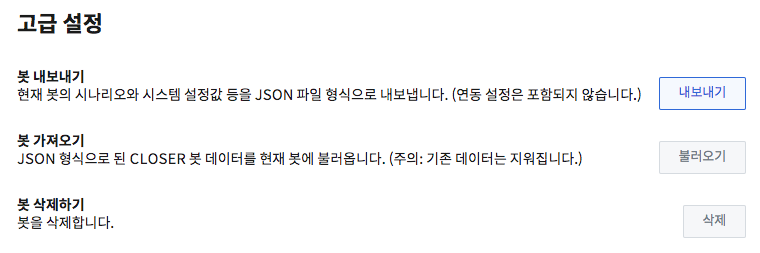

# 봇 정보 설정

## 기본 정보 설정 

기본 설정에서는 봇 이름과 봇에 대한 설명을 작성할 수 있습니다.

봇 이름과 설명은 메인 화면에서 챗봇을 구분하기 위한 용도로 사용되며, [웹사이트 채팅 연동](../messenger-integrations/web.md) 시 제목과 설명의 기본값으로도 사용됩니다. 

## 챗봇 동작 설정

챗봇 동작 설정에서는 **대화 시작 시점**에 대한 두 가지 설정을 제공합니다.

* **대화방 열렸을 때 환영 메세지 전송**
  * 지원되는 메시징 채널에서 환영 메세지 이용 여부를 선택합니다.

    * 카카오톡: 최초 1회
    * 카카오톡 상담톡: 상담 세션 시작 시   
    * 라인: 친구 추가 시
    * 네이버 톡톡: 대화방 진입 시 
*  **대화 기록이 없는 고객의 메시지 수신 시 환영 메시지 전송**

  * 환영 메시지를 사용하지 않기로 설정한 경우에 한하여, 고객이 보낸 첫 번째 메시지에 대한 응답으로 환영 메시지를 보낼 것인지, 가장 첫번째 사용자 입력 요청 노드에서 답변을 시작할 것인지를 결정합니다.

## 시스템 응답 설정 

시스템 응답은 작성하신 시나리오에서 **실제 챗봇 수행 결과에 필요한 데이터가 부족할 경우** 사용하게 되는 응답입니다.

* **오류 메시지**
  * 노드 실행 오류 혹은 시나리오 상에서의 오류가 발생할 경우 사용됩니다. 
  * 주로 템플릿 문법 적용 결과 오류 혹은 플로우 설계 오류등의 상황에서 발생합니다.
* **빈 메시지**
  * 챗봇 시나리오 수행 결과에서 답변을 생성하지 못한 경우 사용됩니다.
* **추가 선택지**
  * 메시징 채널별 제약사항으로 인해 모든 버튼을 표시하지 못한 경우, 새로운 말풍선으로 추가 선택지를 표시할 때 사용되는 텍스트입니다. 
  * 카카오톡 상담톡에서만 사용됩니다.
* **지원하지 않는 미디어**
  * 메시징 채널별 제약사항으로 인해 특정 미디어를 표시하지 못한 경우 사용됩니다.
  * 카카오톡 상담톡에서만 사용됩니다.

## 고급 설정

고급 설정 항목에서는 작성한 챗봇을 json파일로 내보내거나, 내보낸 봇을 다시 불러들이는 기능을 제공합니다.

