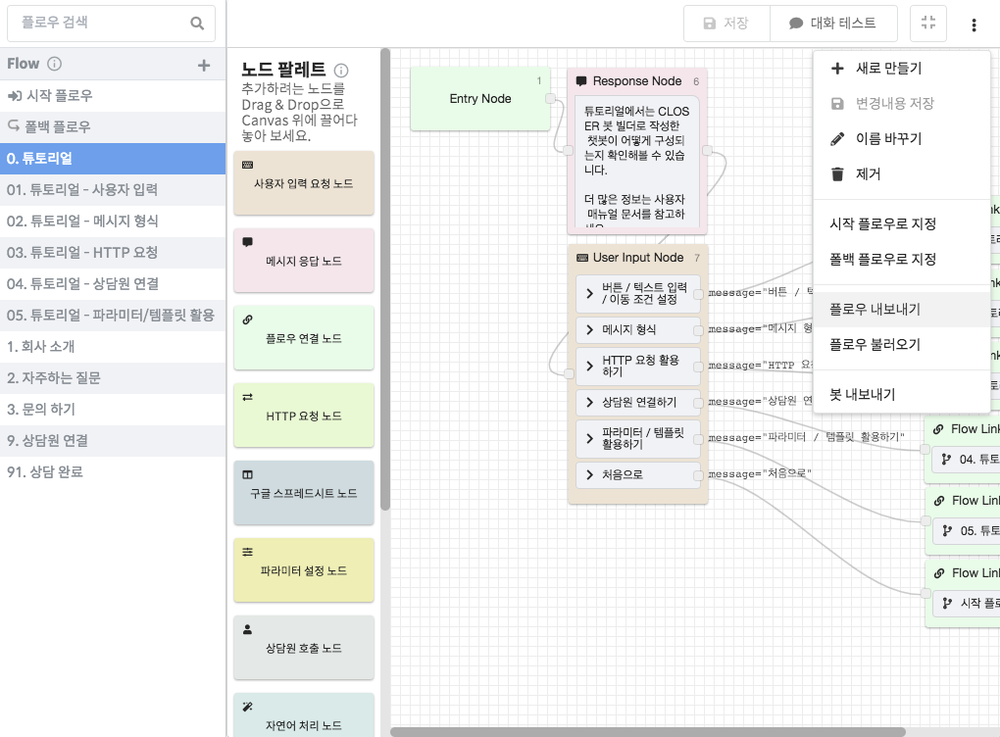
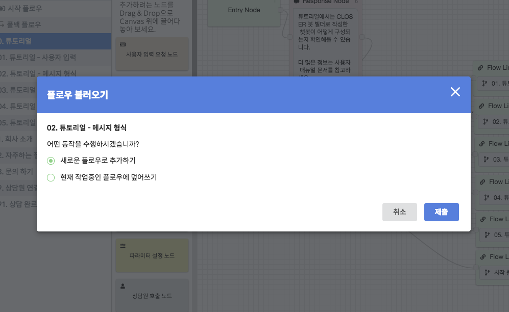

# 플로우 \(Flow\)

CLOSER 챗봇에서 플로우는 **시나리오 구성 단위**를 의미합니다.

다양한 기능을 하나의 플로우에 담을 수도 있지만, 기능이나 시나리오 단위로 분리하여 작성하는 방법도 있습니다.  
기능 단위로 분리된 플로우는 다른 플로우에서 재활용할 수도 있고, 잘 정돈된 플로우는 추후 챗봇 유지보수에도 도움이 됩니다.

## 시스템 플로우 

시스템 플로우는 플로우 진입 시점을 사용자가 선택하는 것이 아닌 시스템에 의해 선택되는 플로우를 말합니다.  
CLOSER 챗봇은 두 가지 시스템 플로우를 갖습니다.

### **시작 플로우**  **** 

* 챗봇의 시나리오가 시작되는 플로우입니다.
* 시작 플로우에 작성된 첫 번째 메시지는 고객이 처음 방문했을 때 환영 메시지로서 동작합니다. 

### **폴백 플로우**  **** 

* 챗봇이 올바른 시나리오\(노드\)를 찾지 못하였을 때 빠지게 되는\(Fallback\) 플로우입니다.
* 고객이 선택지 외의 입력을 하였을 때 혹은 특정 노드에서 진행할 다음 노드가 존재하지 않을 때 이용됩니다.
* 폴백 플로우가 등록되어 있지 않다면 시작 플로우로 이동하게 됩니다.

시스템 플로우의 수정/관리는 플로우 목록의 컨텍스트 메뉴 \(마우스 오른쪽 버튼을 클릭할 때 나오는 메뉴\)를 통해 수행할 수 있습니다.

## 플로우 내보내기 / 가져오기 

작성한 플로우를 백업하거나 복제하고자 할 때 플로우 내보내기/가져오기 기능을 이용할 수 있습니다.  
플로우 내보내기/가져오기 기능은 봇 편집기 도구모음의 오른쪽 더보기 메뉴\(\)를 통해 확인하실 수 있습니다.

내보내기 한 플로우의 파일을를 불러올때는 현재 플로우에 덮어씌울지, 새로운 플로우로 생성할 지 사용자에게 물어보는 대화창이 나타납니다. 여기서 어떠한 방식으로 불러들일 지 결정할 수 있습니다. 


만약 플로우를 불러오는데 실패하신다면 해당 파일이 올바른 CLOSER 플로우 파일인지 확인해주시고, 문제가 지속될 경우 support@closer.ai 로 해당 파일을 보내주시면 문제 해결에 도움드리도록 하겠습니다.


