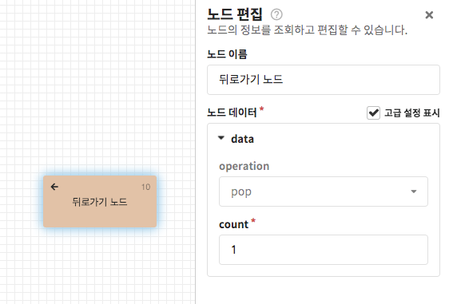
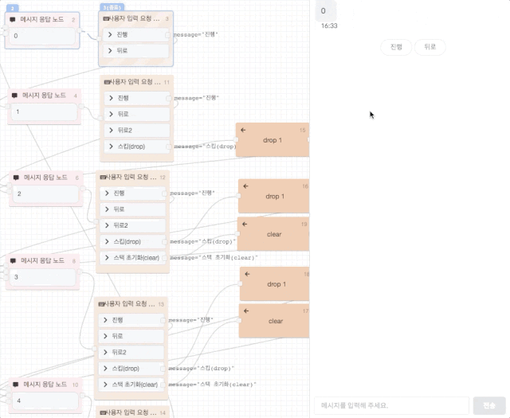

# 뒤로가기 노드

뒤로가기 노드는 **가장 마지막 선택지가 나타나는 자동응답이 시작된 위치로 돌아가는 기능**을 제공합니다. 원하지 않는 지점을 건너뛰거나, 특정 플로우에서는 더 이상 뒤로가기를 할 수 없도록 고급 설정을 통해 뒤로가기 지점을 초기화할 수도 있습니다.

* `operation`: 동작 설정 \(고급 설정, 기본값: `pop`\)
  * `pop`: 저장된 뒤로가기 위치 중 `count` 번째 지점으로 이동
  * `drop`: 저장된 뒤로가기 위치를 `count`만큼 제거하고 다음 노드로 이동
  * `clear`: 저장된 뒤로가기 위치를 초기화하고 다음 노드로 이동
* `count`: 동작 횟수 설정 \(기본값: `1`\)


보관된 갯수를 넘어 뒤로가기\(`pop`\)를 수행하는 경우 **진입 플로우로 이동**합니다.



기존 제공되던 [뒤로가기 스택 노드\(deprecated\)](backstack.md)에서는 스택을 직접 관리해야 하였지만, 뒤로가기 노드에서는 **뒤로가기 스택이 기본적으로 쌓이도록** 변경되었습니다.

단, **뒤로가기를 허용하지 않을 시나리오는 drop이나 clear 등으로 직접 관리해주셔야 합니다**.

스택에 대한 설명은 아래 블로그를 참고해 주세요.

* \(국문\) [https://rimi-rimi.tistory.com/1](https://rimi-rimi.tistory.com/1) - 자료구조 STACK\(스택\) 쉽게 이해하기


## **동작 예시**

위 예시는 뒤로가기 노드가 어떻게 동작하는지를 보여줍니다. 이를 하나하나 풀어보면 다음과 같습니다.

1. 처음 `"진행"`입력 시 다음에 연결된 메시지 응답 노드\(`"1"`\) 위치가 스택에 보관됨
2. 두 번째 `"진행"`입력 시 다음에 연결된 메시지 응답 노드\(`"2"`\) 위치가 스택에 보관됨
3. 세 번째 `"진행"`입력 시 다음에 연결된 메시지 응답 노드\(`"3"`\) 위치가 스택에 보관됨
4. `"뒤로"` 입력 시 `pop 1` 이 수행되며, `"3"`이 표시되기 전인 `"2"`위치로 돌아감 \(뒤로가기 노드는 [폴백 플로우](../flow.md#fallback-flow)에 작성되어 있습니다.\)
5. `"뒤로"` 입력 시 `pop 1` 이 수행되며, `"2"`이 표시되기 전인 `"1"`위치로 돌아감
6. `"스킵(drop)"`입력 시 `drop 1`이 수행되며, 다음에 연결된 메시지 응답 노드\(`"2"`\) 위치는 스택에 보관되지 않음.
7. 이후 `"뒤로"` 입력 시 `pop 1` 이 수행되며, `"1"`위치로 돌아감

위 예시에 사용된 챗봇 시나리오가 담겨있는 JSON파일을 첨부하였습니다.  
봇 설정 &gt; 봇 불러오기 기능을 통해 뒤로가기 노드를 직접 테스트해보며 사용법을 익혀보세요.



