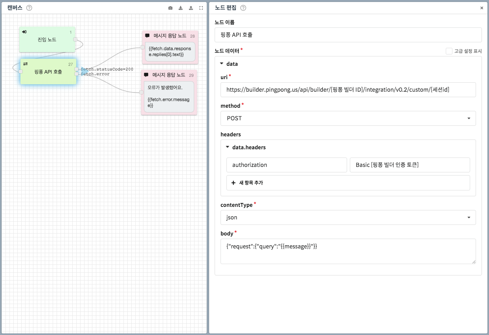

# 일상대화 노드 👩🏻‍🔬

일상대화 노드는 사용자의 발화에 대해 인공지능으로부터 자동 생성된 일상 회화를 반환하는 노드입니다.


현재 일상대화 노드는 핑퐁\(PINGPONG\) 서비스를 통해 제공됩니다.  
[https://pingpong.us/](https://pingpong.us/)


### 일상대화 커스텀하기 

현재 일상대화 노드는 핑퐁 서비스를 통해 제공됩니다.  
아직 CLOSER가 제공하는 기본 일상대화를 편집하는 기능은 제공되지 않습니다. 대신, 핑퐁 서비스에 가입하신 후 다음과 같이 HTTP 요청 노드를 통해 답변을 이용해 보세요.  



