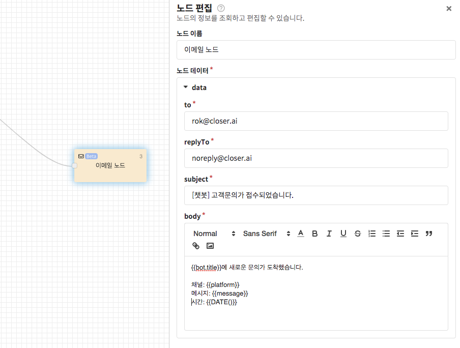

# 이메일 전송 노드 👩🏻‍🔬

이메일 전송 노드는 고객으로부터 받은 요청을 특정 사서함으로 전송할 때 사용할 수 있습니다.

* `to`: 받는 사람 메일 주소
* `replyTo`: 답장 보낼 메일 주소 \(고객으로부터 답장 받을 메일 주소를 입력받아 사용하시면 유용합니다.\)
* `subject`: 메일의 제목
* `body`: 메일의 본문 


모든 입력값은 예시와 같이 [템플릿 문법](../advanced/template-syntax.md)을 이용하여 작성 가능합니다.



보낸 사람 메일 주소는 noreply@closer.ai 로 발송됩니다. 


