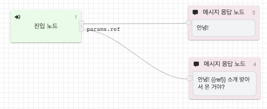

# 진입 노드

진입 노드는 플로우의 시작 지점을 나타냅니다.   
진입 노드는 각 플로우마다 1개만 존재하며, 삭제하거나 추가할 수 없습니다.

### 진입 노드의 시나리오 분기 

진입 노드가 가진 기능은 없지만, **진입 시점의 파라미터를 검사**하여 다른 시나리오로 분기하는 용도로 활용할 수 있습니다. 주로 시작 플로우에서 **재방문 사용자를 검사**하여 재방문 시나리오를 진행하는 용도 등으로로 활용할 수 있습니다.

 

