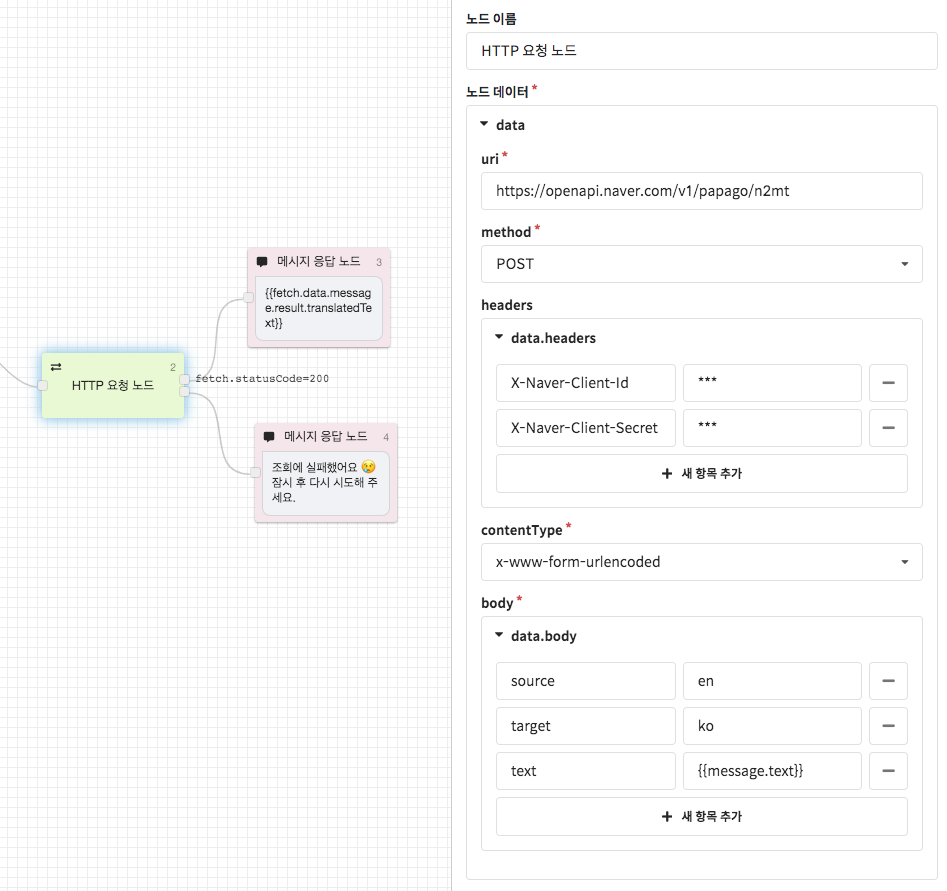

# HTTP 요청 노드

### **HTTP요청 노드\(HTTP Fetch Node\)**

HTTP 요청 노드는 공개된 HTTP API를 이용하여 해당 반환값을 CLOSER 챗봇 시나리오에 활용할 수 있게끔 도와주는 역할을 합니다.

* GET, POST, PUT, DELETE 네 가지 method를 이용할 수 있습니다.
* HTTP 요청 결과는 `fetch` context 를 통해 획득할 수 있습니다. \(text / json 형식의 데이터를 지원합니다.\)

#### fetch _\(object\)_

HTTP 요청 수행 후 생성되는 반환값을 담고 있는 객체입니다.

| 파라미터 | 타입 | 설명 |
| :--- | :--- | :--- |
| uri | strng | 요청 URI |
| data | object | 서버에서 반환된 데이터 \(json / text 형식\) |
| statusCode | number | 서버에서 반환한 statusCode \(200, 401 등\) |
| status | string | 성공시 'COMPLETED', 실패시 'FAILED' |
| error | Error | 오류 정보   |

* 반환된 데이터는 [템플릿 문법](../advanced/template-syntax.md)을 활용하여 메시지에 삽입할 수 있습니다. 
* 전체 반환값을 확인하시려면 `{{fetch.data}}` 같이 작성하실 수 있으며, 반환값이 [JSON](https://ko.wikipedia.org/wiki/JSON) 형태인 경우 `{{fetch.data.path[2].your.object}}`와 같은 경로로 접근하여 해당 값을 사용하실 수 있습니다.


요청이 성공했지만 statusCode가 성공\(`2xx`\)  상태가 아닐 경우 `error` \(StatusCodeError\) 객체가 함께 반환됩니다.  


다음은 네이버가 제공하는 파파고 영어번역 API 연동 설정 예시입니다.   
실제 API와는 다를 수 있으니 참고용으로만 확인해 주세요.  

