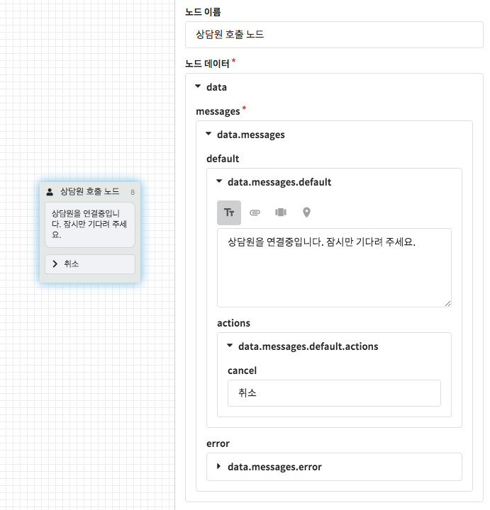
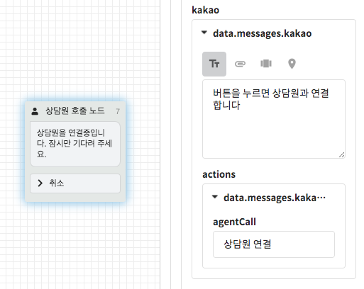
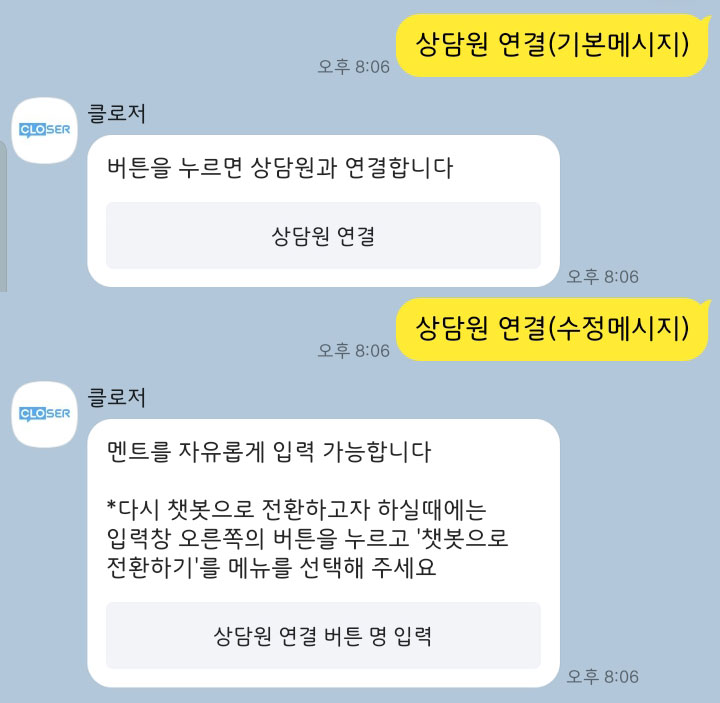

# 상담원 호출 노드

상담원 호출 노드는 [CLOSER Chat](../../../chat/about/)이나 다른 고객센터 솔루션과 연동할 경우 상담원을 호출 이벤트를 발생시키는 노드 입니다. 

* 해당 노드에 진입하면 안내메시지를 출력한 뒤 상담원을 호출하는 webhook이 전송됩니다.
* 상담원이 상담을 종료하거나 사용자가 취소 메시지를 입력하기 전까지 챗봇의 자동응답은 일시 중지됩니다.

상담원 호출 노드 다음 연결은 **상담원이 연결되기 전 호출을 취소**했을 때 진행됩니다. 상담원이 연결된 이후의 동작을 정의하시려면 [CLOSER Chat의 상담 완료 설정](../../../chat/settings/conversations.md#completed-call)을 참고해주세요.

   


봇 편집기의 **대화 미리보기**에서는 상담원 호출 기능을 이용하실 수 없습니다.   
실제 메시징 채널\(예: [웹사이트 채팅](../advanced/messenger-integrations/web.md)\)과 연동한 이후 테스트를 진행해 주세요.


## 카카오톡

카카오톡의 경우에는 상담원 호출 노드에 진입 시 상담원을 즉시 호출하지 않고 **상담원 연결** 버튼이 포함된 새로운 메시지를 반환합니다. 이는 카카오톡 오픈빌더에서 [상담원 연결 기능을 메시지 버튼으로만 제공](https://i.kakao.com/docs/key-concepts-plugin#%EC%83%81%EB%8B%B4%EC%9B%90-%EC%97%B0%EA%B2%B0)하기 때문인데요, 이 때 사용되는 메시지는`data.message.kakao` 값을 통해 편집하실 수 있습니다. 

카카오톡에서의 상담은 ① 카카오톡채널 관리자센터의 1:1 채팅 기능과 ② 카카오톡 상담톡을 이용하는 두 가지 방식이 존재합니다. 더 자세한 사항은 [카카오톡 연동 &gt; 상담 연계](../advanced/messenger-integrations/kakao.md#live-chat-integration) 페이지를 참고해주세요.



