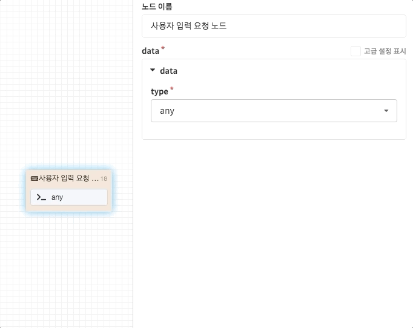
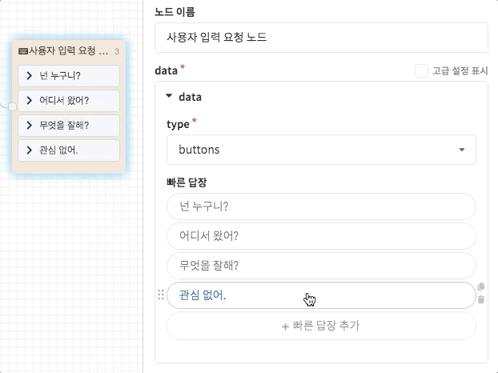
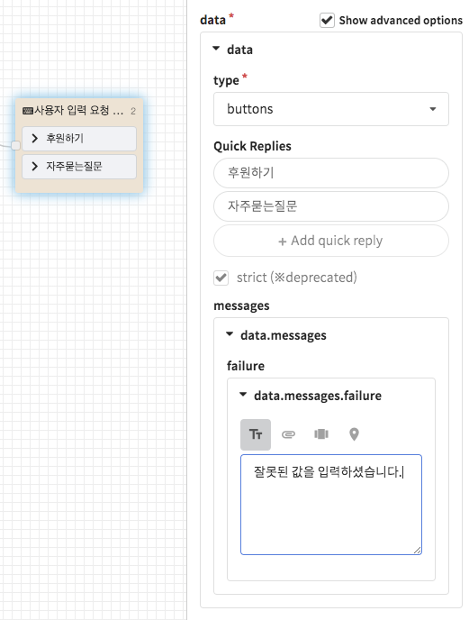

# 사용자 입력 요청 노드

사용자 입력 요청 노드는 **챗봇의 답변 생성을 멈추고 사용자의 입력을 대기하는 역할**을 담당하며, 이는 CLOSER 챗봇 시나리오에서 굉장히 큰 비중을 차지합니다. 

CLOSER에서 제공하는 사용자 입력 요청 노드는 메시징 채널에 따라 **키보드의 입력 방식을 제안하거나 해당 메신저의 입력 플러그인을 반영**합니다. 보통 빠른 답장\(buttons\) 형태를 가장 많이 이용합니다.

이제 어떠한 입력 방식들을 사용할 수 있는지 알아봅니다.

## 사용자 메시지의 종류

메시징 채널에서 사용자가 입력할 수 있는 방법은 메신저에 따라 다릅니다만, 크게는 **텍스트**와 **첨부파일**로 나눌 수 있습니다.

* **텍스트**
* **첨부파일** \(사진, 동영상, 음성메시지, 이모티콘, 위치, 링크 공유\)


사용자의 입력 방식을 특정 형태로 제공하여도 사용자는 언제든 입력 방식을 바꾸어 다른 메시지를 전송할 수 있습니다. 즉, **입력 방식 설정이 입력 값에 대한 검증이 아니라는 점**을 유의해 주세요.


## 사용자 입력 요청 방식

### 입력 방식 미지정 \(any\)

* 고객의 입력 방식을 별도로 지정하지 않습니다. \(모든 메시지 전송이 가능합니다.\)
* 대부분의 메신저에서 텍스트 입력 요청과 동일하게 동작합니다.

### 텍스트 입력 요청 \(text\)

* 고객의 입력 방식을 텍스트 방식으로 지정하여 요청합니다.

### 빠른 답장 방식 \(buttons\)

* 텍스트 입력 방식에 더하여 고객의 입력을 도와주는 선택지를 제공합니다.
* 대부분의 메시징 채널에서 **빠른 답장\(quick reply\)**형태의 선택지로 변환되며, 빠른 답장을 지원하지 않는 경우에는 포스트백 버튼이나 키보드 버튼의 형태로 제공됩니다.
* 각 메시징 채널 별 빠른 답장 지원 여부에 대해서는 [메신저 연동 &gt; 지원 여부 테이블](../../messenger-integrations/#availability-table) 문서를 확인해주세요.

### 숫자 입력 요청 \(number\) 👩🏻‍🔬

* 고객의 입력 방식을 숫자 입력 방식으로 지정하여 요청합니다.
* 메신저에서 키보드 형태를 숫자 패드\(numpad\)로 제한할 수 있는 경우에 숫자 형태의 키보드가 노출됩니다. 

### 위치 입력 요청 \(location\) 👩🏻‍🔬

* 고객의 입력 방식을 위치 입력으로 요청합니다.
* 메신저의 위치 전송 지원 여부에 따라 CLOSER 웹페이지를 이용한 입력방식이 이용될 수 있습니다. \(이 때, `actions` 값에 설정된 텍스트들이 이용됩니다.\)
* 전달받은 위치의 위도와 경도 값은 `{{keyboard.value.latitude}}` , `{{keyboard.value.longitude}}` 두 가지 속성을 통해 획득할 수 있습니다.


{{keyboard}} 속성은 추후 변경될 가능성이 있습니다.  
만일 위 속성이 변경될 경우 고객님들께 변경 전 미리 안내드리도록 하겠습니다.


## 설정 방법 

사용자 입력 요청 노드는 보통 유형\(type\) 값을 [사용자 입력 요청 방식](request.md#undefined-1)에서 서술한 방식으로 지정하는 것으로 설정이 끝납니다. 단, **빠른 답장** 형식의 데이터는 조금 복잡한 기능이 있어 별도 설명을 추가합니다.

### 빠른 답장 추가하기 

빠른 답장은 기본적으로 사용자로 하여금 선택한 버튼의 문자열을 그대로 전송하게끔 해주는 **포스트백 버튼**으로 동작합니다.  \(간혹 선택지에 설정된 문자열과 사용자가 전송할 문자열을 다르게 설정할 수 있는 메신저가 있는데, 이는 모든 메신저에 공통적으로 제공하기 힘든 기능이기에 CLOSER에서는 제공되지 않습니다.\)

빠른 답장은 최대 50개까지 설정이 가능합니다. 단, 10개 이상 설정하는 것은 권장하지 않습니다.


메신저별로 보낼 수 있는 빠른 답장 버튼의 텍스트 길이나 갯수 제한을 초과한 경우, 초과분은 표시되지 않고 사라집니다. 메신저별 제약사항에 대해 더 자세히 알아보려면 다음 페이지를 참고해주세요.




### 포스트백 페이로드 추가하기 

빠른 답장 선택지를 클릭했을 때 나타나는 팝업 메뉴를 통해 [포스트백 페이로드 \(Postback Payload\)](request.md#postback-payload)를 설정하거나 제거할 수 있습니다.

* 포스트백 페이로드가 추가된 선택지는 우측의 `</>` 아이콘을 통해 구분할 수 있습니다.
* 직접 입력하는 방법 외에도 [테이블 형식 데이터를 이용](request.md#undefined-7)하는 기능을 제공합니다.
* 포스트백 페이로드에 대해서는 다음 문서를 참고해주세요.




빠른 답장은 [메시지 버튼](response.md#undefined-2)의 설정과 동일한 형태이지만,   
메시지 버튼과는 다르게 URL 링크 형식을 사용할 수는 없습니다.


## 고급 기능 

### 입력 값 검증하기 \(value validation\)

사용자가 입력한 값이나 형태를 검증하기 위해서는 [**노드의 연결 진행 조건**](./#undefined-3)을 이용하시거나 [사용자 정의 스크립트 노드](sandbox.md)를 통해 검증하는 방법이 있습니다. 여기서는 간단하게 노드의 연결 조건을 이용하는 방법을 알아보겠습니다.

위 플로우 예시에서는 사용자가 올바른 휴대폰 번호를 입력하였는지 검사하기 위해서 **정규표현식** 조건을 이용하고 있습니다. \(위 조건은 예시로서, 모든 전화번호 패턴을 100% 검증하지는 않습니다.\) 이 외에도 이용 가능한 조건들에 대해서는 [**노드 연결 &gt; 이용 가능한 조건 문서**](./#undefined-5)를 참고하세요.

### 입력 유형 검증하기 \(strict option\) ⚠️ deprecated

* 입력된 메시지의 유형을 검증하기 위해서는 에 나타난 `strict` 옵션을 이용할 수 있습니다.
* `strict` 설정이 활성화된 경우, 요청한 입력 방식과 다른 메시지가 도착한 경우 `messages`에 설정된 오류 메시지가 반환되며 다음 노드로 진행되지 않습니다. 주로 **특정 형태 / 특정 선택지 입력을 검증**하고자 할 때 사용됩니다.


strict 옵션은 앞서 서술한 연결 조건의 [**입력 값 검증 기능**](request.md#value-validation)을 통해 완전히 대체될 수 있습니다.   
복잡도를 낮추기 위하여 추후 제거될 예정이니, 가능하면 **연결 조건** 기능을 이용해 주세요.


### 테이블 형식 데이터\(엑셀 등\) 이용하기 

빠른 답장 데이터를 설정할 때, 미리 엑셀 등으로 작성한 시나리오가 있다면 해당 데이터를 그대로 활용할 수 있습니다.   
테이블 형식 데이터를 복사하여 빠른 답장 입력 위치에 붙여넣으면 다음과 같이 값이 입력됩니다.

* 첫 번째 열은 항상 **빠른 답장 본문**으로 사용됩니다.
* 두 번째 열이 있다면 [**포스트백 페이로드**](../advanced/postback-payload.md)로 사용됩니다.

엑셀 외에도 테이블 형식으로 된 데이터\(html, csv 등\)라면 무엇이든 활용할 수 있습니다.

