# 메시지 응답 노드

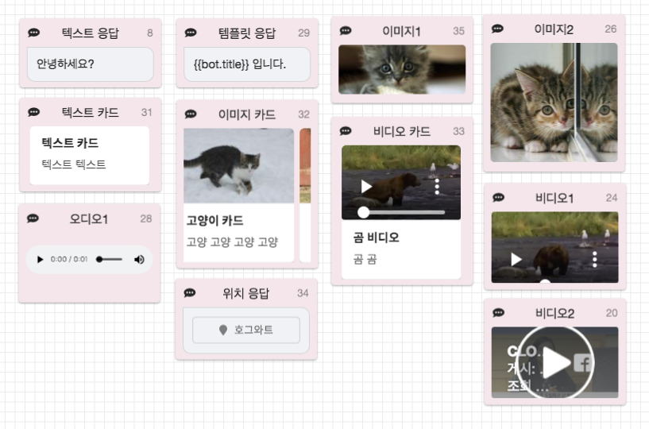

메시지 응답 노드는 **챗봇이 고객에게 전송하는 메시지**를 설정하는 노드 입니다.

CLOSER는 다음 네 가지의 메시지 형태를 지원하고 있습니다.

* 텍스트 메시지
* 미디어 메시지 \(이미지, 동영상, 음성\)
* 카드형 메시지 \(캐러셀\)
* 위치 메시지 👩🏻‍🔬

각 유형별 메시지 설정 방법은 아래 문서를 참고해 주세요.

## 전송 가능한 메시지 유형

### 텍스트 메시지 \(text\)

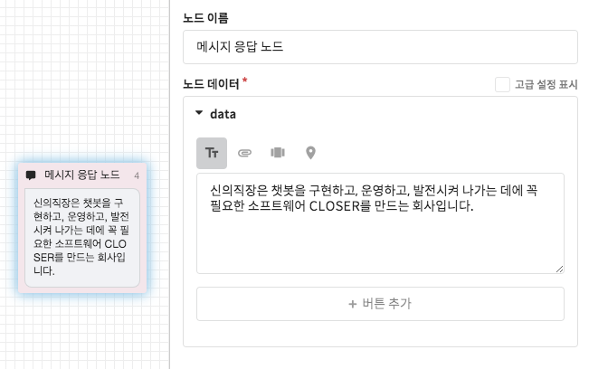

텍스트 응답 방식은 모든 메시징 채널에서 지원하는 가장 기본적인 **텍스트 말풍선** 응답 방식입니다.  
정적인 텍스트 외에도 다음 기능을 제공합니다.

* [템플릿 기능을 이용한 동적 메시지 생성](response.md#undefined-4)
* 말풍선 또는 카드형 메시지에 포함될 [메시지 버튼](response.md#undefined-2) 설정

### 미디어 메시지 \(media\)

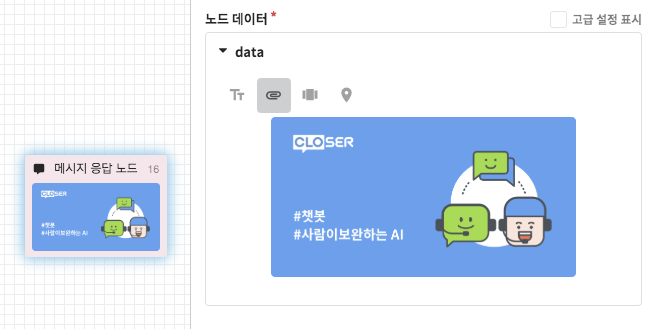

미디어 메시지에는 사진이나 동영상 또는 음성 형태의 미디어를 설정할 수 있습니다.   
빈 미디어를 클릭하면 ① **URL을 직접 입력**하거나 ② **데스크톱에서 파일을 선택**할 수 있는 팝업 메뉴가 나타나며, 나아가 ③ **파일을 끌어다 놓아서 이미지를 첨부**하거나 ④ **복사 + 붙여넣기를 통해 이미지를 첨부**하는 방법도 지원합니다. 

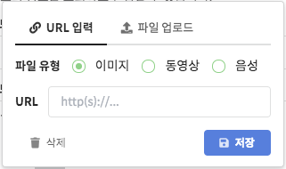

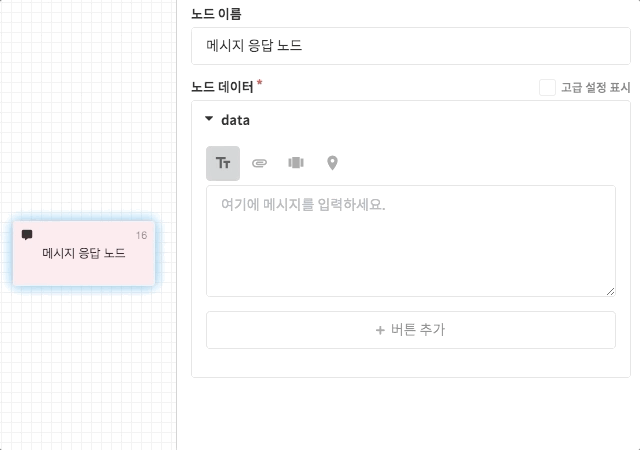

CLOSER에서는 이미지 파일에 한하여 파일 첨부 기능을 제공하고 있습니다.   
단, 지나치게 높은 용량의 파일은 업로드 시 화질 손상이 발생할 수 있는 점 유의해주세요.

* 업로드 용량 제한: 10mb 
* 업로드 형식 제한: jpg, gif, png, bmp
* 이미지 크기 제한: 1024 \* 1024 px


메시징 채널 별로 지원하는 미디어의 형식, 크기 등의 제한이 각각 다르게 설정되어 있습니다.  
특정 미디어의 응답을 지원하지 않는 메시징 채널에서는 단순 링크로 대체되거나, \(지원하지 않는 미디어\) 시스템 오류 메시지가 출력됩니다.


### 카드형 메시지 \(card\)

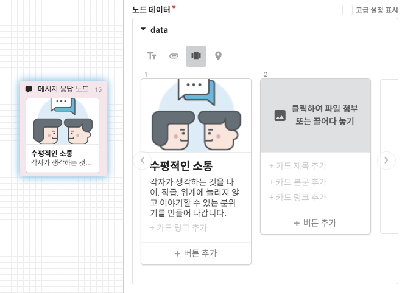

카드형 메시지에는 **미디어** **썸네일**\(작은 이미지\)이나 **카드에 첨부될 버튼** 등을 정의할 수 있으며, 한 메시지당 최대 9개의 카드를 설정할 수 있습니다.

한 메시지에 두 개 이상의 카드를 설정할 시에는 가로로 스크롤이 가능한 **캐러셀\(Carousel\) 형태**로 표현됩니다. 캐러셀을 지원하지 않는 메신저라면 단일 카드를 여러장 전송하게 되며, 카드 형태의 메시지를 지원하지 않는 메신저에서는 이미지와 텍스트를 별도 전송하게 됩니다.

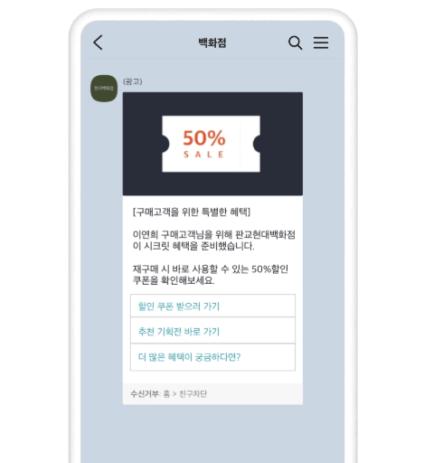

### 위치 메시지 \(location\) 👩🏻‍🔬

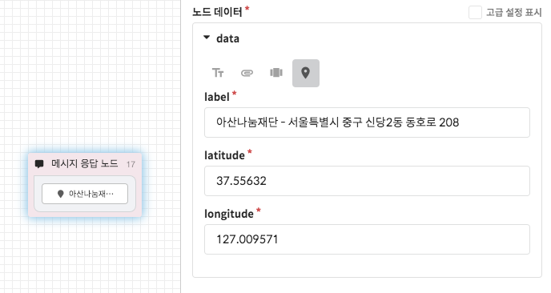

위치 응답 방식에서는 설정한 좌표\(위도, 경도\)를 표시하는 지도 형식의 말풍선을 반환합니다.   
위치 메시지를 지원하는 메신저의 경우는 해당 좌표를 가리키는 위치 메시지를, 그 외에는 구글 지도 링크로 대체됩니다.

### 메신저별 제약사항 

메시징 채널에 따라 텍스트 길이 제한이나 특수형태 메시지 지원 여부에 차이가 있습니다. CLOSER에서 설정한 메시지가 연동한 메신저에 제대로 표시되지 않는다면 아래 사항들을 확인해주세요. 

* 길이 제한을 초과한 경우: 초과한 텍스트는 말줄임표\(...\)로 대체됩니다. 
* 지원하지 않는 위젯의 경우: 해당 위젯이 표시되지 않습니다. \(예: 말풍선 버튼\)
* 카드의 갯수나 버튼 갯수를 초과한 경우: 초과한 항목들은 생략되거나, 가능한 경우 메시지를 나누어서 전송합니다.
* 지원하지 않는 미디어 유형의 경우: 지원하지 않는 미디어라고 표시되거나 웹 링크로 대체됩니다.

메신저별 제약 사항에 대해서 더 자세히 살펴보시려면 다음 페이지를 참고해주세요.



## 메시지 버튼 

**텍스트형 메시지**와 **카드형 메시지** 에는 최대 9개의 메시지 버튼을 첨부할 수 있습니다.   
메시지 버튼에는 기본 동작 외에 다음 세 가지 유형이 지원됩니다.

* [웹/앱 URL 링크 버튼](response.md#undefined-2) ****\(`link`\)
* [포스트백 버튼](response.md#undefined-3) \(`postback`\)
* [플로우 연결](response.md#undefined-4) \(`goto`\)

메시지 버튼의 동작은 버튼 선택 시 노출되는 팝업 메뉴를 통해 설정을 변경할 수 있습니다.

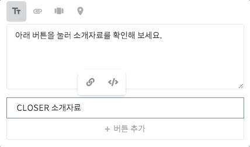

### 링크 버튼  

링크 버튼에는 웹/앱으로 연결되는 URL을 작성하실 수 있습니다.   
다음은 사용 가능한 링크의 몇 가지 예시들입니다.

* 웹 URL: `https://closer.ai`
* 전화 연결: `tel:010xxxxxxxx`
* 이메일 전송: `mailto:support@closer.ai` 


링크의 URL scheme \(http, tel, mailto 등\) 지원 여부는 메시징 채널별로 상이합니다.  
연동 시 충분한 테스트를 거치신 이후 이용해주세요.


### 포스트백 버튼  

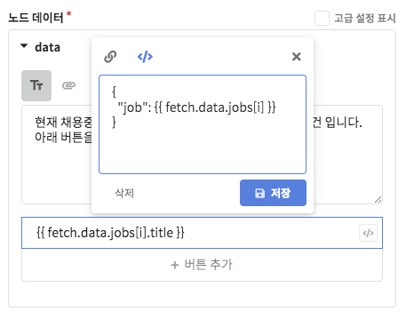

**포스트백\(Postback\)**이란 시스템\(=챗봇\)이 전달한 데이터를 사용자가 다시 시스템\(=챗봇\)으로 반환한다는 의미를 가진 정보통신 용어입니다. CLOSER에서 메시지 버튼은 기본적으로 페이로드\(Payload, 전송되는 데이터\) 없는 포스트백 버튼으로 동작하며, 추가 데이터가 필요한 경우 이 기능을 활용하실 수 있습니다.

이 기능은 쉽게 이해하기는 어렵겠지만, **자연스러운 챗봇을 제작하기 위한 핵심 기능**에 해당하니 한번 쯤 읽어보시는 것을 권해드립니다.



### 플로우 연결 버튼 

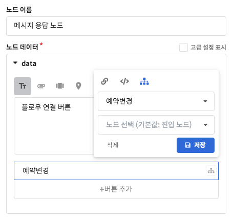

플로우 연결 버튼은 **사용자가 어떤 위치에 있어도 해당 버튼에 설정된 플로우로 이동**하는 기능입니다.

탈출 불가능한 시나리오를 고려한다면 \(예: 정보 입력 시나리오\) 플로우 연결 버튼을 이용하기 전에 다시 한 번 생각해주세요.


설정한 플로우 \(또는 노드\) 가 수정되어 찾을 수 없게 된 경우에는 [폴백 플로우](../flow.md#fallback-flow)로 이동합니다.


## 고급 사용자용 

### 템플릿을 이용한 메시지 생성 

앞서 중괄호 \(`{{...}}`\) 를 이용한 텍스트를 발견하고 생소함을 느끼셨나요?   
이 표현은 **템플릿 문법**이라고 불리는 기능으로서, 현재 **대화의 맥락\(Context\)**에 존재하는 값을 이용해 다음 메시지를 생성하는 데 사용할 수 있도록 하는 기능입니다. 더 자세한 내용은 다음 문서를 참고해 주세요.





### 커스텀 메타데이터 👩🏻‍🔬 

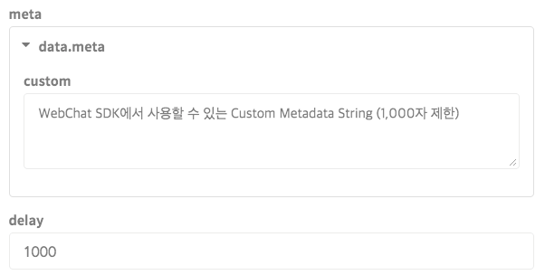

위 속성들은  를 활성화했을 때 표시되는 설정입니다.

* `meta.custom`
  * CLOSER SDK를 이용하여 Custom UI를 구현하시는 경우 여기에 사용자 정의 데이터를 설정하실 수 있습니다. 여기서 설정된 값은 `message.meta.custom` 을 통해 획득할 수 있습니다. \(최대 1,000자.\)
* `delay`

  * 메시지가 한 번에 전송되는 것을 원치 않은 경우, 메시지 사이에 임의의 지연 시간을 설정할 수 있습니다. \(단위: milliseconds\) 위 스크린샷의 경우에는 1초\(1,000 밀리초\) 뒤에 메시지를 전송합니다. 

### 외부 데이터 붙여넣기 \(xls\)

말풍선 버튼을 입력하는 다른 방법으로 [테이블 데이터 \(엑셀 등\)를 이용하는 방법](request.md#clipboard-data)을 참고하세요.

