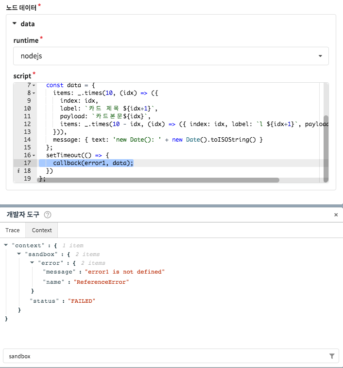
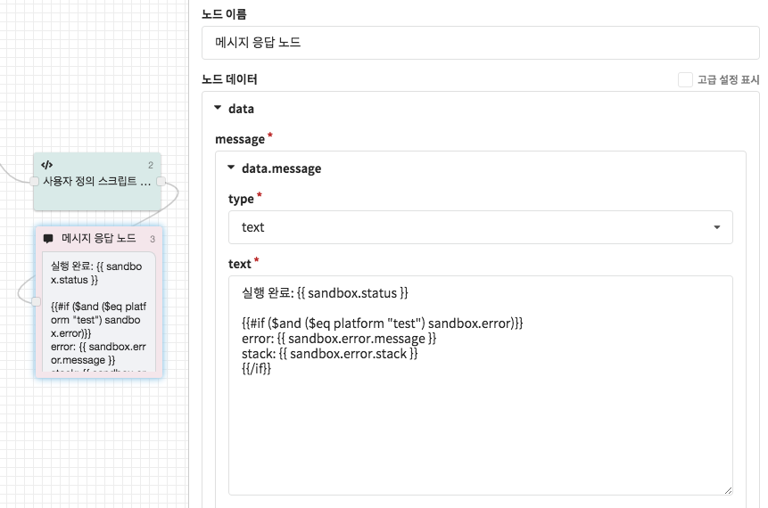
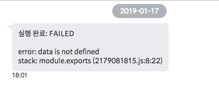
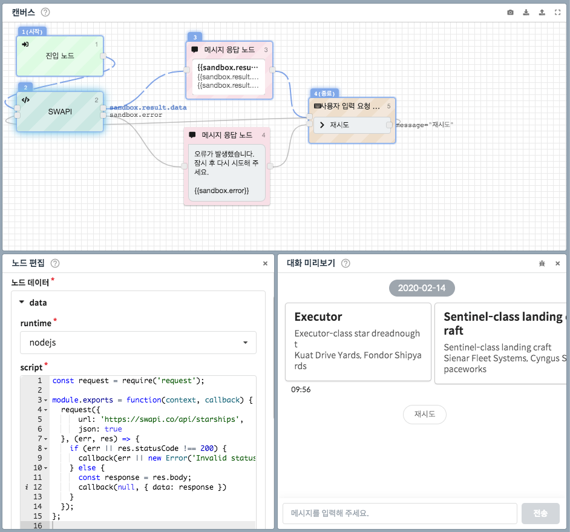

# 사용자 정의 스크립트 노드

## 실행환경

런타임: Node.js v12  
타임아웃: `5,000`ms  
코드길이 제한: `50,000`byte  
응답크기 제한: `50,000`byte

실행 과정에서 오류가 발생하거나 수행시간이 5,000ms 를 초과할 경우 스크립트 실행이 종료됩니다. 

만일 수행 시간이 초과된 경우 실행 중인 스크립트에 대한 결과는 보장할 수 없습니다. 따라서 제한 시간을 넘지 않도록 주의해 주시고, 오류 발생시 분기가 필요하다면 [오류 처리하기](sandbox.md#3-error-handling) 항목을 참고해 주세요.

### 제공되는 Node.js 라이브러리

| 패키지 | 용도 | 버전 |
| :--- | :--- | :--- |
| apn | Apple Push Messaing | 2.2.0 |
| aws-sdk | AWS SDK | 2.389.0 |
| axios | HTTP request utility | 0.19.2 |
| bluebird | Javascript \(Promise\) Utility | 3.7.2 |
| cheerio | HTML DOM Parser | 1.0.0-rc.3 |
| crypto | Crypto Utility | - |
| csv-parse | CSV Manipulation | 4.8.8 |
| fetch | HTTP request utility | 1.1.0 |
| gm | Image Manipulation | 1.23.1 |
| googleapis | Google API SDK | 48.0.0 |
| iconv-lite | Text Encoding Converter | 0.5.1 |
| imagemagick | Image Manipulation | 0.1.3 |
| jsonwebtoken | JWT Token  | 8.5.1 |
| lodash | Javascript Utility | 4.17.15 |
| moment | DateTime Utility | 2.24.0 |
| moment-timezone | DateTime Utility | 0.5.28 |
| nodemailer | SMTP Mailer | 6.4.6 |
| request | HTTP request utility | 2.88.2 |
| request-promise | HTTP request utility | 4.2.5 |
| superagent | HTTP request utility | 5.2.2 |
| underscore | Javascript Utility | 1.10.2 |
| uuid | UUID | 7.0.3 |
| xml2js | XML Manipulation | 0.4.23 |

## 핸들러 함수

사용자 정의 스크립트 노드에 작성하는 script는 하나의 Node.js의 모듈과 동일합니다.  
CLOSER에서는  `module.exports` 에 반환된 **핸들러 함수**를 실행하며, 핸들러 함수는 callback과 async function 두 가지 형태를 지원합니다.

### handler\(context, callback?\): _void_

#### context _\(Object\)_

진행중인 대화의 현재 맥락을 담고 있는 객체. [Context](sandbox.md#context) 참조

#### callback\(error, result\) _\(Function\)_

챗봇에 결과를 전달하는 콜백 함수

| Argument | Type | Description |
| :--- | :--- | :--- |
| error | Error | 오류 발생시 전달할 객체 |
| result | [HandlerResult](sandbox.md#type-handler-result) | 스크립트 실행 결과로 전달할 객체 |

**Callback 예시**

```javascript
module.exports = function handler(context, callback) {
  callback(null, {
    params: {
      result: 'Hello CLOSER'
    }
  });
};
```

### handler\(context\): _Promise&lt;HandlerResult&gt;_

#### context _\(Object\)_

진행중인 대화의 현재 맥락을 담고 있는 객체. [Context](sandbox.md#context) 참조

Promise형태로 결과값을 반환할 수 있습니다.

**Promise 예시**

```javascript
module.exports = function handler(context) {
  return new Promise((resolve, reject) => {
    resolve({
      params: {
        result: 'Hello CLOSER'
      }
    });
  });
};
```

**Async Function 예시**

```javascript
module.exports = async function handler(context) {
  // const somePromise = ...
  // await somePromise;
  return {
    params: {
      result: 'Hello CLOSER'
    }
  };
};
```

### 데이터 타입

#### Bot   <a id="type-bot"></a>

| Property | Type | Description | Required |
| :--- | :--- | :--- | :--- |
| title | String | 봇의 이름 | Y |
| description | String | 봇의 설명 | N |

#### Context

| Property | Type | Description |
| :--- | :--- | :--- |
| bot | [Bot](sandbox.md#type-bot) | 챗봇의 정보 |
| conversationId | String | 진행 중인 대화 식별자 |
| endUserId | String | 진행 중인 대화의 고객 식별자 |
| params | Object | 진행 중인 대화의 파라미터 딕셔너리 |
| platform | String | 진행 중인 대화의 메시징 채널 식별자`'kakao', 'kakaobiz', 'facebook', 'line', 'navertalk', 'bizchat', 'wechat', 'web', 'test'` |
| userKey | String | 메시징 플랫폼에서 제공하는 고객의 고유 Id |
| message | [Message](sandbox.md#type-message) | 고객이 입력한 메시지 |

#### HandlerResult   <a id="type-handler-result"></a>

| Property | Type | Description | Required |
| :--- | :--- | :--- | :--- |
| custom | Object | 이후 노드에서 `sandbox.result.custom`으로 접근할 객체 | N |
| params | Object | 노드 실행 후 설정할 파라미터  \(설정된 키에 대한 값만 덮어씌워집니다.\) | N |

## 오류 처리하기

사용자 정의 스크립트 노드 수행 중 오류가 반환되는 경우 `sandbox.error` 객체가 생성됩니다. 개발자 도구를 통해 오류를 확인하거나 템플릿 문법을 통해 메시지를 출력할 수 있고, 연결 조건을 이용하면 오류 발생 시 다른 시나리오가 진행되도록 분기점을 설정하는 것도 가능합니다. 

### 오류 확인하기 \(개발자 도구\)



[개발자 도구](../advanced/inspector.md)를 이용하면 스크립트 실행 중 어떤 오류가 발생했는지 쉽게 확인 가능합니다. 위 스크린샷에서는 `error1`이라는 이름의 존재하지 않는 변수를 사용하여 오류가 발생하였음을를 확인할 수 있습니다.

### 오류 출력하기 \(템플릿 문법\)

`sandbox` 객체는 [컨텍스트](../context.md)에 존재하는 값으로서, [템플릿 문법](../advanced/template-syntax/)을 활용하여 오류 메시지를 출력할 수 있습니다.   `{{sandbox.error}}` 혹은 `{{sandbox.error.message}}` 값을 이용해 보세요.

이 때, 최종 사용자에게 해당 메시지가 그대로 노출되지 않도록 유의하세요.

아래는 **대화 테스트**\(platform: `test`\)일 때에 오류가 존재하면 오류의 정보를 출력하는 디버깅 방법의 예시입니다.





### 오류 발생 시 분기

사용자 정의 스크립트 노드에서 오류가 발생할 경우 챗봇은 아무런 메시지를 반환하지 않지만, `sandbox.error` 값의 존재 유무를 통해 오류가 발생하였을 경우의 시나리오를 처리할 수 있습니다. 

더 자세한 사항은 [연결 조건 설정하기](./#connection-condition) 항목을 참고하세요.

## 예제

### 1. 간단한 곱셈 스크립트


위 플로우는 챗봇에서 가격과 세율를 입력 받아 곱한 값을 반환하는 시나리오입니다. 제품의 가격을 사용자 입력 요청노드를 통해 입력받고, 파라미터 설정 노드에서 `price`에 `{{message}}`를 설정합니다. 세율을 사용자 입력 요청노드를 통해 입력받고, 파라미터 설정 노드에서 `taxRate`에 `{{message}}`를 설정합니다.

```javascript
module.exports = function handler(context, callback) {
  // 파라미터의 타입이 String일 수 있으므로 Number 타입으로 형변환합니다.
  const price = Number(context.params.price);
  const taxRate = Number(context.params.taxRate);
  const result = {
    custom: {
      price: price * taxRate
    },
    params: {
      price: price * taxRate
    }
  };
  callback(null, result);
};
```

앞서 입력받은 파라미터는 사용자 정의 스크립트 노드에서 `context.params`에서 참조할 수 있습니다. `context.params.price`와 `context.params.taxRate`를 곱한 값을 반환합니다.

`custom`에 반환되는 값은 이후 노드에서 `{{sandbox.result.custom}}`으로 참조할 수 있습니다. `params`에 반환되는 값은 이후 노드에서 해당 파라미터의 값을 설정합니다. 예제 스크립트의 경우 `price`파라미터를 새 값으로 덮어 씁니다.

만일 `message`로 `{ text: '가격: ' + price * taxRate }`을 반환하면 챗봇은 사용자 정의 스크립트 노드가 종료되는 시점에 `text`에 해당하는 String을 최종 사용자에게 메시지로 전달합니다. 메시지 객체의 타입은 추후 변경될 수 있으니 가급적 추가적으로 메시지 응답 노드를 생성하여 [템플릿 문법](../advanced/template-syntax/)을 활용하는 것을 추천합니다.

### 2. HTTP 요청 처리하기 \(API 연동\)  <a id="3-error-handling"></a>

[HTTP 요청 노드](fetch.md)보다 복잡한 처리\(payload 전처리 및 response 후처리 등\)가 필요한 경우에는 스크립트 노드를 통해 HTTP 요청을 수행할 수 있습니다.   
CLOSER에서는 현재 사용자 정의 스크립트 노드에 `request`, `superagent` 두 가지 HTTP 요청 라이브러리를 제공하고 있습니다. 각각의 라이브러리에 대한 자세한 설명은 다음을 참고해주세요.

* [https://github.com/request/request](https://github.com/request/request) \(영문\)
* [https://github.com/visionmedia/superagent](https://github.com/visionmedia/superagent) \(영문\)  

다음은 `request` 라이브러리와 [템플릿 문법](../advanced/template-syntax/)을 이용해 [템플릿 문법 &gt; 스타워즈 우주선 목록](../advanced/template-syntax/#example-1)을 재구현해 본 예시입니다. 첨부된 플로우 또는 스크립트를 참고하여 고객님께 필요한 기능을 추가해보세요.  



```javascript
const request = require('request');

module.exports = function(context, callback) {
  request({
      url: 'https://swapi.co/api/starships',
      json: true
  }, (err, res) => {
    if (err || res.statusCode !== 200) {
      callback(err || new Error('Invalid status code:' + res.statusCode));
    } else {
      const response = res.body;
      callback(null, { data: response })
    }
  });
};
```



  


