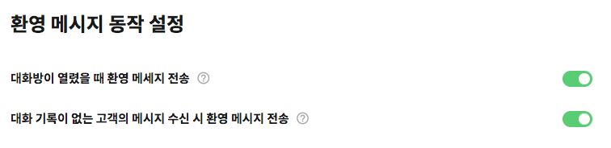

# 시스템 메시지

## 환영 메시지 동작 

환영 메시지 동작 설정에서는 **대화 시작 시점 \(대화방 열린 시점\)** 에서 수정 가능한 두 가지 설정을 제공합니다.

* **대화방 열렸을 때 환영 메세지 전송**
  * 지원되는 메시징 채널에서 환영 메세지 이용 여부를 선택합니다.

    * 카카오톡: 최초 1회
    * 카카오톡 상담톡: 상담 세션 시작 시   
    * 라인: 친구 추가 시
    * 네이버 톡톡: 대화방 진입 시 
*  **대화 기록이 없는 고객의 메시지 수신 시 환영 메시지 전송**

  * 환영 메시지를 사용하지 않기로 설정한 경우  1. 고객이 보낸 첫 번째 메시지에 대한 응답으로 환영 메시지를 보낼 것인지 2. 가장 첫번째 사용자 입력 요청 노드에서 답변을 시작할 것인지를 선택합니다.

## 시스템 메시지 

시스템 메시지는 답변 생성 과정에서 **오류가 발생하거나필요한 데이터가 부족할 경우** 대신 사용되는 응답입니다.

#### **오류 메시지**

* 노드 실행 오류 혹은 시나리오 상에서의 오류가 발생할 경우 사용됩니다. 
* 주로 템플릿 문법 적용 결과 오류 혹은 플로우 설계 오류등의 상황에서 발생합니다.

#### **빈 메시지**

* 챗봇 시나리오 수행 결과에서 답변을 생성하지 못한 경우 사용됩니다.
* FAQ &gt; [챗봇에서 계속 \(메시지 없음\) 또는 \(Empty Message\) 응답만 나와요](../../faq.md#q-empty-message)

#### **추가 선택지**

* 메시징 채널별 제약사항으로 인해 모든 버튼을 표시하지 못한 경우, 새로운 말풍선으로 추가 선택지를 표시할 때 사용되는 텍스트입니다. 
* 카카오톡 상담톡에서만 사용됩니다.

#### **지원하지 않는 미디어**

* 메시징 채널별 제약사항으로 인해 특정 미디어를 표시하지 못한 경우 사용됩니다.
* 카카오톡 상담톡에서만 사용됩니다.

