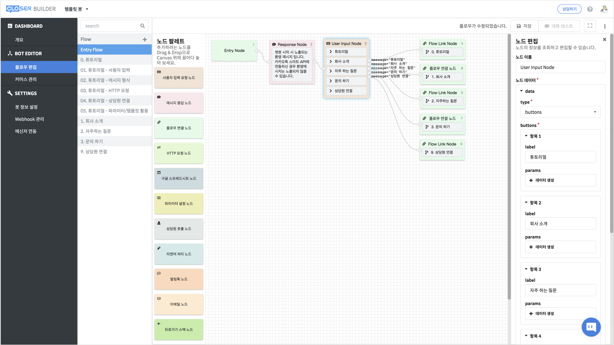
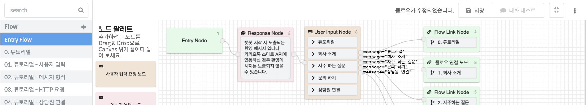
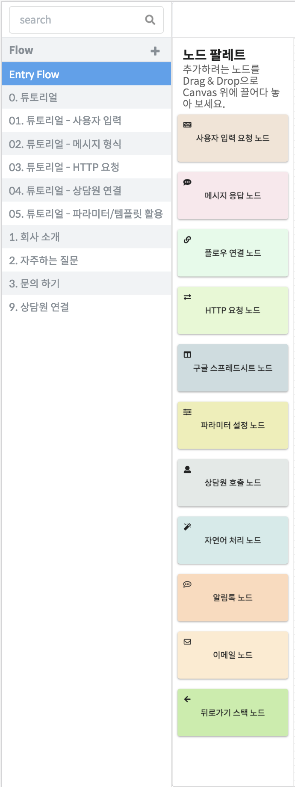

# 봇 에디터\(플로우 편집\)

플로우 에디터는 자유롭게 대화의 흐름을 설계할 수 있는 도구 입니다.

왼쪽 메뉴에서 플로우 편집 버튼을 누르면 진입할 수 있습니다.

## 화면 구성 

### 플로우 편집 화면 상단 

* 화면 상단에는 대화 구성 단위인 플로우의 목록이 나타납니다. 클릭해서 해당 플로우를 수정할 수 있습니다.
* 우측 상단 저장 버튼을 누르면 수정한 플로우가 저장 됩니다. 
* 우측 상단 대화 테스트 버튼을 누르면 현재 설계한 봇을 바로 테스트해 볼 수 있습니다.
* 가장 우측의 드롭다운 메뉴\(\)에서는 플로우와 봇에 대한 여러 기능들을 제공합니다.

### 플로우 편집 화면 좌측 노드 팔레트 

* 사용할 수 있는 기능별 노드목록을 보여줍니다. 원하는 노드를 캔버스에 끌어다 놓아 대화를 설계할 수 있습니다.

### 플로우 편집 화면 중앙 캔버스 

* 노드를 이어 대화를 설계하는 공간 입니다. 
* 빈 봇을 만들거나 새로운 플로우를 생성하면 엔트리 노드만 존재합니다.
* 봇의 대화는 Entry Flow의 Entry Node에서부터 시작합니다.

