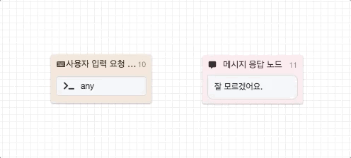
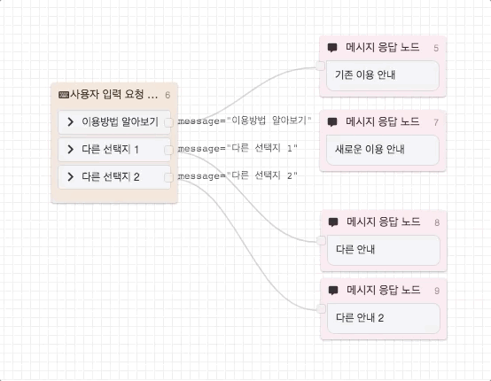
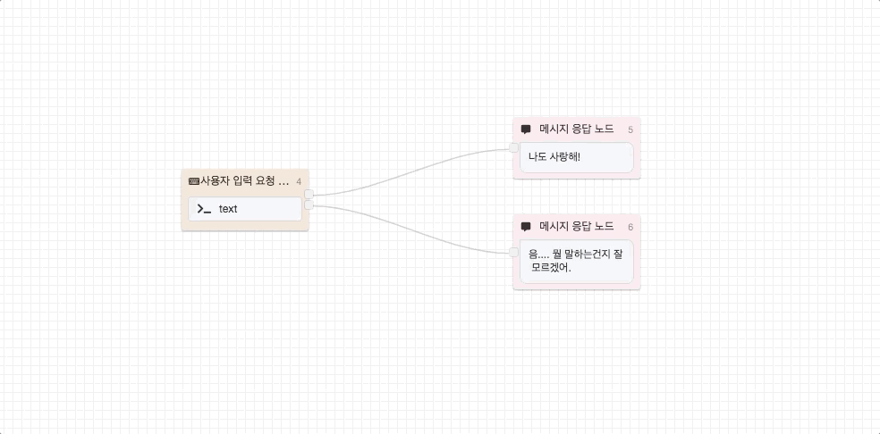
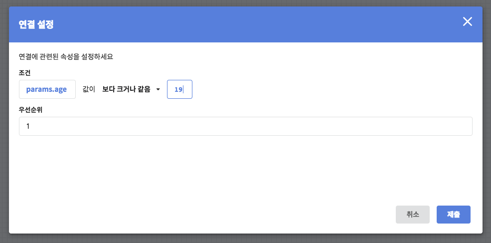
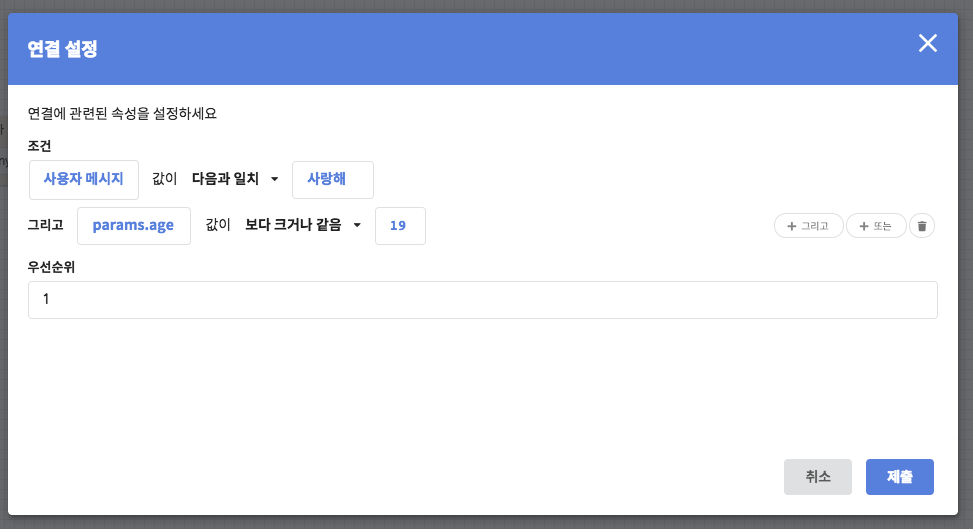
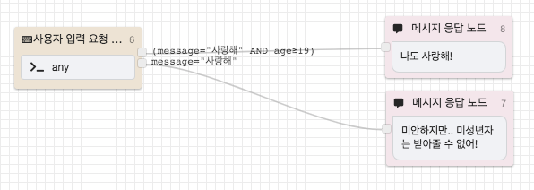

# 노드 연결하기

## 노드 연결하기 

이전 문서에서는 CLOSER 챗봇의 기능 수행 단위인 [노드\(Node\)](node/) 에 대하여 알아보았습니다.   
여기서는 챗봇의 수행 순서를 제어하기 위해 노드와 노드를 연결하는 방법을 알아보겠니다.

### 연결 생성하기 

노드에 마우스 커서를 가져다 대시면 해당 노드 오른쪽에 **하늘색 삼각형 도형**이 표시됩니다. 이 때 해당 도형 위에서 마우스 왼쪽 버튼을 누르시면 **새로운 연결 선\(Edge\)**이 생성 되고, 이 선을 끌어다 연결할 노드 위에 가져다 놓으시면 두 노드가 서로 연결됩니다. \(Drag & Drop\)

선택지형 입력 노드는 사용자 편의를 위해 더 특별한 기능을 제공합니다. 자세한 내용은 아래를 확인해주세요. 

선택지형 입력 노드에서는 선택지 위에 마우스 커서를 올리면 앞서 보였던 것보다 **더 작은 하늘색 삼각형 도형**이 표시됩니다. 노드를 연결할 때 처럼 해당 도형에서 마우스 왼쪽 버튼을 눌러 연결 선을 연결할 노드에 가져다 놓으시면 **해당 선택지를 선택한 조건이 자동으로 작성**되어 연결이 생성됩니다.

만일 선택지 입력 외의 다른 입력에 대한 노드를 연결하려는 경우, 선택지 영역 밖 \(그러나 노드 영역 내부\) 으로 마우스 커서를 이동하시면 다시 기존에 보았던 **크기가 다른 삼각형 도형**을 확인하실 수 있습니다. 이를 이용하여 선택지 외의 입력에 대한 노드를 지정할 수 있습니다. 

### 연결 수정하기 

챗봇 시나리오를 변경하려는 경우 기존 연결을 새로운 노드로 이동하여야 하는 상황이 발생합니다. 이 경우 연결과 연결 사이에 있는 **연결점\(Joint\)**을 끌어서 이동하는 방식으로 연결을 손쉽게 수정할 수 있습니다.

* 연결점을 새로운 노드로 끌어다 놓는 경우: 해당 연결이 다른 노드로 연결됩니다. 
* 연결점을 노드가 아닌 캔버스 위로 끌어다 놓는 경우: 해당 연결이 제거됩니다. 


실수로 연결을 제거하셨나요? 걱정하지 마세요! 실행 취소 \(Ctrl + Z\) 기능을 사용하실 수 있답니다 🤗


## 연결에 조건 설정하기   

상황별로 주어진 조건에 따라 다양한 노드로 시나리오가 분기되어야 하는 경우 있습니다. 이 때, 노드와 노드 사이의 연결에 필요한 조건과 그 우선순위를 설정하여 흐름을 다양하게 제어할 수 있습니다.

### 조건 

조건 설정 화면은 연결선\(Edge\)을 더블클릭하여 확인할 수 있습니다. 조건에 사용되는 속성으로는 주로 **사용자 메시지**\(message.text\) ****값을 이용하며, 나아가 [파라미터\(Parameter\)](parameter.md) 및 [컨텍스트\(Context\)](template-syntax.md#context) 값도 활용할 수 있습니다. 

아래는 사용자의 나이를 age에 입력받았다고 가정하였을 때, 특정 플로우에 진입 시 19세 미만은 이용할 수 없다는 안내 메시지를 출력하는 시나리오의 예제입니다다.

연결 조건에는 **그리고\(AND\)** 및 **또는\(OR\)** 결합 조건을 통해 하나 이상의 속성으로 조건을 설정할 수도 있습니다. 각 조건 항목 위에 마우스 커서를 가져다 대시면 우측에 +**그리고 버튼**과 +**또는 버튼**을 확인할 수 있는데, 이 버튼들을 클릭하여 결합 조건을 추가하거나 **휴지통 버튼**을 눌러 조건을 제거하실 수 있습니다.

### 우선순위   

노드에는 여러가지 조건을 설정할 수 있지만, 최종적으로는 단 하나의 노드로만 진행됩니다.   
만약 특정 노드에 연결된 노드가 2개 이상이고, 2개 이상의 연결 조건들을 동시에 만족하는 경우에 다음 노드 선택에 사용할 **우선순위** 값을 설정할 수 있습니다.

만일 조건을 만족하는 연결들이 모두 같은 우선순위를 갖는 경우, 결합 조건이 더 많이 설정된 연결이 우선되어 선택됩니다.


우선순위와 조건의 수가 모두 같은 경우에는 **동작의 일관성을 보장할 수 없습니다.**  
때문에, 이러한 경우 우선순위 설정을 잘 확인해주세요.


