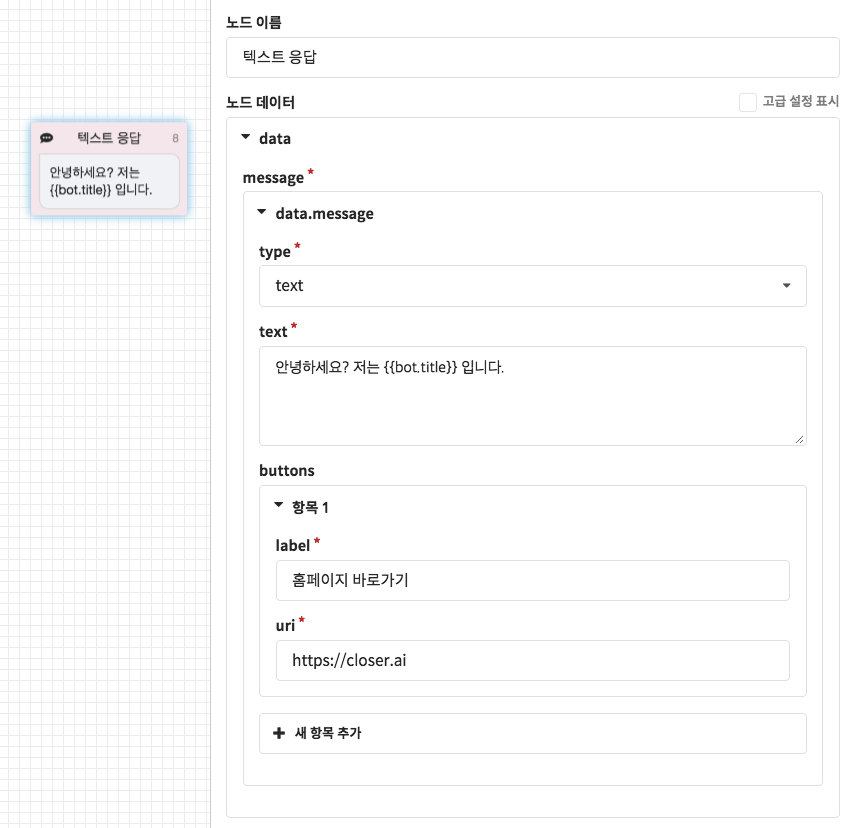
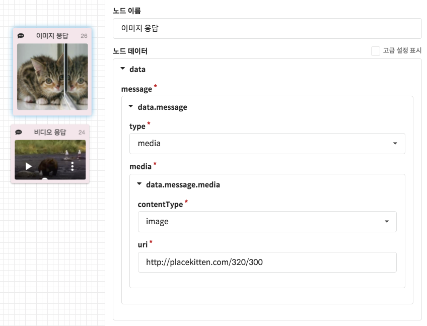
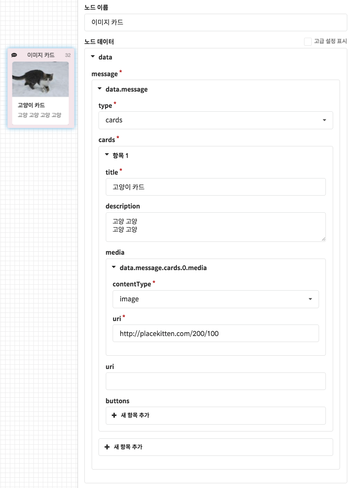
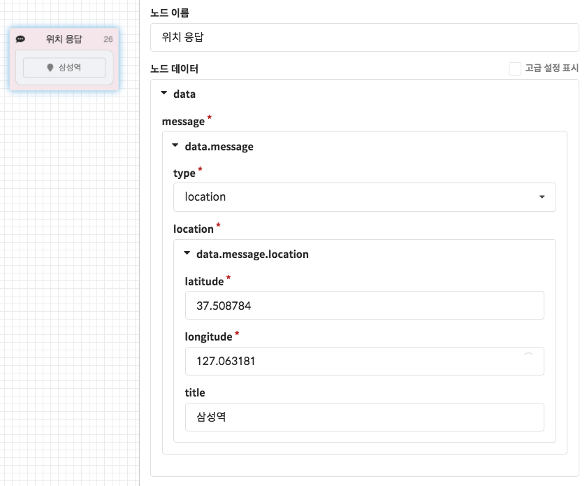

# 메시지 응답 노드

챗봇이 고객에게 전송하는 메시지를 설정할 수 있는 노드 입니다.

CLOSER에서는 최대한 많은 메시징 채널에서 호환성을 갖기 위하여, 각 메시징 채널에서 공통적으로 지원하는 메시지 유형들 중에서 사용 빈도가 높은 다음 네 가지 유형들을 골라 기능을 선택적으로 제공하고 있습니다.

* 텍스트 응답 방식
* 미디어 응답 방식 \(이미지, 동영상, 오디오\)
* 카드형 응답 방식 \(캐러셀\)
* 위치 응답 방식 

각 유형별 메시지 설정 방법은 아래 기본 설정 항목을 참고해 주세요.

## 기본 설정

### 텍스트 응답 방식

텍스트 응답 방식은 모든 메시징 채널에서 지원하는 가장 기본적인 **말풍선 텍스트** 응답 방식입니다.  
위 예시 화면에서는 템플릿 엔진을 활용하고 있습니다. 이에 대한 자세한 내용은 [템플릿 문법](../template-syntax.md) 항목을 참고해 주세요.

* **`type`**: `text`
* **`text`**: 1,000자 제한 
* **`buttons`**: 말풍선에 삽입될 버튼, 최대 3개. \(현재 웹 링크 형식만 지원합니다.\)


메시징 채널 별로 설정된 길이 제한이 상이합니다.   
만일 1,000자 이하로 작성한 경우에도 메시징 채널에서 설정된 길이 제한을 초과한 경우, 초과한 텍스트는 말줄임표\(`...`\)로 대체됩니다


### 미디어 응답 방식

미디어 응답 방식에서는 사진, 동영상 및 음성 형태의 데이터 전송을 지원합니다. 현재는 다른 서비스를 통해 업로드된 미디어의 URL을 입력해야 되지만, 곧 자체 업로드 기능또한 제공할 예정입니다.

* **`type`**: `media`
* **`media.contentType`**: `image`, `video`, `audio`
* **`media.uri`**: 미디어 파일 주소 


각 메시징 채널마다 지원하는 미디어의 압축 형식, 크기 제한 등이 상이합니다.    
설정한 미디어 응답을 지원하지 않는 메시징 채널에서는 단순 링크로 대체되거나 \(지원하지 않는 미디어\) 시스템 오류 메시지가 출력됩니다.


### 카드 응답 방식

카드형 응답 방식은 흔히 캐러셀 \(Carousel\) 이라고 부르는 응답 방식으로, 한 메시지에서 가로로 스크롤이 가능한 카드들을 포함한 메시지 형태를 의미합니다.

카드에는 카드 썸네일이나 클릭시 링크, 카드에 포함될 버튼 등을 정의할 수 있으며, 한 메시지당 최대 9개의 카드를 설정할 수 있습니다.

* `type`: `cards`
* `cards`: 카드의 배열, 최대 9개까지 추가 가능\) 
  * `title`: 카드의 제목
  * `description`: 카드 내용
  * `media`: 카드 썸네일로 사용될 미디어, [미디어 응답 방식](response.md#undefined-1)에서 사용되는 데이터와 동일
  * `uri`: 카드 클릭 시 이동할 링크 주소 \(공란으로 설정 시 링크 사용하지 않음\)
  * `buttons`: 카드 내부에 삽입될 말풍선 버튼 \(최대 3개\), [텍스트 응답 방식](response.md#undefined)에서 사용되는 데이터와 동일


메시징 채널 별로 카드형 메시지 \(Carousel\) 응답의 지원 여부가 상이합니다.

만일 카드형 메시지를 지원하지 않는 메시징 채널의 경우 하나의 말풍선으로 합쳐져서 표시되거나, 여러 개의 말풍선으로 구분하여 표시될 수 있습니다.


### 위치 응답 방식

위치 응답 방식에서는 설정한 좌표 \(위도, 경도\)를 표시하는 지도 형식의 말풍선을 반환합니다.   
자체적으로 지도를 지원하는 메신저의 경우는 해당 지도의 좌표를, 그 외에는 구글 지도 링크로 대체됩니다..

* `type`: `location`
* `location`: 표시할 위치의 위도/경도 좌표값
  * `latitude`: 위도
  * `longitude`: 경도
  * `title`: 위치\(장소\)의 이름


메시징 채널 별로 위치 메시지의 응답 여부가 상이합니다.

만일 지원하지 않는 메시징 채널일 경우 구글 지도로 이동하는 링크 메시지로 대체될 수 있습니다. 


## 고급 설정

* `meta.custom`: CLOSER WebChat SDK를 이용하여 Custom UI를 구현하시는 경우 여기에 사용자 정의 데이터를 설정하실 수 있습니다. 여기서 설정된 값은 `message.meta.custom` 으로 가져올 수 있습니다. \(최대 1,000자.\)
* `delay`: 메시지가 전송되는 간격이 빠른 경우, 메시지 사이사이에 임의의 지연 시간을 설정할 수 있습니다. 위 예시에서는 1초 뒤에 메시지를 전송합니다. \(milliseconds 단위\)
* 메시지 응답 설정에 사용되는 값으로는 사용자의 현재 컨텍스트\(Context\)에 존재하는 값을 이용할 수도 있습니다. 이에 대한 자세한 내용은 [템플릿 문법](../template-syntax.md) 문서를 참고해 주세요.

