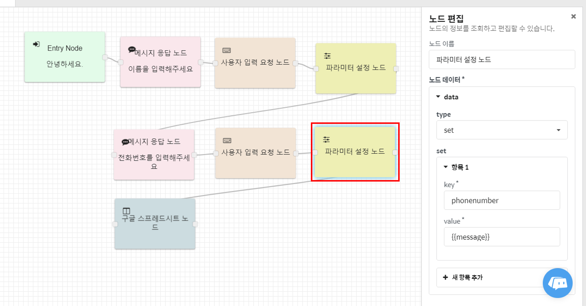

# 파라미터\(Parameter\)

대화에서 발생한 값들을 key-value 형식으로 저장할 때 사용합니다.  
CLOSER에서는 기본적인 예약 파라미터를 제공합니다. 아래에서 예약 파라미터 종류를 볼 수 있습니다.  
기본적으로 제공하는 예약 파라미터를 제외하고, 사용자는 파라미터 노드에서 원하는 값을 설정하여 [템플릿 문법](template-syntax.md)을 이용해 다음 노드의 입력값으로 사용할 수 있습니다.

## 예약 파라미터 \(Reserved Parameters\) {#reserved-parameters}

| 파라미터 명 | 설명 |
| :--- | :--- |
| `id` | 사용자의 대화 \(Conversation\) 를 식별하는 키 |
| `platform` | 사용자가 유입된 메신저 플랫폼을 나타내는 키 `web`, `kakao`, `kakaobiz`, `facebook`, `line`, `navertalk`, `wechat` |
| `userKey` | 각 메신저 플랫폼에서 설정된 사용자 식별 키 |
| `message` | 사용자가 마지막으로 입력한 텍스트 메시지 |
| `bot.title` | 현재 사용중인 봇의 이름 |
| `bot.description` | 현재 사용중인 봇의 설명 |

### 파라미터 사용 예시 {#parameter-example}

아래 표시된 파라미터 설정 노드는 사용자가 입력한 전화번호{{message}}를 phonenumber라는 파라미터에 저장합니다. 추후에 전화번호 파라미터를 사용할 때에는 {{phonenumber}}로 사용할 수 있습니다.

