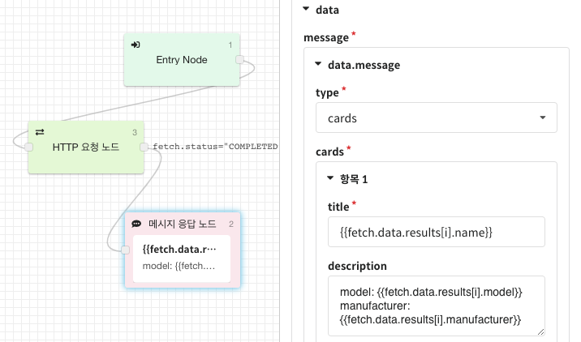
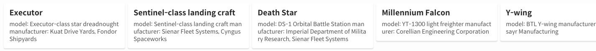

# 템플릿 문법\(Template Syntax\)

## 템플릿이란?

템플릿\(Template\)이란 형판\(形板\)을 의미합니다.  
미리 데이터가 들어갈 형판을 만들어 두면 챗봇 시나리오에서 생성된 데이터를 답변 생성 시점에 주입할 수 있습니다.

간단한 인삿말을 예로 들어 보겠습니다. 

1. `안녕하세요 고객님? 좋은 하루 되세요.`
2. `안녕하세요 {{name}}님? 좋은 하루 되세요.`

1은 정적인 텍스트로만 답변을 작성한 예시이며, 2는 템플릿 기능을 이용해 답변을 작성한 예시입니다.  
답변을 작성할 때 템플릿을 이용하면 고객과의 대화 내용에 따라 더욱 더 풍성하고 다채로운 답변을 작성하는 것이 가능해집니다.

* 템플릿에 사용되는 데이터들은 챗봇의 실행 시점에서 결정되며, 이 값은 [컨텍스트 \(Context\)](template-syntax.md#context) 라고 부릅니다.
* 템플릿에 사용할 수 있는 표현식들은 [경로 접근식](template-syntax.md#path-expression), [조건부 표현식](template-syntax.md#conditional-expression), [반복자 표현식](template-syntax.md#array-to-cards) 등이 있습니다. 

템플릿 기능에 대한 자세한 사용 방법은 아래에서 더 자세히 알아보세요.


CLOSER에서는 [템플릿 엔진](https://en.wikipedia.org/wiki/Template_processor)으로 Handlebars를 이용하고 있습니다.   
동작 원리를 더 자세히 알고 싶으시다면 Handlebars documentation을 참고해 주세요.

\(영문\) [https://handlebarsjs.com/](https://handlebarsjs.com/)


## 템플릿 사용 방법 <a id="basic"></a>

기본적인 템플릿 문법은 중괄호 2개\(`{{ }}`\)로 감싸진 구문으로 작성됩니다.   
템플릿 문법에서 사용되는 데이터는 컨텍스트\(Context\)에 담겨서 제공됩니다. 자세한 내용은 아래를 참고해 주세요.

### 컨텍스트 \(Context\)

CLOSER에서는 사용자의 입력이나 다른 노드의 반환값들이 담겨있는 컨텍스트\(Context\)라는 객체를 제공합니다.  
다음과 같은 들이 제공됩니다.

| 키 \(key\) | 값 \(value\) |
| :--- | :--- |
| botId | 챗봇의 ID |
| endUserId | 고객의 식별자 |
| conversationId | 고객의 대화 세션 식별자 |
| platform | 고객의 유입 채널 \(e.g. `facebook`, `kakao`, `web`, ...\) |
| userKey | 고객의 유입 채널에서 제공 식별 |
| params | 챗봇 시나리오에 설정된 파라미터 |
| message | 마지막으로 수신된 고객의 메시지 \(`message.text`값과 동일\) |
| message.type | 마지막으로 수신된 고객의 메시지 유형 \(e.g. `text`, `media`, `location`\) |
| \[NODE\_TYPE\] | 각 노드의 실행 결과가 담겨있는 객체 |
| \[NODE\_TYPE\].status | 각 노드의 실행 상태 \(e.g. `PENDING`, `COMPLETED`, `FAILED`\)  |
| \[NODE\_TYPE\].error | 각 노드의 실행 오류 \(실행에 실패하였을 경우 반환됨\) |


아직 Context 반환값에 대한 문서는 아직 100% 완성되지 않았습니다.   
각 노드별 반환값에 대한 설명은 추후 추가될 예정입니다.


템플릿 문법에서는 컨텍스트에 담겨있는 값들이 이용됩니다. 예를 들어 카카오톡에서 유입된 사용자에게 `{{platform}}에서 오셨군요`라는 값을 이용하면 `kakao에서 오셨군요` 라는 결과가 나타납니다.

파라미터의 경우는 조금 더 편리한 방법을 지원합니다.  `name` 이라는 파라미터를 사용하려는 경우 원래대로라면`{{params.name}}` 라는 식을 통해 접근해야 하지만, 사용자의 편의를 위해 `{{name}}` 이라고 작성하여도 동일한 효과를 나타낼 수 있습니다.


컨텍스트에 이미 존재하는 예약어와 파라미터의 키 값이 겹치는 경우에는 컨텍스트의 값이 먼저 이용됩니다. 따라서`platform`이라는 파라미터를 따로 생성하신 경우엔 `{{params.platform}}`경로를 통해 이용해 주세요.  



### 경로 접근식 \(Path Expression\) <a id="path-expression"></a>

이용하고자 하는 값이 객체나 배열 안에 있는 값일 경우에 JavaScript의 [속성 접근자\(Property Accessor\)](https://developer.mozilla.org/ko/docs/Web/JavaScript/Reference/Operators/Property_Accessors) 문법을 이용할 수 있습니다.

* **템플릿**

  ```text
  {{poets[0]}}과 {{poets[1]}}과 {{novel.author}}
  ```

* **컨텍스트**

  ```javascript
  {
    params: {
      poets: ['김소월', '유치환', '김수영'],
      novel: {
        author: '김동인',
        title: '감자'
      }
    }
  }
  ```

* **결과**

  ```text
  김소월과 유치환과 김동인
  ```


배열의 경우 Javascript의 속성 접근자 외에도 Handlebars의 속성 접근자를 사용할 수도 있습니다.

* Javascript 방식법: `path.to.array[i]`
* Handlebars 방식: `path.to.array.[i]`



### 조건부 표현식 \(Conditional Expression\)

다음과 같은 상황을 예로 들어 보겠습니다.

* 
  
  ```text
  입력하신 전화번호는 {{phoneNumber}}입니다.
  {{reservationDate}}에 연락드리겠습니다.
  ```
  
  
* 
  
  ```javascript
  { 
    params: { phoneNumber: '010-1234-5678' }
  }
  ```
  
  

위는 `phoneNumber`는 존재하지만 `reservationDate`는 존재하지 않는 상황입니다. 이 경우, 템플릿 엔진은 다음과 같은 결과를 반환합니다.

* ```text
  입력하신 전화번호는 010-1234-5678입니다.
  에 연락드리겠습니다.
  ```

이러한 상황을 처리하는 방법으로는 두 가지 방법이 있습니다.

1. 값이 있는 경우와 없는 경우를 **챗봇 플로우 상에서 분기하여 처리**
2. 템플릿 문법의 **조건부 표현식** 활용

이제 조건부 표현식을 사용한 예시를 살펴보겠습니다.

* 
  
  ```text
  입력하신 전화번호는 {{phoneNumber}}입니다.
  {{#if reservationDate}}
    {{reservationDate}}에 연락드리겠습니다.
  {{else}}
    곧 연락드리겠습니다.
  {{/if}}
  ```
  
  
* 
  
  ```text
  입력하신 전화번호는 010-1234-5678입니다.
  곧 연락드리겠습니다.
  ```
  
  


조건부 표현식은 Handlebars의 block helper 기능을 통해 제공됩니다. 

더 자세한 사항은 Handlebars의 Builtin Helpers 도움말을 참고해 주세요. [https://handlebarsjs.com/builtin\_helpers.html](https://handlebarsjs.com/builtin_helpers.html)  



### 반복자 표현식 \(Iterator Expression\) <a id="array-to-cards"></a>

객체\(Object\)나 배열\(Array\)안에 있는 항목들에 대해 템플릿을 확장하고 싶을 때 반복자 표현식을 이용할 수 있습니다.  
다음 예시를 참고해주세요.

* **입력받은 파라미터**

  ```javascript
  {
    carts: [
      { name: '사과', quantity: 1 },
      { name: '포도',  quantity: 2 },
      { name: '복숭아', quantity: 4 },
      { name: '망고', quantity: 4 }
    ]
  }
  ```

* **템플릿**

  ```text
  장바구니 목록입니다.

  {{#each carts}}
    {{name}} {{quantity}} 개
  {{/each}}

  결제를 진행하시겠습니까?
  ```

* **결과**

  ```text
  장바구니 목록입니다.

  사과 1개
  포도 2개
  복숭아 4개
  망고 4

  결제를 진행하시겠습니까?
  ```


반복자 표현식은 Handlebars의 block helper 기능을 통해 제공됩니다.

더 자세한 사항은 Handlebars의 Builtin Helpers 도움말을 참고해 주세요. [https://handlebarsjs.com/builtin\_helpers.html](https://handlebarsjs.com/builtin_helpers.html)  


### 

### 도우미 함수 \(Helper Functions\)

CLOSER 템플릿 엔진에서는 Handlebars에서 제공하는 문법 외에도 CLOSER가 제공하는 함수들을 이용할 수 있습니다.

* **DATE\(\)** : 현재 시간을 반환합니다.
  * e.g. `{{DATE()}}` -&gt; `2018-12-07T05:47:14.667Z` \(ISO Date\)
* **RAND\(\[from, to\]\)**: `from`과 `to`사이의 숫자를 반환합니다. \(from, to 모두 정수로 입력된 경우\)
  * e.g. `{{RAND(1,10)}}` -&gt; `6` \(1~10 사이의 값\)
* **RAND\(\[...items\]\)**: `items` 값 중 하나를 반환합니다.
  * e.g. `{{RAND("철수", "영희"}}` -&gt; `철수` \(철수, 영희 둘 중 하나\)


도우미 함수는 계속해서 추가될 예정입니다. 



## 템플릿 문법 오류 <a id="syntax-error"></a>

템플릿 문법에 오류가 발생한 경우 노드의 기능이 제대로 동작하지 않을 수 있습니다. 때문에 템플릿 사용시에는 각별한 주의가 필요합니다. 

* **템플릿**

  ```text
  {{#if}}if를 닫지 않음
  ```

* **결과** 

  ```text
  Parse error on line 1:
  {{#if}}if를 닫지 않음
  ----------------^
  Expecting 'OPEN_INVERSE_CHAIN', 'INVERSE', 'OPEN_ENDBLOCK', got 'EOF'
  ```


템플릿에 오류가 발생한 경우에는 봇에서 설정한 **시스템 오류 메시지 응답**이 반환됩니다.


### 자주 실수하는 표현

1. 여는 괄호 / 닫는 괄호 쌍이 일치하지 않음
   *  `{{ }}}`, `{{{ }}`, `{{ }` 등
2. 경로 접근식에 콤마를 사용함
   * `{{path,to,property}}`: 🙅‍♀️
   * `{{path.to.property}}` : 🙆‍♀️
3. 조건부 표현식 \(Handlebar Block Expression\) 사용 시 여는 표현과 닫는 표현 쌍이 존재하지 않음
   * `{{#if}}...{{/if}}`: 🙆‍♀️
   * `{{if}}...{{/if}}`: 🙅‍♀️
   * `{{#if}}...{{if}}`: 🙅‍♀️
4. JSON Body에 템플릿 문법을 사용할 때 닫는 괄호와 템플릿 문법이 겹치는 경우  \(HTTP 요청 노드 등의 body 작성시 자주 발생합니다.\)
   * `{ "string": "{{params.string}}", "number": {{params.number}}}` : 🙅‍♀️
   * `{ "string": "{{params.string}}", "number": {{params.number}} }` : 🙆‍♀️

## 실제 사용 예제

### 스타워즈 우주선 목록 


여기서는 **메시지 응답 노드에 한정하여 사용할 수 있는 반복자 표현식**을 사용합니다.  
\(이 반복자 표현식은 Handlebars와는 관계가 없습니다.\)


[SWAPI](https://swapi.co/)에서 스타워즈 우주선 목록 배열을 가져오는 API를 사용해 자동으로 확장되는 카드형 메시지를 생성해보겠습니다.

1. HTTP 요청 노드를 통해 [https://swapi.co/api/starships](https://swapi.co/api/starships) 에 GET 요청을 보냅니다.  이 때, 응답 결과는 `fetch` 컨텍스트에 담겨서 반환됩니다.
2. HTTP 요청 노드가 성공적으로 수행된 이후, 우주선 목록은 `{{fetch.data.results}}`에 반환됩니다.  이제 카드를 하나 만들어 제목에 `{{fetch.data.results[i].name}}`, 설명에 `{{fetch.data.results[i].description}}` 같이 작성하여 주시면 `fetch.data.results` 의 크기만큼 카드가 동적으로 생성됩니다.



* **실행 컨텍스트**

  ```javascript
  // GET https://swapi.co/api/starships
  {
    fetch: {
      data: {
        count: 37,
        next: 'https://swapi.co/api/starships/?page=2',
        previous: null,
          results: [
            {
              name: 'Executor',
              model: 'Executor-class star dreadnought',
              manufacturer: 'Kuat Drive Yards, Fondor Shipyards',
              url: 'https://swapi.co/api/starships/15/',
              // ...
            },
            {
              name: 'Sentinel-class landing craft',   
              // ...
            },
            // ...
          ]
        }
      }
    }
  ```

* **메시지 응답 결과**



### Handlebars 템플릿 예제

#### if-else, unless 구문

* **템플릿**

  ```text
  {{#if monkey}}원숭이 엉덩이는 빨개{{/if}}
  {{#if red}}빨간 건 사과{{/if}}
  {{#if apple}}
    {{apple}}는 맛있어
  {{else}}
    맛있으면 {{banana}}
  {{/if}}
  {{banana}}는 길어
  ```

  **입력받은 파라미터**

  ```javascript
  { monkey: '원숭이', apple: '사과', banana: '바나나' }
  ```

* **결과**

  ```javascript
  원숭이 엉덩이는 빨개

  사과는 맛있어
  바나나는 길어
  ```

#### each, with 구문

* **템플릿**

  ```text
  {{#with novel}}
    {{author}}은 <{{title}}>를 썼다.
  {{/with}}
  ```

* **입력받은 파라미터**

  ```text
  {
    poets: ['김소월', '유치환', '김수영'],
    novel: {
      title: '감자',
      author: '김동인'
    }
  }
  ```

* **결과**

  ```text
  김동인은 <감자>를 썼다.
  ```


Handlebars 템플릿 문법을 즉석에서 테스트 해 보세요.  
[http://tryhandlebarsjs.com/](http://tryhandlebarsjs.com/)

\(CLOSER가 독자적으로 제공하는 문법은 지원되지 않습니다.\)



