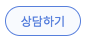

# 고객 분석하기

## 챗봇 사용량 확인하기

화면 좌측의 **DASHBOARD &gt; 개요** 메뉴에서는 기본적인 챗봇 사용량에 대한 통계 수치들을 확인할 수 있습니다. 

통계 지표들은 실시간으로 갱신되는 것은 아니기 때문에, 사용자 수나 메시지 수가 즉각 반영되지 않을 가능성이 있습니다. 만약 수치가 변경되지 않는다면 시간이 조금 지난 후에 새로고침을 시도해 보세요.

그럼, 제공되는 지표들을 참고하여 챗봇의 고객 유지 전략들을 다각도에서 수립해 보세요!

## 실시간 대화 모니터링

CLOSER Builder 에서 제작한 챗봇의 대화는 CLOSER Chat 에서 실시간으로 확인할 수 있습니다.  
화면 오른쪽 상단에 위치한   버튼을 클릭해보세요. 바로 CLOSER Chat 으로 이동하실 수 있습니다.



## 더 알아보기

기존 제공되는 통계 지표만으로는 고객 분석에 대한 요구사항을 충족할 수 없나요?   
CLOSER 에서는 원하는 지표를 직접 수집하여 분석하실 수 있도록 **커스텀 통계 대시보드 솔루션**을 오픈소스로 제공합니다. [CLOSER Webhook 연동 가이드 문서 하단의 이벤트 대시보드 항목](../../developer/closer-webhook.md#samples-closer-event-dashboard)을 참고해주세요.



