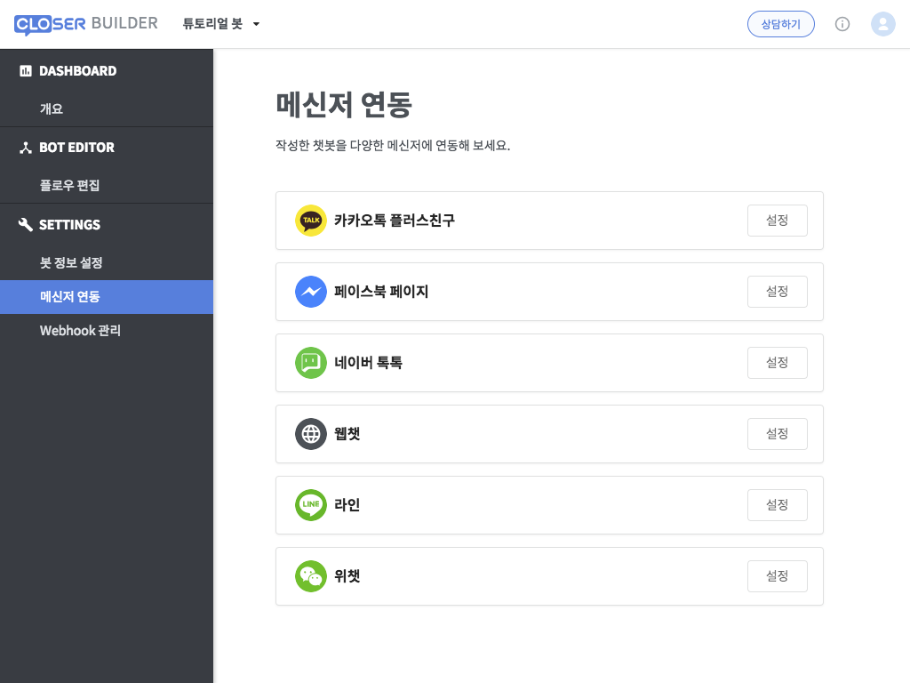
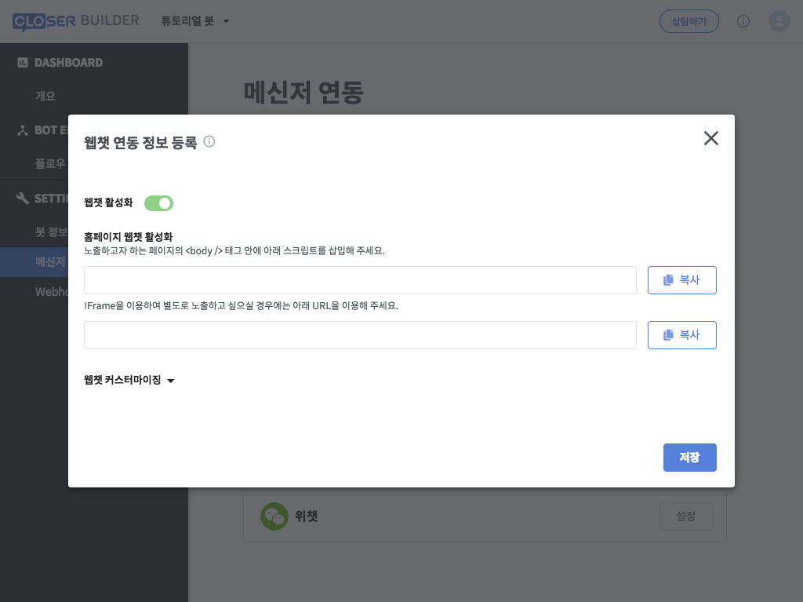
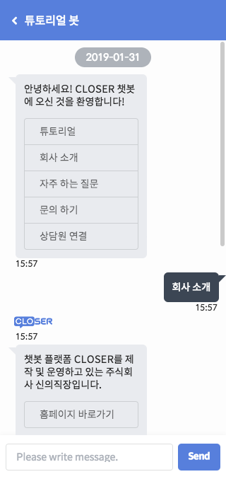

# 메신저에 연동하기

## 메신저 연동하기 

CLOSER Builder 웹 앱의 화면 좌측 메뉴에 보이는 **SETTINGS &gt; 메신저 연동** 항목을 클릭하시면 메신저 연동 설정 화면으로 진입할 수 있습니다.

카카오톡 플러스친구나 페이스북 페이지, 네이버 톡톡 등 실제 메신저에 연결하기 위해서는 각 메시징 채널에서 제공하는 비즈니스 계정이 필요합니다. 따라서 여기서는 간단하게 웹 페이지\(홈페이지\)에 챗봇을 삽입하는 연동 방법 대해 알아보도록 하겠습니다. 

웹 페이지 연동을 설정하시려면 우선  항목 우측의 **설정** 버튼을 클릭하신 뒤 나타나는 설정 창에서 웹챗 활성화 스위치를 \(ON\) 으로 변경해주세요. 연동 설정이 완료되었다면 웹챗 연동을 위한 HTML script 혹은 Iframe URL을 확인할 수 있습니다.

빠르게 챗봇 동작을 테스트해보기 위해서, 제공된 iframe URL을 새로운 브라우저 창에서 접속해 보도록 합시다.

웹페이지 연동 시의 화면은 대화 테스트의 화면과 크게 차이가 없으나, 이 때 챗봇 이용 고객은 **실제 사용자로 집계**됩니다.

실제 사용자의 경우에는 통계 페이지에서 고객 사용량 수치가 반영되며, CLOSER Chat에서 실제 대화 내용을 확인할 수 있게 됩니다.

## 메신저 연동 해제하기 

설정한 채널의 연동 스위치를 \(OFF\) 로 변경해 주시면 해당 채널에서의 챗봇 서비스가 중단됩니다.  
연동을 일시적으로 중지하는 것이 아니라 저장된 설정값을 제거하시려면 우측의 제거 버튼을 이용해주세요.

## 더 알아보기

실제로 보유하고 계신 채팅 프로필이 있으신가요?   
채팅 프로필에 챗봇을 연동하는 방법은 다음 문서를 통해 확인해주세요.



