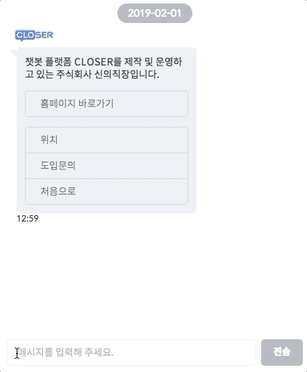

# 챗봇 편집하기

## 편집화면 알아보기 

지금까지 안내를 잘 따라오셨다면 위와 같은 화면을 마주하고 계실 거에요.   
아직 많은 것들이 생소하실거라 예상되기에 위 화면상에 보이는 플로우를 간단히 설명해드리도록 할게요. 

1. 처음 진입 시 **"챗봇 시작 시 노출되는 환영 메시지입니다"** 라는 인삿말을 반환
2. 고객에게 \[**"튜토리얼", "회사 소개", ..., "상담원 연결"\] 의 5가지 선택지**를 노출하고 고객의 입력을 대기
3. 고객이 선택한 **선택지에 따라 각기 다른 역할을 수행하는 플로우\(시나리오\)로 이동** 

잘 모르시겠다구요? 그렇다면 우측 상단의  버튼을 눌러보세요. 챗봇이 실제로 어떻게 동작하는지 바로 확인해볼 수 있답니다.

챗봇 편집기와 구성요소에 대해 더 자세히 알아보시려면 하단 문서를 참고해주세요.



## 환영 메시지 수정하기 

먼저 챗봇의 환영 메시지를 수정해볼까요?   
진입 플로우의 두 번째에 위치한 **답변 반환 노드\(메시지 응답 노드\)**를 더블클릭하여 노드 편집창을 열어보도록 합시다.

노드를 더블클릭했을 때 화면 우측에 나타나는 창이 각 기능 별 노드의 설정을 수정하기 위한 **노드 편집창** 입니다.  
메시지 응답 노드에서는 **메시지 유형\(type\)**과 **메시지 내용 \(text\)**을 설정할 수 있는데요, 지금은 우선 환영 메시지의 텍스트만 변경해보도록 합시다.

수정된 챗봇 동작을 확인하기 위해서는 수정사항을 저장해야 되겠죠?   
편집기 우측 상단의버튼을 누른 후 다시 를 수행해보도록 합시다. 

위와 같이 환영 메시지가 변경되었다면 성공입니다!

## 플로우 알아보기 

챗봇을 테스트하시면서 **플로우 연결 노드** 를 통해 다른 플로우로 이동하여 답변이 생성되는 모습을 발견하셨을 거에요.   
\(혹시 아직 확인하지 못하셨나요? 대화 테스트를 눌러 다른 선택지들을 클릭해 보세요.\) 그렇다면 다른 답변들은 어디서 등장한 걸까요?

정답은 다른 플로우에 존재한다 입니다. 지금까지 보아온 노드들은 시작 플로우\(Entry Flow\)에 존재하는 노드들에 불과했는데요, 이제 다른 플로우에 대해서도 한 번 알아보도록 합시다. 우선 화면 좌측의 플로우 목록을 주목해 주세요.

각 플로우마다 해당하는 시나리오가 분리되어 작성되어 있는 모습을 확인하셨나요?   
여기서 눈썰미가 좋은 사용자라면 두 가지 특별한 플로우가 존재한다는 것을 알아차리셨을 겁니다. 그 두 가지 플로우는 각각 아이콘이 옆에 붙어있으며, **시스템 플로우**라고 불립니다. 이들은 챗봇 동작 과정에서 중요한 역할을 담당합니다.

### 시스템 플로우 

* **시작 플로우**  
  * 챗봇의 시나리오가 시작되는 플로우입니다. 시작 플로우에 작성된 첫 번째 메시지는 고객이 처음 방문했을 때 환영 메시지로서 동작합니다. 
* **폴백 플로우**  
  * 챗봇이 올바른 시나리오\(노드\)를 찾지 못하였을 때 빠지게 되는\(Fallback\) 플로우입니다. 고객이 선택지 외의 입력을 하였을 때 혹은 특정 노드에서 진행할 다음 노드가 존재하지 않을 때 이용됩니다.
  * 폴백 플로우가 등록되어 있지 않다면 시작 플로우로 이동하게 됩니다.

역시 설명만으로는 이해하기 힘들죠? 어디 한 번 시작 플로우와 폴백 플로우를 변경해봅시다.

플로우 목록의 플로우 항목 위에서 **마우스 오른쪽 버튼을 클릭**하면 플로우에 대한 **컨텍스트 메뉴**가 나타납니다. 여기서 원하는 플로우를 **시작 플로우로 지정**하신 후  버튼을 다시 눌러 봅시다. 환영 메시지가 달라진 것이 보이시죠?

폴백 플로우 기능은 지정된 선택지 외의 다른 입력을 제출해 보시면 쉽게 확인해볼실 수 있습니다. 제공된 선택지에 없는 다른 메시지를 입력해 보세요.

여기까지 잘 따라오셨다면 CLOSER 챗봇이 플로우와 노드를 어떻게 사용하는지 알게 되셨을 거에요. 이제 튜토리얼 챗봇의 내용을 토대로 고객님께서 원하는 동작을 수행하도록 수정해보세요!

## 더 알아보기 

CLOSER 챗봇은 기능 수행 단위인 노드들을 유기적으로 배치하고 연결함으로서 동작하게 됩니다.   
각각의 노드들이 어떠한 역할을 수행하는지 알아보고, 원하는 동작을 구현하기 위해서 어떤 노드를 어떻게 구성하여야 하는지 다음 문서들을 통해 더 자세히 알아보세요.





