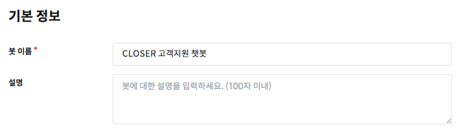
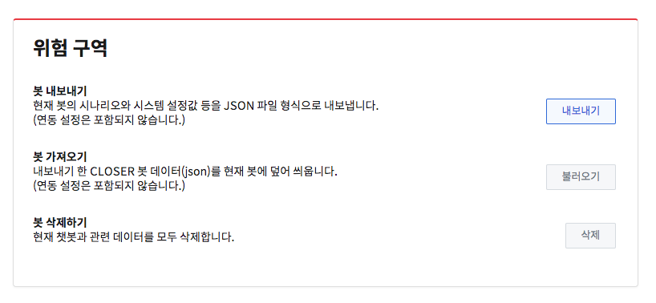

# 봇 정보 설정

## 기본 정보 설정 

기본 설정에서는 챗봇 이름과 챗봇에 대한 설명을 작성할 수 있습니다.

이름과 설명은 챗봇 목록 화면에서 챗봇을 구분하기 위한 용도로 사용되며, [웹사이트 채팅 연동](../messenger-integrations/web.md) 시 제목과 설명의 기본값으로도 사용됩니다. 

## 위험 구역 

위험 구역의 설정에서는 현재 챗봇 데이터를 덮어씌우거나 삭제하는 기능을 제공합니다. 이 때, 봇 내보내기 / 불러오기에 포함되는 설정은 다음과 같습니다.

* [챗봇 기본 정보](bot-settings.md) \(제목 및 설명\)
* 플로우 상태
* [환영 메시지 동작](../chatbot/system-response.md) 설정 / [시스템 메시지](../chatbot/system-response.md#undefined-1) 설정
* [잠재고객](../audience.md) 테이블 설정

포함되지 않는 설정들은 다음과 같습니다.

* [저장된 버전](versions.md) 
* [메신저 연동](../messenger-integrations/) 설정
* [Webhook](webhook.md) 설정


봇 정보 설정에서 사용되는 내보내기 / 불러오기 기능은 [버전 관리](versions.md)시 이용되는 값과는 다르게 **잠재고객 테이**블 / **챗봇 기본 정보** 설정이 추가로 적용됩니다.


