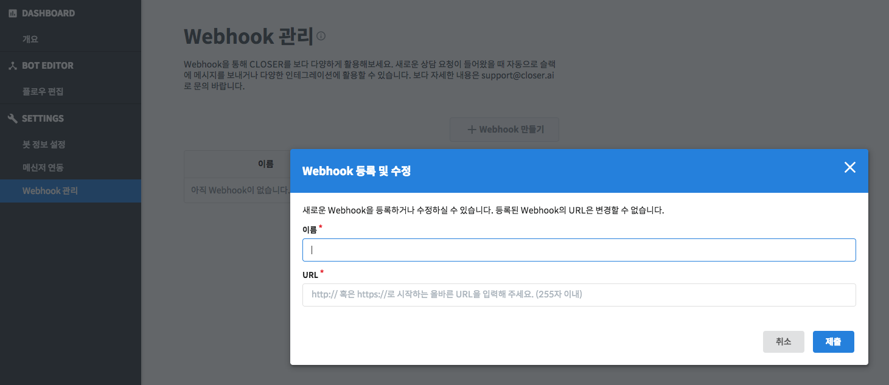
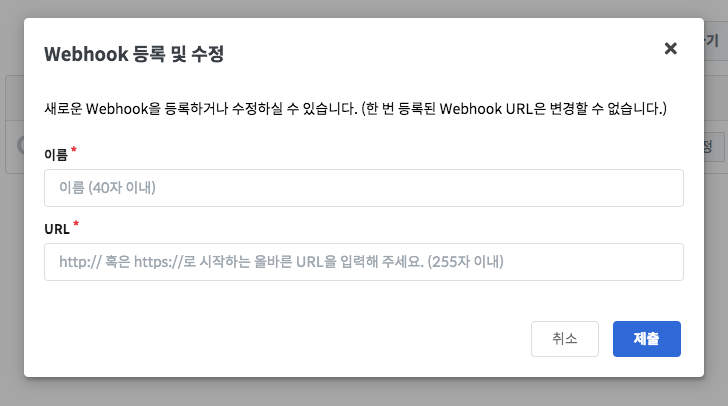

# Webhook 관리

**Webhook\(웹훅\)** 이란 웹 서비스에서 발생하는 이벤트 또는 데이터를 외부에 전달하는 방법 중 하나입니다. CLOSER에서는 고객 획득, 고객 메시지 수신, 고객 이탈 등의 이벤트를 Webhook으로 제공하고 있으며, 이벤트를 수신하여 통계 서버 또는 커스텀 푸시 메시지 채널 등에 연계하여 사용하실 수 있습니다.  

## 설정 방법

Webhook 등록하기 버튼을 클릭하면 새로운 Webhook 등록을 위한 양식이 표시됩니다. 

* **이름**: Webhook 관리 화면에서 각각의 Webhook을 구분하기 위한 사용자 정의 이름입니다. \(필수\)
* **URL**: Webhook 을 수신할 서버의 URL을 입력합니다. \(필수\)

Webhook 연동을 위해서는 CLOSER 에서 전송하는 Webhook 데이터를 받아 HTTP 200 StatusCode을 반환하는 웹 서버가 필요합니다. Webhook 데이터 양식은 아래 연동 가이드 문서를 참고해주세요.




등록하신 Webhook URL이 비정상적인 답변을 반환하는 경우 \(404 등\) 30분간 최대 3회 재전송을 시도하며, 이후에도 오류가 발생하면 Webhook 설정이 자동으로 비활성화 됩니다.


## 활용 예제 

### CLOSER 이벤트 대시보드 

CLOSER에서는 webhook event를 수집하고 시각화하는 이벤트 통계 대시보드를 오픈소스로 제공하고 있습니다. 아래 GitHub Repository를 확인해주세요.

* [https://github.com/sini-company/closer-event-dashboard](https://github.com/sini-company/closer-event-dashboard)

