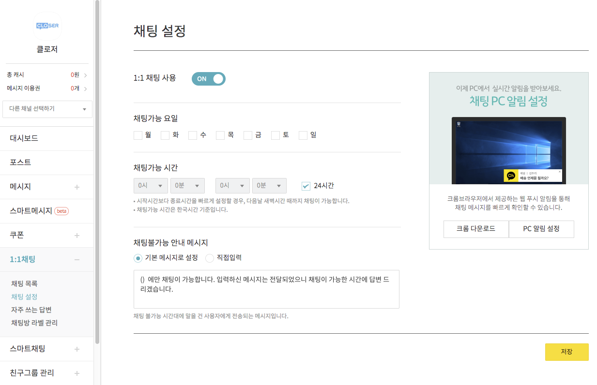
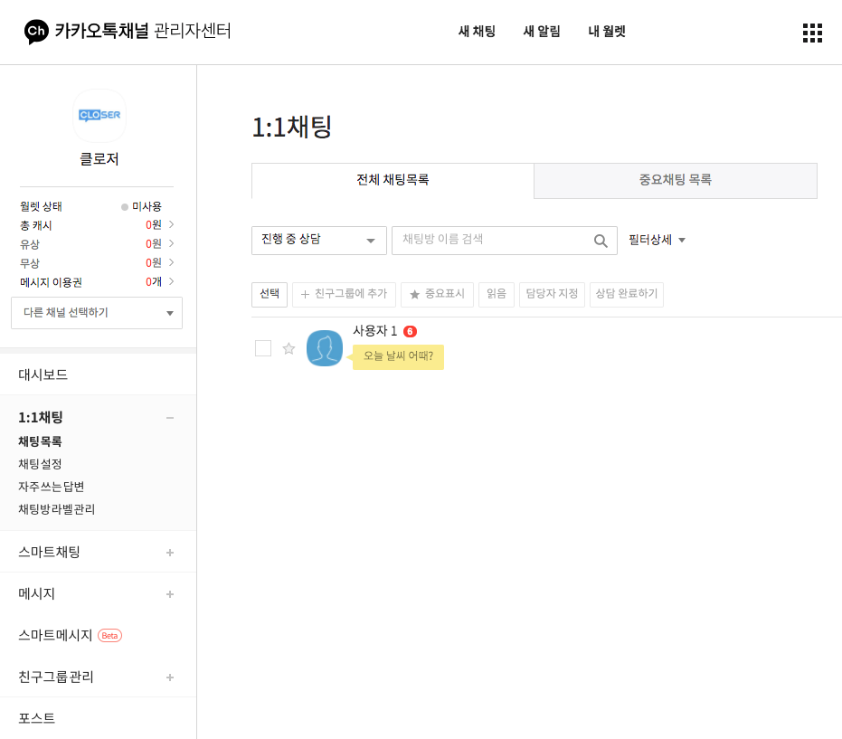

# 카카오톡 연동

## 시작하기 전에    

카카오톡채널 계정에 챗봇을 연동하는 방법은 두 가지가 있습니다.

* 카카오 i 오픈빌더 \(현재\)
* API형 스마트채팅 \(구, **신규가입 불가**\)

API형 스마트채팅은 과거에 제공되던 방식으로, 2020년 현재 서비스가 중단되었습니다. 

> API형 스마트채팅 신규 등록 중단 안내  
> [https://center-pf.kakao.com/notices/233](https://center-pf.kakao.com/notices/233)


기존 API형 스마트채팅을 카카오 i 오픈빌더로 전환하고 싶으신가요? 아래 서비스를 이용해 보세요!  
[https://kakao.closer.ai](https://kakao.closer.ai)


### 요구사항 

활성화된 카카오톡 플러스친구 계정이 필요합니다.  
카카오톡 플러스친구 서비스는 비지니스를 위한 카카오톡 계정 생성 서비스로서, 1:1 채팅이나 마케팅 메시지 전송 등 비즈니스에 필요한 기능들을 제공합니다. 플러스친구 계정을 생성하려면 아래 카카오 for 비즈니스 홈페이지를 이용해 주세요.

* 카카오 for 비즈니스 홈페이지: [https://business.kakao.com/](https://business.kakao.com/)
* 카카오톡 플러스친구 FAQ: [https://cs.kakao.com/helps?category=29&locale=ko&service=8](https://cs.kakao.com/helps?category=29&locale=ko&service=8)

## 카카오 i 오픈빌더 연동    

다음 문서를 참고하여 연동을 진행해주세요.

> [https://bit.ly/2w6h69h](https://bit.ly/2w6h69h)

## 상담 연계 

카카오톡에서의 상담은 ① 카카오톡채널 관리자센터의 1:1 채팅 기능과 ② 카카오톡 상담톡을 이용하는 두 가지 방식이 존재합니다.

### 카카오톡채널 1:1 채팅

카카오톡채널 1:1채팅은 카카오톡채널 관리자센터에서 제공하는 1:1 대화 기능으로, 위 설정 페이지에서 1:1채팅을 사용 설정하시면 고객이 언제든 챗봇에서 1:1채팅으로 전환하여 대화를 시작할 수 있습니다.

* 카카오톡채널 관리자센터: [https://center-pf.kakao.com/](https://center-pf.kakao.com/)
* 카카오톡채널 관리자용 모바일 어플리케이션: [안드로이드](https://play.google.com/store/apps/details?id=com.kakao.yellowid&hl=ko), [아이폰](https://apps.apple.com/kr/app/%EC%B9%B4%EC%B9%B4%EC%98%A4%ED%86%A1-%EC%B1%84%EB%84%90-%EA%B4%80%EB%A6%AC%EC%9E%90/id990571676)


카카오톡채널 1:1채팅을 통해 주고받은 메시지는 카카오톡 외부로 제공되지 않습니다.  
따라서 **CLOSER에서 대화를 확인하실 수 없으며**, [**CLOSER Chat**](../../chat/about/)**을 통한 상담도 불가능**합니다.


### 카카오톡 상담톡

> [https://business.kakao.com/info/bizmessage/](https://business.kakao.com/info/bizmessage/)

카카오톡 상담톡은 카카오톡에서 기업 대상으로 판매하는 고객센터 구축용 상품으로, 상담톡에 가입하여 이용하시면 [CLOSER Chat](../../chat/about/)을 통한 상담을 진행하실 수 있습니다.

CLOSER는 현재 루나소프트와 협업하여 상담톡을 제공해드리고 있습니다.   
상담톡 신규 가입을 희망하신다면 아래 메일 주소로 상담톡 도입 문의를 남겨주세요.


상담톡 도입에 관심이 있는 경우, 다음 메일 주소로 문의해주세요.  
[support@closer.ai](mailto:support@closer.ai?subject=%5B%EC%B9%B4%EC%B9%B4%EC%98%A4%EC%83%81%EB%8B%B4%ED%86%A1%EC%8B%A0%EC%B2%AD%5D%20%ED%9A%8C%EC%82%AC%EB%AA%85&body=-%20%EA%B3%A0%EA%B0%9D%EC%82%AC%EB%AA%85%20%3A%0A-%20%EB%B0%9C%EC%8B%A0%ED%94%84%EB%A1%9C%ED%95%84%EB%AA%85%20%3A%0A-%20%EA%B3%A0%EA%B0%9D%EC%82%AC%20%EB%8C%80%ED%91%9C%EB%B2%88%ED%98%B8%20%3A%0A-%20%EA%B3%A0%EA%B0%9D%EC%82%AC%20%ED%99%88%ED%8E%98%EC%9D%B4%EC%A7%80%20URL%20%3A%0A-%20%EC%82%AC%EC%97%85%EC%9E%90%EB%93%B1%EB%A1%9D%EC%A6%9D%20%3A%20%28%EC%B2%A8%EB%B6%80%29)


