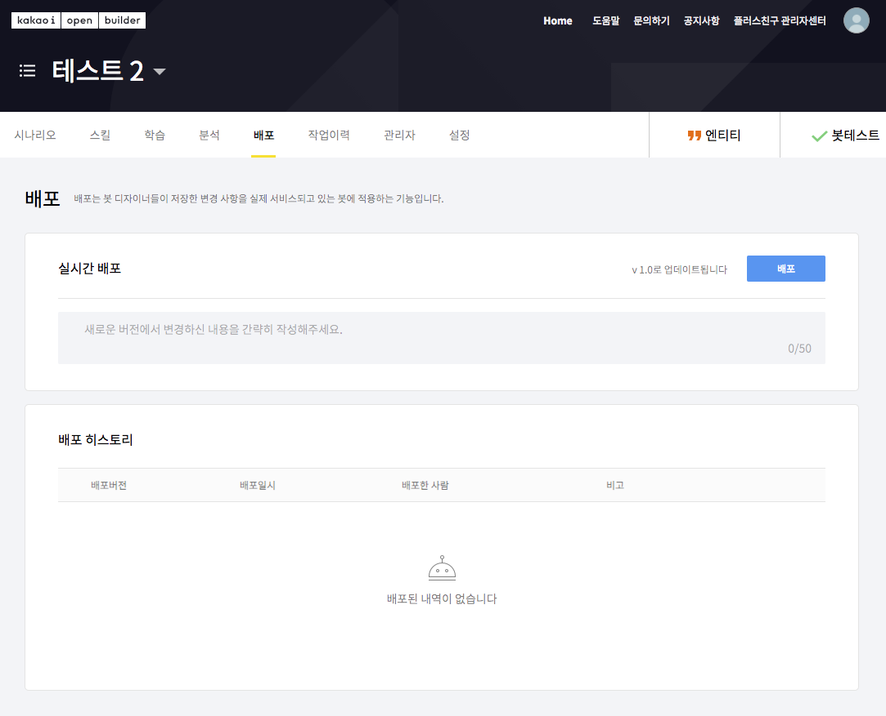

# 카카오톡 연동

## 시작하기 전에    

카카오톡채널 계정에 챗봇을 연동하는 방법은 두 가지가 있습니다.

1. **카카오 i 오픈빌더** \(현재\)
2. API형 스마트채팅 \(⚠️ 구버전, 현재 이용 불가\)

API형 스마트채팅은 2019년까지 제공되던 방식으로, 현재는 서비스가 중단되었습니다. 


기존 API형 스마트채팅을 카카오 i 오픈빌더로 전환하고 싶으신가요? 아래 서비스를 이용해 보세요!  
[https://kakao.closer.ai](https://kakao.closer.ai)


### 요구사항 

활성화된 카카오톡 플러스친구 계정이 필요합니다.  
카카오톡 플러스친구 서비스는 비지니스를 위한 카카오톡 계정 관리 서비스로서, 1:1 채팅이나 마케팅 메시지 전송 등 비즈니스에 필요한 기능들을 제공합니다. 플러스친구 계정을 생성시려면 아래 카카오 for 비즈니스 홈페이지를 이용해 주세요.

* 카카오 for 비즈니스 홈페이지: [https://business.kakao.com/](https://business.kakao.com/)
* 카카오톡 플러스친구 FAQ: [https://cs.kakao.com/helps?category=29&locale=ko&service=8](https://cs.kakao.com/helps?category=29&locale=ko&service=8)

## 카카오 i 오픈빌더 연동     

**카카오 i 오픈빌더**는 카카오의 인공지능 플랫폼 **카카오 i** 의 기술을 활용해 카카오톡 플러스친구 챗봇부터 카카오미니 스피커봇까지 설계할 수 있는 개발 플랫폼입니다.  
CLOSER에서는 카카오 i 오픈빌더의 [스킬](https://i.kakao.com/openbuilder/docs/guide/skill.html) 기능을 통해 챗봇 연동을 제공합니다.

* 카카오 i 오픈빌더 홈페이지: [https://i.kakao.com/openbuilder](https://i.kakao.com/openbuilder/docs/index.html)
* 카카오 i 오픈빌더 소개글: [https://brunch.co.kr/@openbuilder/2](https://brunch.co.kr/@openbuilder/2)
* 카카오 i 오픈빌더 도움말: [https://i.kakao.com/openbuilder/docs/index.html](https://brunch.co.kr/@openbuilder/2)

### 1. 오픈빌더 봇 생성

카카오 i 오픈빌더 홈페이지\([https://i.kakao.com/openbuilder](https://i.kakao.com/openbuilder/docs/index.html)\) 로그인하시면 위와 같은 화면을 확인할 수 있습니다. **플러스친구 챗봇 만들기** 버튼을 클릭해 주세요.

우측 상단의 +버튼을 눌러 카카오톡 챗봇을 생성할 수 있습니다.

### 2. 오픈빌더 봇 설정

CLOSER 챗봇 연동은 오픈빌더의 스킬 기능을 이용하여 이루어집니다.  
상단 **스킬 메뉴**를 클릭하여 스킬 설정 화면으로 진입해 주세요.

스킬 설정 화면으로 진입하셨다면, 우측 상단의 **생성** 버튼을 눌러 주세요.

* **스킬명**: 관리 용이성을 위해 **CLOSER**를 입력해주세요. 다른 이름을 입력하셔도 문제는 없습니다.
* **URL**: CLOSER에서 제공받은 스킬 연동 URL을 입력해 주세요. \(예: `https://bot-api.closer.ai/webhook/kakao/[botId]/i/skill`\)
* 설명, 기본 스킬로 설정, 헤더값 입력이나, 변환함수 설정 등은 입력하지 않으셔도 됩니다
* Test URL에는 실제 연동되는 API가 아닌 테스트용 API를 등록하는 곳으로서, 다른 봇을 테스트하는게 아니라면 입력하지 않으셔도 됩니다.


변환함수 설정은 카카오 i 오픈빌더에서 CLOSER로 보내는 요청을 변환시킵니다.  
어떤 결과를 초래하는지 모르신다면 비워두세요.


위 설정대로 값을 입력하신 후 오른쪽 상단의 **저장** 버튼을 눌러 주세요.  
스킬이 성공적으로 저장되면 기본 정보 항목에 스킬 버전과 업데이트 일자, 등록자 등의 정보가 표시됩니다.

이제 **시나리오** 메뉴를 클릭하여 시나리오 설정 화면으로 진입합니다.

CLOSER에서는 기본 블록 중 두 가지 블록을 설정합니다.

* **웰컴 블록**: 오픈빌더 챗봇이 처음 대화방에 입장한 사용자에게 환영 메시지를 반환하는 블록
* **폴백 블록**: 오픈빌더 챗봇이 시나리오 상에서 적절한 응답을 찾지 못했을 때 진행하는 블록 \(※ 오픈빌더에서 설정한 스킬이나 블록 등의 시나리오를 찾지 못하였을 때를 의미합니다.\)

우선 폴백 블록을 클릭하여 폴백 블록 설정 화면으로 이동해 주세요.

폴백 블록의 초기 설정은 위 스크린샷과 같이 "무엇을 원하는지 잘 모르겠어요", "이해하기 어려워요" 등의 메시지를 반환하도록 설정되어 있습니다.  
이제 이 메시지를 CLOSER에서 처리하도록 앞서 생성한 CLOSER 스킬을 연결합니다.

* 우측의 **파라미터 설정** 스위치를 눌러 스킬 기능을 활성화합니다.  이후 나타나는 스킬 드롭다운 메뉴에서 앞서 생성한 CLOSER 스킬을 연결합니다.
* **응답 추가** 설정 메뉴에서 **스킬데이터로 사용**을 눌러 스킬을 통해 메시지를 반환하도록 설정합니다.

위 설정을 성공적으로 마치셨다면 아래와 같은 화면을 확인할 수 있습니다.

이제 저장 버튼을 누르고, 블록 목록으로 돌아가 **웰컴 블록**에도 같은 설정을 적용해 줍니다.


오픈빌더 봇 시나리오에 다른 블록들이 설정되어 있는 경우, 특정 시나리오에서 CLOSER로 전달되는 맥락이 유실되어 챗봇 동작에 문제가 생길 수 있습니다.  
가급적이면 봇 시나리오를 웰컴 블록과 폴백 블록으로만 구성해주시는게 좋습니다.


### 3. 오픈빌더 봇 테스트

오픈빌더 봇에 **CLOSER 스킬을 설정**하였고**, 웰컴 블록과 폴백 블록에 CLOSER 스킬을 설정**하는 과정을 마쳤으면 실제 봇 동작을 테스트할 수 있습니다.

오픈빌더 화면 우측 상단의 **봇테스트**를 누르면 아래와 같이 **봇테스트 기능**을 사용할 수 있습니다.

봇 테스트의 대화 입력 공간에 메시지를 입력해 실제 동작을 확인해 보세요.  
연동이 성공적으로 이루어졌다면 아래와 같이 입력한 발화와 출력값을 확인할 수 있습니다.


CLOSER에서는 테스트 요청에 대해서는 대화 정보를 보관하지 않기 때문에 대화가 설정한 시나리오대로 진행되지 않을 수도 있습니다.


### 4. 오픈빌더 봇 배포

이제 설정하신 챗봇이 플러스친구 계정을 통해 동작하도록 배포를 진행할 차례입니다.  
상단의 **배포** 메뉴를 클릭하여 배포 화면으로 이동하신 후에, 우측에 존재하는 **배포** 버튼을 눌러주세요. 배포가 완료된 이후에는 연결된 플러스친구를 통해 챗봇 동작을 확인하실 수 있으며, **웰컴 블록**을 설정하셨다면 최초 대화방에 진입 시 환영 메시지 동작을 확인할 수 있습니다.


현재 카카오 i 오픈빌더에서 웰컴 블록을 통한 환영 메시지 동작은 계정당 최초 1회만 동작합니다.  
대화방을 나가거나 친구 삭제 후 다시 대화를 걸어도 한 번 환영 메시지를 수신한 사용자들에게는 다시 환영 메시지가 출력되지 않습니다.  


## 상담 연계 

카카오톡에서의 상담은 ① 카카오톡채널 관리자센터의 1:1 채팅 기능과 ② 카카오톡 상담톡을 이용하는 두 가지 방식이 존재합니다.

### 카카오톡채널 1:1 채팅

카카오톡채널 1:1채팅은 카카오톡채널 관리자센터에서 제공하는 1:1 대화 기능으로, 위 설정 페이지에서 1:1채팅을 사용 설정하시면 고객이 언제든 챗봇에서 1:1채팅으로 전환하여 대화를 시작할 수 있습니다.

* 카카오톡채널 관리자센터: [https://center-pf.kakao.com/](https://center-pf.kakao.com/)
* 카카오톡채널 관리자용 모바일 어플리케이션: [안드로이드](https://play.google.com/store/apps/details?id=com.kakao.yellowid&hl=ko), [아이폰](https://apps.apple.com/kr/app/%EC%B9%B4%EC%B9%B4%EC%98%A4%ED%86%A1-%EC%B1%84%EB%84%90-%EA%B4%80%EB%A6%AC%EC%9E%90/id990571676)


카카오톡채널 1:1채팅을 통해 주고받은 메시지는 카카오톡 외부로 제공되지 않습니다.  
따라서 **CLOSER에서 대화를 확인하실 수 없으며**, [**CLOSER Chat**](../../chat/about/)**을 통한 상담도 불가능**합니다.


### 카카오톡 상담톡

> [https://business.kakao.com/info/bizmessage/](https://business.kakao.com/info/bizmessage/)

카카오톡 상담톡은 카카오톡에서 기업 대상으로 판매하는 고객센터 구축용 상품으로, 상담톡에 가입하여 이용하시면 [CLOSER Chat](../../chat/about/)을 통한 상담을 진행하실 수 있습니다.

CLOSER는 현재 [루나소프트](https://lunasoft.co.kr/home/main/page/main/index)와 협업하여 상담톡을 제공해드리고 있습니다.   
상담톡 신규 가입을 희망하신다면 아래 메일 주소로 상담톡 도입 문의를 남겨주세요.


상담톡 도입에 관심이 있는 경우, 다음 메일 주소로 문의해주세요.  
[support@closer.ai](mailto:support@closer.ai?subject=%5B%EC%B9%B4%EC%B9%B4%EC%98%A4%EC%83%81%EB%8B%B4%ED%86%A1%EC%8B%A0%EC%B2%AD%5D%20%ED%9A%8C%EC%82%AC%EB%AA%85&body=-%20%EA%B3%A0%EA%B0%9D%EC%82%AC%EB%AA%85%20%3A%0A-%20%EB%B0%9C%EC%8B%A0%ED%94%84%EB%A1%9C%ED%95%84%EB%AA%85%20%3A%0A-%20%EA%B3%A0%EA%B0%9D%EC%82%AC%20%EB%8C%80%ED%91%9C%EB%B2%88%ED%98%B8%20%3A%0A-%20%EA%B3%A0%EA%B0%9D%EC%82%AC%20%ED%99%88%ED%8E%98%EC%9D%B4%EC%A7%80%20URL%20%3A%0A-%20%EC%82%AC%EC%97%85%EC%9E%90%EB%93%B1%EB%A1%9D%EC%A6%9D%20%3A%20%28%EC%B2%A8%EB%B6%80%29)


