# 카카오톡

## 유의사항  

카카오톡 플러스친구 계정에 챗봇을 연동하는 방법은 두 가지가 있습니다.

* 카카오 i 오픈빌더 연동 \(신규, 권장\)
* API형 스마트채팅 연동 \(레거시\)

카카오 i 오픈빌더 카카오의 인공지능 플랫폼 도입과 함께 새로 공개된 챗봇 개발 플랫폼으로, 2018년 12월 3일 이후 일반 사용자에게 공개됩니다.

API형 스마트채팅은 기존 플러스친구 사용자에게 제공되던 방식으로, 2018년 12월 3일 이후 신규 가입이 중단됩니다.   
서비스는 기존에 등록한 사용자들에 한해 19년 12월까지만 제공되며, 이후에는 서비스 또한 완전히 종료됩니다.

> API형 스마트채팅 신규 등록 중단 안내  
> [https://center-pf.kakao.com/notices/233](https://center-pf.kakao.com/notices/233)

새로 카카오톡 챗봇을 연동하고자 하시는 고객님들께서는 카카오 i 오픈빌더 연동 방법을 이용해주시기 바랍니다.


기존 API형 스마트채팅을 카카오 i 오픈빌더로 전환하고 싶으신가요? 아래 서비스를 이용해 보세요!  
[https://kakao.closer.ai](https://kakao.closer.ai)


## 사전 요구사항  

활성화된 카카오톡 플러스친구 계정이 필요합니다.  
카카오톡 플러스친구 서비스는 비지니스를 위한 카카오톡 계정 생성 서비스로서, 1:1 채팅이나 마케팅 메시지 전송 등 비즈니스에 필요한 기능들을 제공합니다. 플러스친구 계정을 생성하려면 아래 카카오 for 비즈니스 홈페이지를 이용해 주세요.

* 카카오 for 비즈니스 홈페이지: [https://business.kakao.com/](https://business.kakao.com/)
* 카카오톡 플러스친구 FAQ: [https://cs.kakao.com/helps?category=29&locale=ko&service=8](https://cs.kakao.com/helps?category=29&locale=ko&service=8)

## 카카오 i 오픈빌더 연동   

**카카오 i 오픈빌더**는 카카오의 인공지능 플랫폼 **카카오 i** 의 기술을 활용해 카카오톡 플러스친구 챗봇부터 카카오미니 스피커봇까지 설계할 수 있는 개발 플랫폼입니다.  
CLOSER에서는 카카오 i 오픈빌더의 [스킬](https://i.kakao.com/openbuilder/docs/guide/skill.html) 기능을 통해 챗봇 연동을 제공합니다.

* 카카오 i 오픈빌더 홈페이지: [https://i.kakao.com/openbuilder](https://i.kakao.com/openbuilder/docs/index.html)
* 카카오 i 오픈빌더 소개글: [https://brunch.co.kr/@openbuilder/2](https://brunch.co.kr/@openbuilder/2)
* 카카오 i 오픈빌더 도움말: [https://i.kakao.com/openbuilder/docs/index.html](https://brunch.co.kr/@openbuilder/2)

### 1. 오픈빌더 봇 생성

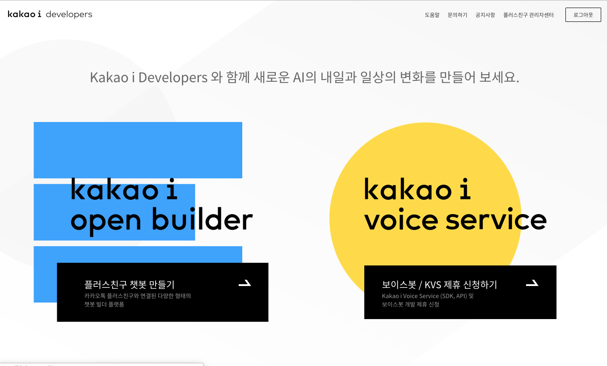

카카오 i 오픈빌더 홈페이지\([https://i.kakao.com/openbuilder](https://i.kakao.com/openbuilder/docs/index.html)\)  로그인하시면 위와 같은 화면을 확인할 수 있습니다. **플러스친구 챗봇 만들기** 버튼을 클릭해 주세요.

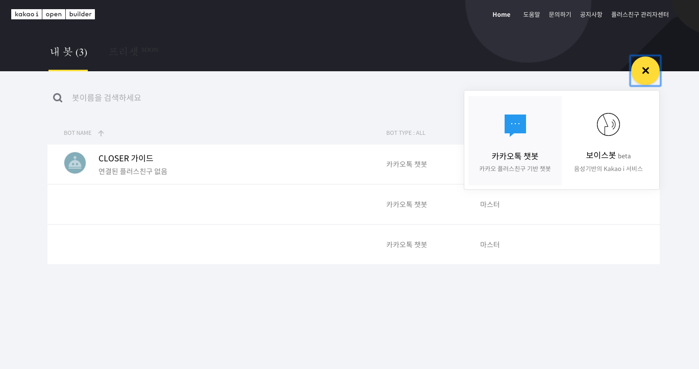

우측 상단의 +버튼을 눌러 카카오톡 챗봇을 생성할 수 있습니다.

### 2. 오픈빌더 봇 설정

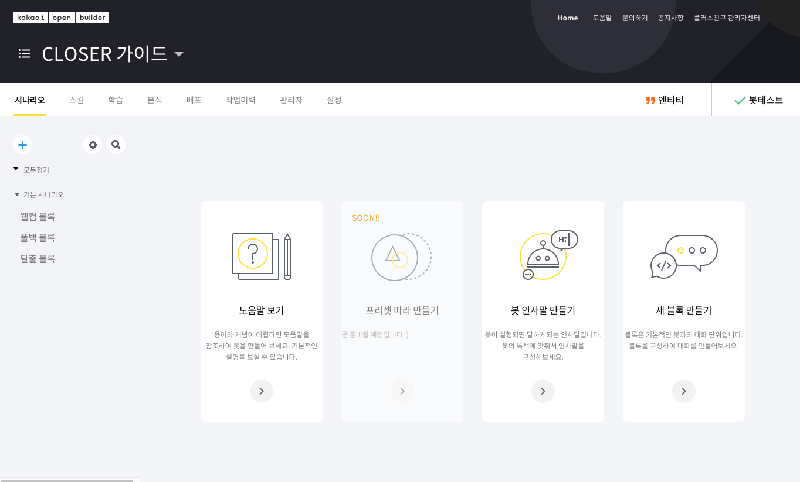

CLOSER 챗봇 연동은 오픈빌더의 스킬 기능을 이용하여 이루어집니다.  
상단 **스킬 메뉴**를 클릭하여 스킬 설정 화면으로 진입해 주세요.

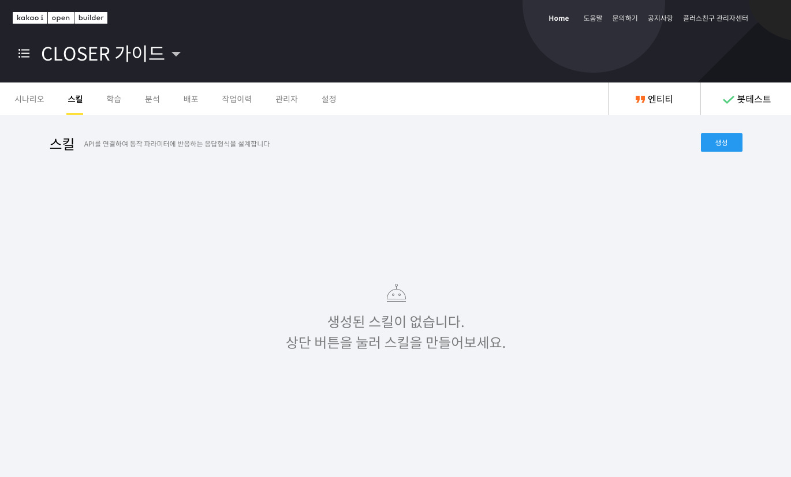

스킬 설정 화면으로 진입하셨다면, 우측 상단의 **생성** 버튼을 눌러 주세요.

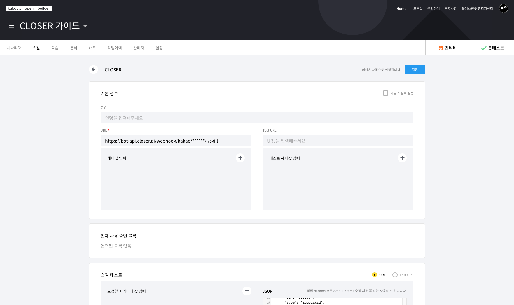

* **스킬명**: 관리 용이성을 위해 **CLOSER**를 입력해주세요. 다른 이름을 입력하셔도 문제는 없습니다.
* **URL**: CLOSER에서 제공받은 스킬 연동 URL을 입력해 주세요. \(예: `https://bot-api.closer.ai/webhook/kakao/[botId]/i/skill`\)
* 설명, 기본 스킬로 설정, 스킬 파라미터 설정, 변환함수 설정 등은 입력하지 않으셔도 됩니다.


변환함수 설정은 카카오 i 오픈빌더에서 CLOSER로 보내는 요청을 변환시킵니다.  
어떤 동작이 수행되는지 모르신다면 비워두시는게 좋습니다.


위 설정대로 값을 입력하신 후 오른쪽 상단의 **저장** 버튼을 눌러 주세요.  
스킬이 성공적으로 저장되면 기본 정보 항목에 스킬 버전과 업데이트 일자, 등록자 등의 정보가 표시됩니다.

이제 **시나리오** 메뉴를 클릭하여 시나리오 설정 화면으로 진입합니다.

CLOSER에서는 기본 블록 중 두 가지 블록을 설정합니다.

* **웰컴 블록**: 챗봇이 처음 대화를 건 사용자에게 인삿말을 반환하는 블록
* **폴백 블록**: 챗봇이 적절한 응답을 찾지 못했을 때 반환하는 블록

우선 폴백 블록을 클릭하여 폴백 블록 설정 화면으로 이동해 주세요.

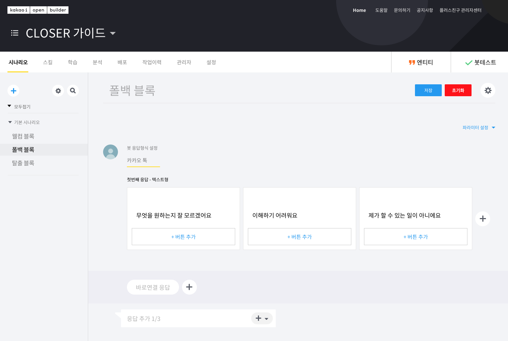

폴백 블록의 초기 설정은 위 스크린샷과 같이 "무엇을 원하는지 잘 모르겠어요", "이해하기 어려워요" 등의 메시지를 반환하도록 설정되어 있습니다.  
이제 이 메시지를 CLOSER에서 처리하도록 앞서 생성한 CLOSER 스킬을 연결합니다.

* 우측의 **파라미터 설정** 스위치를 눌러 스킬 기능을 활성화합니다.  이후 나타나는 스킬 드롭다운 메뉴에서 앞서 생성한 CLOSER 스킬을 연결합니다.
* **응답 추가** 설정 메뉴에서 **스킬데이터로 사용**을 눌러 스킬을 통해 메시지를 반환하도록 설정합니다.

위 설정을 성공적으로 마치셨다면 아래와 같은 화면을 확인할 수 있습니다.

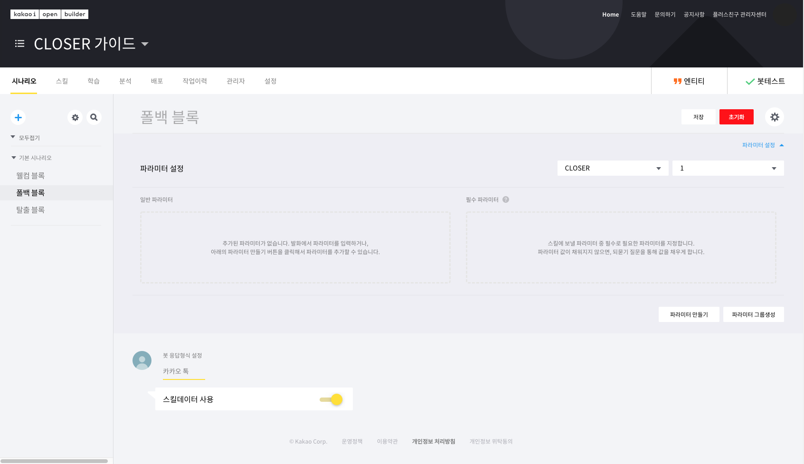

이제 저장 버튼을 누르고, 블록 목록으로 돌아가 **웰컴 블록**에도 같은 설정을 적용해 줍니다.


오픈빌더 봇 시나리오에 다른 블록들이 설정되어 있는 경우, 특정 시나리오에서 CLOSER로 전달되는 맥락이 유실되어 챗봇 동작에 문제가 생길 수 있습니다.  
가급적이면 봇 시나리오를 웰컴 블록과 폴백 블록으로만 구성해주시는게 좋습니다.


### 3. 오픈빌더 봇 테스트

오픈빌더 봇에 **CLOSER 스킬을 설정**하였고**, 웰컴 블록과 폴백 블록에 CLOSER 스킬을 설정**하는 과정을 마쳤으면 실제 봇 동작을 테스트할 수 있습니다.

오픈빌더 화면 우측 상단의 **봇테스트**를 누르면 아래와 같이 **봇테스트 기능**을 사용할 수 있습니다.

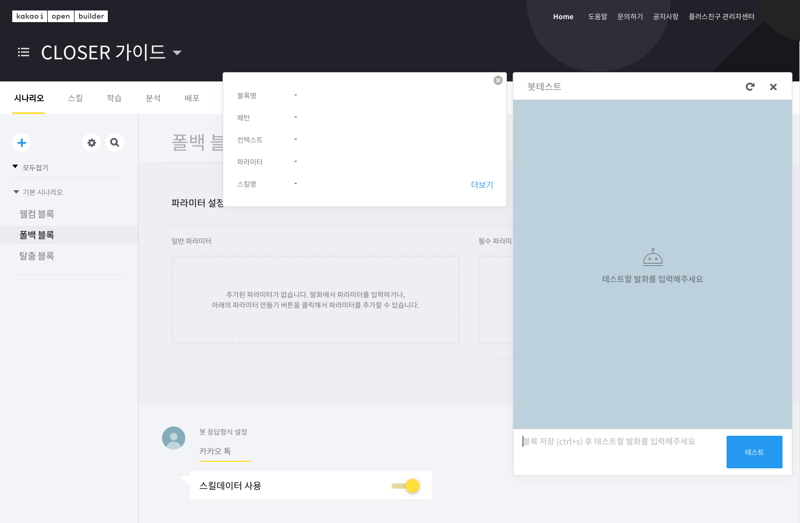

봇 테스트의 대화 입력 공간에 메시지를 입력해 실제 동작을 확인해 보세요.  
연동이 성공적으로 이루어졌다면 아래와 같이 입력한 발화와 출력값을 확인할 수 있습니다.

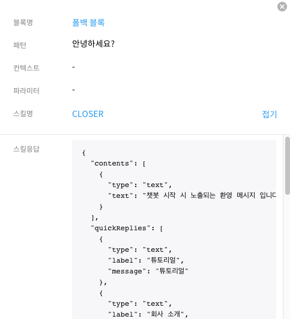

이제 챗봇을 **배포**하고 연결하신 플러스친구 계정을 통해 챗봇 동작을 확인해 보세요.  
플러스친구에 처음으로 __대화를 거는 경우 **웰컴 블록**을 통해 설정된 환영 메시지 동작을 확인할 수 있습니다.


현재 카카오 i 오픈빌더에서 웰컴 블록을 통한 환영 메시지 동작은 계정당 최초 1회만 동작합니다.  
대화방을 나가거나 친구 삭제 후 다시 대화를 걸어도 한 번 환영 메시지를 수신한 사용자들에게는 다시 환영 메시지가 출력되지 않습니다.  
\(2019년 11월 29일 최종 확인\)


## API형 스마트채팅 연동  

플러스친구 스마트채팅은 사용자의 메시지에 대해 정해진 답변을 제공하거나, API를 통해 답변을 생성할 수 있습니다. CLOSER에서는 API형 스마트채팅을 통 챗봇 연동을 제공합니다.

* 카카오톡 스마트채팅 FAQ: [https://cs.kakao.com/helps?category=285&locale=ko&service=102](https://cs.kakao.com/helps?category=285&locale=ko&service=102)
* API형 스마트채팅 연동 가이드: [https://github.com/plusfriend/auto\_reply](https://github.com/plusfriend/auto_reply)


API형 스마트채팅 서비스는 2018년 12월 3일 이후 신규 가입이 중단됩니다.  
기존에 등록한 사용자들에 한해 2019년 12월까지만 서비스가 제공되며, 이후에는 서비스가 종료됩니다.

새롭게 카카오톡 플러스친구에 챗봇을 연결하시려는 경우 카카오 i 오픈빌더 연동 방법을 이용하세요.


### 1. 스마트채팅 연동 설정

플러스친구 관리자 센터로 진입하여 보유하신 플러스친구 프로필을 선택합니다.

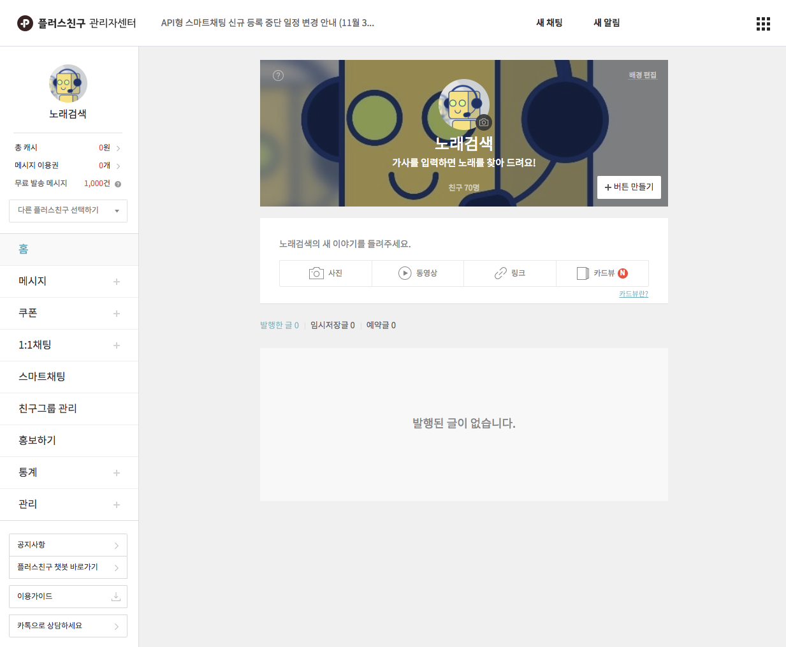

화면 좌측 스마트채팅 메뉴를 클릭해 스마트채팅 설정 화면으로 진입합니다.

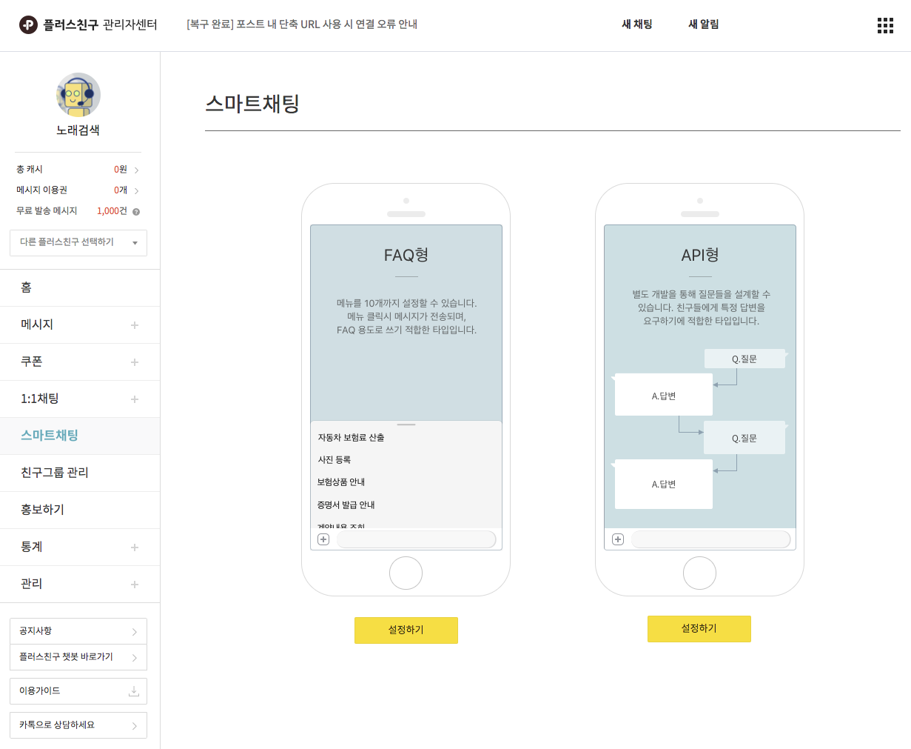

스마트채팅 설정 화면 우측의 API형 스마트채팅 하단에 있는 **설정하기** \(기존 설정이 존재하는 경우 ✏️ 아이콘\) 버튼을 클릭하여 API형 스마트채팅 설정 메뉴로 진입합니다.

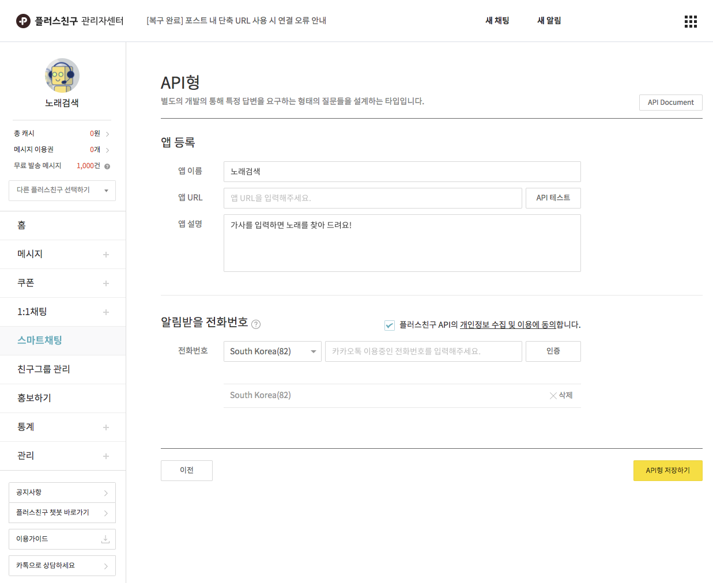

API형 스마트채팅 설정 화면으로 들어오셨다면, 아래 항목을 입력해주세요.

* **앱 URL**: CLOSER에서 제공한 API URL을 입력하세요.
* **알림받을 전화번호**: 챗봇 동작의 오류나 프로필 이용 정지 등의 알림을 수신할 전화번호를 설정합니다. 전화번호를 설정하지 않으면 API형 스마트채팅을 시작할 수 없습니다.
* 앱 이름과 앱 설명에는 원하시는 내용을 입력하세요. CLOSER 챗봇 동작과는 관계가 없습니다.

앱 URL 입력 후 **API 테스트** 버튼을 눌러 응답을 확인해 보세요. 연동이 제대로 이루어 진 경우 아래와 같이 테스트 결과가 출력됩니다.

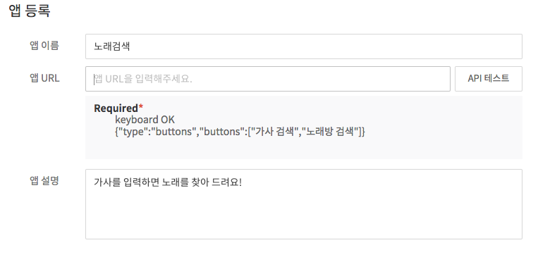

API 응답을 확인하였으면 아래 **저장하기** 버튼을 클릭해 설정을 저장해 주세요.

### 2. 스마트채팅 연동 테스트

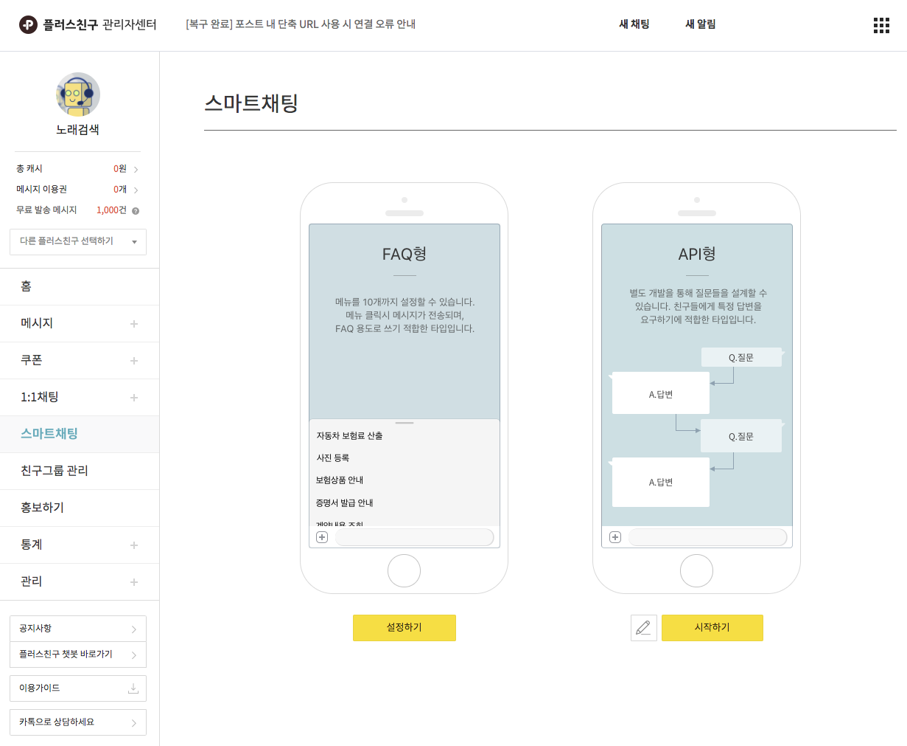

이제 스마트채팅 설정 화면으로 돌아가 **시작하기** 버튼을 클릭해 주세요.  
연동이 잘 이루어진 경우 플러스친구 1:1 대화창을 통해 챗봇 동작을 확인할 수 있습니다.

