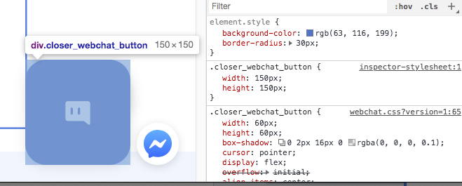

# 웹사이트 연동


CLOSER에서는 웹사이트에 실시간 채팅을 연동할 수 있도록 다음 두 가지 연동 방식을 제공합니다.

1. 웹 페이지에 실시간 채팅 javascript 삽입 방식 
   * 가장 쉽게 연동 가능한 방식으로, 연동하고자 하는 웹페이지의 하단에 CLOSER 웹 채팅 팝업 버튼을 노출하는 스크립트를 삽입하는 방입니다. 
2. 웹 채팅 페이지 URL 직접 접근 방식
   * 팝업 형태로 제공되는 웹 채팅 페이지를 직접 사용자들에게 제공하는 방식입니다. 문자 메세지 등을 통한 아웃바운드 마케팅 링크나 직접 iframe을 통해 웹 채팅의 노출 시점을 관리하고자 할 때 사용합니다..

## 설정 방법 <a id="configuration"></a>

1. 연동하고자 하는 챗봇의 **메신저 연동** 메뉴로 진입합니다.
2. 메신저 연동 페이지에서 **웹챗** 항목의 **설정** 버튼을 클릭합니다.
3. **웹챗 활성화** 스위치를 통해 언제든 즉시 활성화 / 비활성화가 가능합니다.


다음은 CLOSER에서 제공하는 두 가지 연동 방법에 대한 안내입니다.

### **1. 원하는 페이지에 `<script />` 설치** 

* html 페이지에 CLOSER에서 제공하는 `<script />` 를 추가하는 것으로 쉽게 설치가 가능합니다.
* \*\*\*\*[**WebChat Script API**](web.md#webchat-script-api)를 이용할 수 있습니다. \([여기](https://codesandbox.io/s/closer-webchat-integration-example-e0f36)를 눌러 실제 동작하는 설치 예시를 확인해보세요.\)

### **2. 대화창 링크 직접 이용** 

* CLOSER 대화창이 표시되는 URL을 제공합니다.
* 제공된 URL을 popup / iframe 등 원하는 방식으로 노출하여 웹사이트 채팅을 연동해 보세요.

## 테마 설정 <a id="theme"></a>

CLOSER가 제공하는 웹 채팅 위젯은 현재 색상이나 버튼 등의 간단한 커스터마이징을 지원하고 있습니다.  
추후 커스터마이징 지원은 계속 확대될 예정입니다.


웹사이트 연동 설정 하단의 **`웹챗 커스터마이징`** 을 클릭해보세요. 커스터마이징 설정 화면을 확인할 수 있습니다.


* `웹챗 제목, 웹챗 설명` : 처음 사용자가 웹챗에 들어왔을 때 보여지는 봇에 대한 제목 및 설명을 설정합니다.
* `사용자에게 보여질 팝업 메시지 활성화`: 버튼과 함께 출력되는 팝업 메시지를 노출할지 설정합니다.
* `팝업메시지` : 버튼과 함께 출력되는 팝업 메시지 내용을 설정합니다.\(HTML 사용가능\)
* `테마색` : 웹챗의 주 테마 색상을 설정합니다. \(배경, 말풍선, 전송 버튼 등\)
* `버튼 아이콘 변경` : 버튼안에 삽입되는 아이콘 이미지를 변경할 수 있습니다.
* `버튼 위치` : 삽입될 버튼이 홈페이지의 좌측, 우측 하단에 보여질지 설정합니다.
* `버튼 아이콘 사이즈` : 버튼안에 삽입되는 아이콘 이미지의 크기를 변경할 수 있습니다. \(최대 60px까지 지원\)
* `버튼 border-radius` : 버튼의 가장자리의 둥근 정도를 설정합니다.


### CSS Selector를 활용한 버튼 커스터마이징 👩🏻‍🔬 <a id="css-selector"></a>

위에서 제공된 설정 이외에 웹 채팅 버튼이나 웹 채팅을 담게 될 컨테이너의 위치나 크기 등의 수정이 필요하신 경우, CSS Selector를 이용해 조금 더 다양한 속성을 설정할 수 있습니다.

| selector | 역할 |
| :--- | :--- |
| `.closer_webchat_chat_wrapper` | 오픈 애니메이션을 커스텀하거나, 위치를 조절 할 수 있습니다. |
| `.closer_webchat_button_wrapper` | Button의 위치를 조절하거나, 최초 등장 애니메이션을 커스텀할 수 있습니다. |



* 현재 설정 가능한 css selector는 채팅창 버튼과 채팅창을 보여주게 될 container element에 한정됩니다.
* 내부 말풍선 모양이나 폰트 크기 조절은 추후 지원될 예정입니다.

## 고급 설정 <a id="advanced"></a>

### 초기 파라미터 설정

**여러 페이지에 웹 채팅을 연동한 경우** 혹은 **기존 회원 정보와 연동**이 필요한 경우, 각 페이지별로 진입 파라미터를 다르게 설정하면 [챗봇 시나리오에서 해당 값을 구분](../chatbot/node/entry.md#undefined)할 수 있습니다. 

#### 1. `<script/>` 설치 방식: `data-params` 속성에 원하는 파라미터를 다음과 같이 작성해줍니다.

```markup
<script 
  id="embeddedChatbot" 
  src="https://www.closer.ai/js/webchat.min.js"
  botId="{botId}" 
  data-param1="abc"
  data-param2="def"
  data-param3="ghi">
</script>
```

#### 2. 웹페이지 직접 이용 방식: 제공된 URL 뒤에 원하는 파라미터를 다음과 같이 추가합니다.

```http
https://app.closer.ai/webchat/{botId}?param1=abc&param2=def&param3=ghi
```


`data-params`와 `URL` 방식 모두 쿼리스트링\(Query String\) 형식을 따라야 합니다.

* Query String \(Wikipedia, 영문\) [https://en.wikipedia.org/wiki/Query\_string](https://en.wikipedia.org/wiki/Query_string)



다음 값들은 시스템에서 사용하는 값이므로 초기 파라미터로 사용할 수 없습니다.  
`userKey`, `sessionId`, `restart`


#### 3. 설치형 스크립트 API 이용

아래 [Webchat Script API](web.md#webchat-script-api) 항목을 참고하세요.


### Webchat Script API \(설치형 스크립트 API\) <a id="webchat-script-api"></a>

`<script />` 설치 방식을 이용할 경우, 웹페이지에 설치된 webchat element를 제어할 수 있는 API를 제공합니다.


다음 페이지에서 **실제 동작하는 설치형 스크립트 연동 예시**를 확인해보세요.  
[https://codesandbox.io/s/closer-webchat-integration-example-e0f36](https://codesandbox.io/s/closer-webchat-integration-example-e0f36)


#### 스크립트 삽입 예시

```markup
<script>
  function onInit(control) {
    // control.openChatWindow();
    // control.closeChatWindow();
    // control.showChatButton();
    // control.hideChatButton();
    // control.updateParams({ ... });
  }
</script>
<script
  id="embeddedChatbot"
  botId="B2nkjr"
  callback="onInit"
  src="https://www.closer.ai/js/webchat.min.js">
</script>
```

* `botId`: 연동할 챗봇의 id를 입력합니다.
* `callback`: 스크립트가 로드된 이후의 콜백 함수를 지정합니다. 
  * 이 함수는 [**WebChatControl** object](web.md#webchatcontrol-object)와 함께 호출됩니다.
* `data-*`: 초기 파라미터로 지정할 attribute들을 data attributes로 입력합니다. 


* **data attribute**에`botId`, `userKey`, `sessionId`, `restart`값은 사용할 수 없습니다.
* kebab-case, snake\_case 등으로 입력된 key는 모두 **camelCase** key로 변환됩니다.

  key의 예기치 않은 변환을 원치 않으시는다면 [**WebChatControl** object](web.md#webchatcontrol-object) 를 이용해 주세요. 


#### WebChatControl object

* **openChatWindow\(\)** 
  * 대화창을 엽니다. \(대화 버튼을 클릭한 것과 같은 효과\)
* **closeChatWindow\(\)**
  * 대화창을 닫습니다. \(대화창 옆 x 버튼을 클릭한 것과 같은 효과\)
* **showChatButton\(\)**
  * 대화 버튼을 표시합니다. \(대화 활성화와 같은 효과\)
* **hideChatButton\(\)**
  * 대화 버튼을 숨깁니다. \(대화 비활성화와 같은 효과\)
* **updateParams\(params: object\)**
  * 초기 파라미터 또는 진행중인 대화의 파라미터를 변경합니다. 
  * `params` 는 dictionary \(key-value\)형태의 object를 이용 가능합니다.

