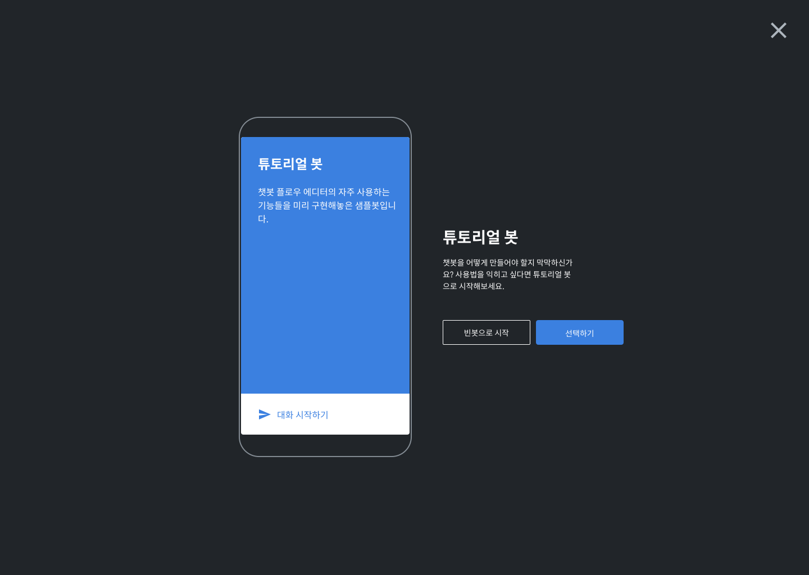
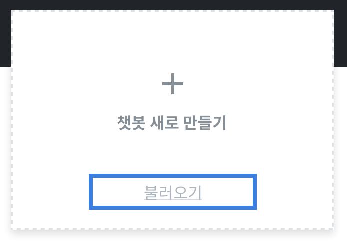

# 새로운 봇 만들기

새로 만들기 버튼을 눌러 봇을 만들 수 있습니다. 세가지 방법이 있습니다.

## 템플릿 봇 만들기 

CLOSER가 제공하는 템플릿에 간단한 정보를 채워 넣으면 템플릿 봇이 완성됩니다.

이후에 플로우 에디터를 활용해 자유롭게 편집할 수 있습니다.

## 비어있는 봇 생성 

비어있는 봇을 생성한 뒤 플로우 에디터를 이용해 원하는대로 설계할 때 사용합니다.

## 봇 불러오기 

기존에 내보내기 한 봇을 불러올 때 사용합니다.

