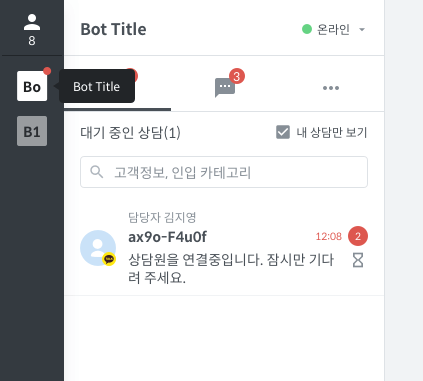
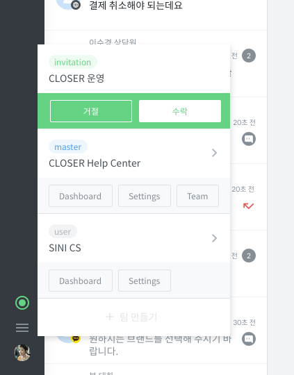

# 사이드 바

## 상담 현황 {#call-status}

* 가장 위에 있는 아이콘에 마우스를 올리면 위 예시 화면과 같은 상담 현황을 확인할 수 있습니다.
* 아이콘 아래의 숫자는 현재 로그인\(온라인+자리비움\) 상태의 상담원 수를 나타냅니다.
* 온라인 상태의 상담원은 상담원 이름 왼쪽에 녹색으로 표시됩니다.
* 자리비움 상태의 상담원은 상담원 이름 왼쪽에 노란색으로 표시됩니다.
* 각 상담원 별로 현재 대기/진행중인 숫자를 확인할 수 있습니다.

## 프로필\(챗봇\) 리스트 {#profile-list}

* 팀에 속한 프로필\(챗봇\)의 리스트 입니다.
* 프로필 이름의 앞 두글자만 표시되고, 프로필아이콘 위에 마우스를 올리면 전체 이름을 확인할 수 있습니다.
* 확인하지 않은 상담요청이 있는 프로필 아이콘의 오른쪽 위에 빨간점이 표시됩니다.

## 하단 메뉴 {#bottom-menu}

### 접속 상태 {#connection-status}

* 하단 메뉴의 가장 위쪽 아이콘은 서버와의 접속 상태를 표시합니다.
* 녹색은 원활한 상태이고, 빨간색은 원활하지 않은 상태입니다.
* 접속 상태 아이콘이 빨간색인 경우에는 메시지를 전송하거나 받을 수 없습니다.

### 상담 메뉴 {#chat-menu}

* 다른 팀의 상담하기 화면으로 이동하거나, 통계/설정 화면으로 이동할 수 있습니다.
* 다른 팀으로 부터의 초대를 수락하거나 거절할 수 있습니다.

### 사용자 메뉴 {#avatar-menu}

* 사용자가 설정한 아바타가 표시됩니다.
* 사용자 메뉴에서 프로필을 변경하거나 봇 빌더로 이동하거나 로그아웃 할 수 있습니다.

