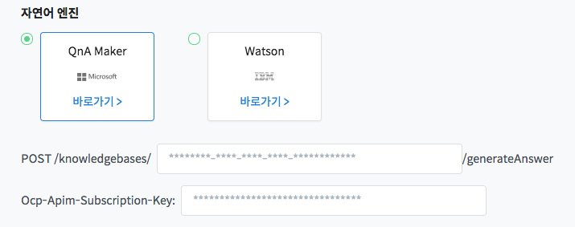
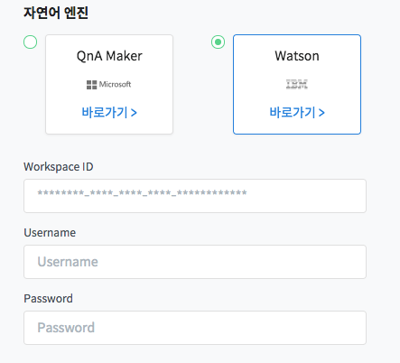
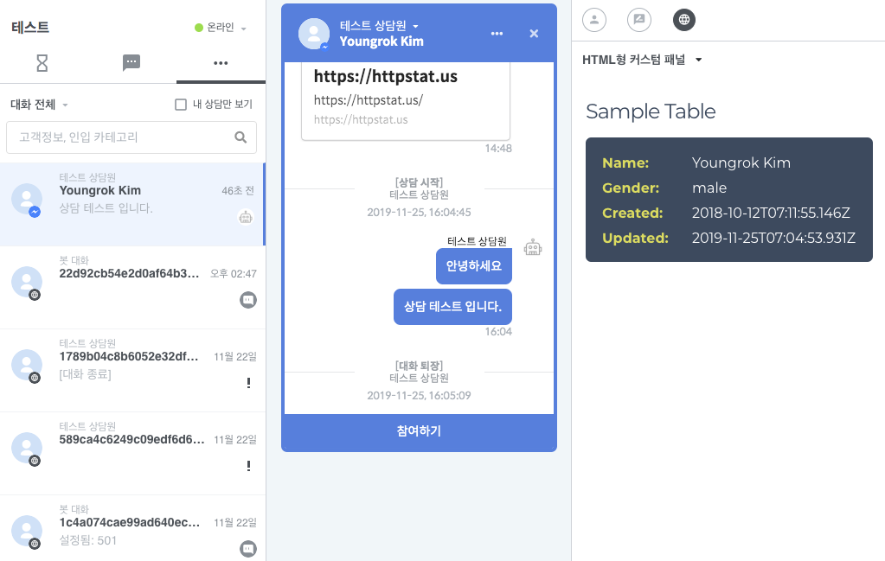
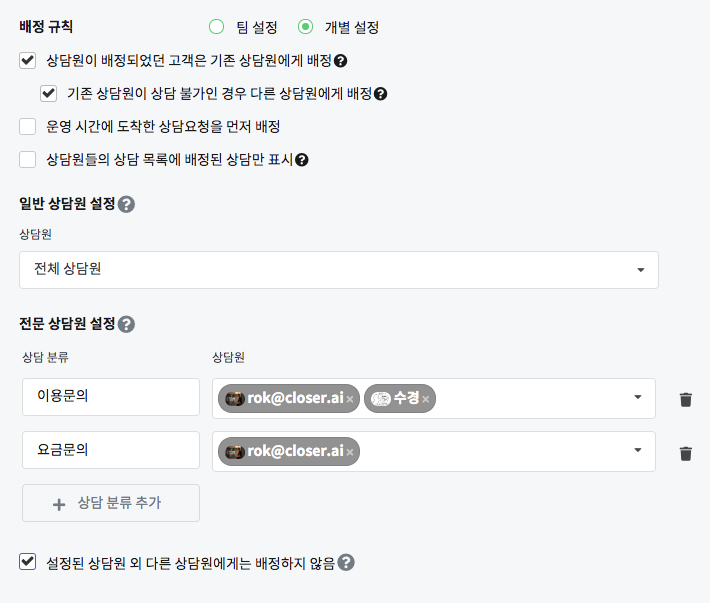
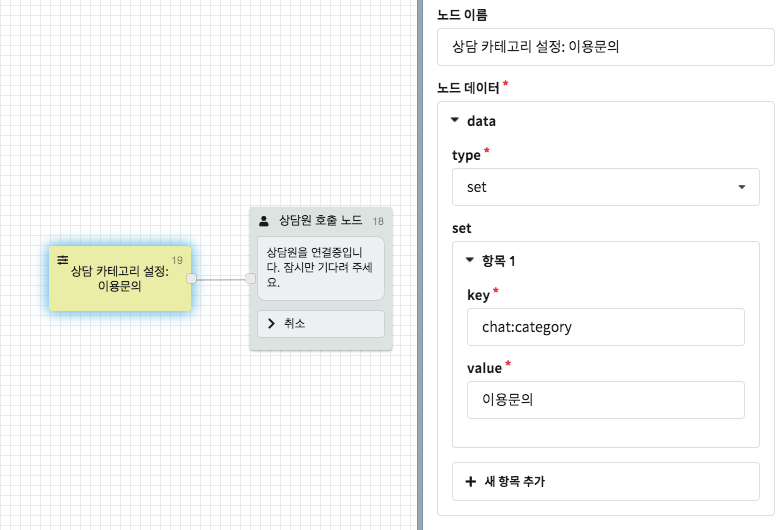

# 상담 설정

## 답변 추천  <a id="recommended-answer"></a>


[**마스터**](../about/#undefined-1)만 설정할 수 있습니다.



상담원들의 답변의 정확도를 높이기 위해 고객이 자주 묻는 질문과 답변들을 Microsoft의 QnA Maker나 IBM의 Watson에서 설정하여 연동할 수 있습니다.  
답변 추천을 설정하면 채팅창에서 고객이 질의한 내용을 선택하면 그에 알맞은 답변을 상담원이 확인하여 활용할 수 있습니다.

### Microsoft QnA Maker



* Microsoft QnA Maker에서 질문 답변을 설정하고 QnA Maker에서 제공하는 정보를 입력합니다

### IBM Watson



* IBM Watson에서 질문과 답변을 설정하고 Wastson에서 제공하는 정보를 입력합니

## 커스텀 웹 패널  <a id="custom-web-panel"></a>


[**마스터**](../about/#undefined-1)만 설정할 수 있습니다.



프로필 별로 다르게 설정할 수 있습니다



상담에 필요한 도구가 추가적으로 필요한 경우, 고객님께서 작성하신 웹 앱을 커스텀 패널로 설정할 수 있습니다. 예를 들어, 기존 고객관리 페이지를 커스텀 패널로 설정하시면 상담원이 상담 화면을 벗어나지 않고도 고객정보를 확인할 수 있게 됩니다.

1. iframe \(외부 페이지 url 입력\) 방식
2. html 직접 작성 방식

iframe 방식은 기존 레거시 시스템과 연동하여 고객 정보를 조회하는 식으로 활용할 때 용이하며, html 직접 작성 방식은 필요한 정보만 원하는 방식으로 간추려서 출력하고자 할 때 사용하기 좋습니다. 

iframe의 URL 주소나 html 입력 방식의 html body에는 모두 [템플릿 문법](../../builder/chatbot/advanced/template-syntax.md) 사용이 가능합니다. `platform`이나 `userKey` 등을 전달하여 이용해보세요.

### iframe URL 방식


iframe은 기존 레거시 시스템과 연동하고자 할 때 사용하면 유용합니다. 고객님께서 이용하실 웹페이지를 직접 호스팅하거나 웹 서버 등을 이용하여 렌더링하신 뒤, 자바스크립트를 이용하여 상담원에게 필요한 도구들을 추가적으로 제공하실 수 있습니다.  

iframe URL에는 [템플릿 문법](../../builder/chatbot/advanced/template-syntax.md) 사용이 가능하기 때문에, query parameter 또는 path parameter로 필요한 값을 제공할 수 있습니다. 주로 `userKey`나 `platform` 등의 값을 제공합니다. 

URL은  `https://` 시작하는 보안 URL을 사용할 것을 권장합니다. `http://` 주소를 사용하실 경우에는 브라우저에 따라 페이지가 표시되지 않을 가능성이 있습니다.


Custom panel은 sandboxed iframe 으로 구현되어 있으며,  
보안상의 이유로 HTTP Cookie나 CORS가 설정된 https 리소스 등은 사용할 수 없습니다

iframe sandbox attribute에는 다음 네 가지 옵션만 활성화되어 제공됩니다.

* **allow-scripts**: javascript 활성화
* **allow-popups**: window.open \(target=\_blank\) 활성화 
* **allow-modals**: window.alert, window.confirm, window.prompt, window.print 활성화
* **allow-forms**: form submit 활성화

더 자세한 내용은 다음 문서를 참고해 주세요.

* [https://html.spec.whatwg.org/multipage/origin.html\#sandboxing-flag-set](https://html.spec.whatwg.org/multipage/origin.html#sandboxing-flag-set)
* [https://developer.mozilla.org/ko/docs/Web/HTML/Element/iframe](https://developer.mozilla.org/ko/docs/Web/HTML/Element/iframe)


### HTML 직접 입력 방식



HTML 직접 입력 방식은 고객에게 입력받은 파라미터 값 등을 더 고유한 방식으로 표시하고자 할 때, 혹은 iframe 페이지를 만들기 전 프로토타이핑 작업을 할 때 유용합니다.


보안상의 이유로 `<script />` tag는 지원되지 않기 때문에 자바스크립트 사용이 불가능합니다. 자바스크립트 사용이 필요한 경우에는 [iframe URL 방식](conversations.md#iframe-url)을 이용해 주세요.

위 예시에 사용된 템플릿은 다음과 같습니다.

```markup
<!-- 
Copyright (c) 2019 by Geoff Yuen (https://codepen.io/geoffyuen/pen/FCBEg)
-->

<style>
@import "https://fonts.googleapis.com/css?family=Montserrat:300,400,700";
.rwd-table {
  margin: 0;
}
.rwd-table tr {
  border-top: 1px solid #ddd;
  border-bottom: 1px solid #ddd;
}
.rwd-table th {
  display: none;
}
.rwd-table td {
  display: block;
}
.rwd-table td:first-child {
  padding-top: .5em;
}
.rwd-table td:last-child {
  padding-bottom: .5em;
}
.rwd-table td:before {
  content: attr(data-th) ": ";
  font-weight: bold;
  width: 6.5em;
  display: inline-block;
}
@media (min-width: 480px) {
  .rwd-table td:before {
    display: none;
  }
}
.rwd-table th, .rwd-table td {
  text-align: left;
}
@media (min-width: 480px) {
  .rwd-table th, .rwd-table td {
    display: table-cell;
    padding: .25em .5em;
  }
  .rwd-table th:first-child, .rwd-table td:first-child {
    padding-left: 0;
  }
  .rwd-table th:last-child, .rwd-table td:last-child {
    padding-right: 0;
  }
}

body {
  font-family: Montserrat, sans-serif;
  -webkit-font-smoothing: antialiased;
  text-rendering: optimizeLegibility;
  color: #444;
}

h1 {
  font-weight: normal;
  font-size:1.5em;
  letter-spacing: -1px;
  color: #34495E;
}

.rwd-table {
  background: #34495E;
  color: #fff;
  border-radius: .4em;
  overflow: hidden;
}
.rwd-table tr {
  border-color: #46637f;
}
.rwd-table th, .rwd-table td {
  margin: .5em 1em;
}
@media (min-width: 480px) {
  .rwd-table th, .rwd-table td {
    padding: 1em !important;
  }
}
.rwd-table th, .rwd-table td:before {
  color: #dd5;
}
</style>

<body>
<h1>Sample Table</h1>
<table class="rwd-table">
<tr>
<th>Name</th>
<th>Gender</th>
<th>Created</th>
<th>Updated</th>
</tr>
<tr>
<td data-th="Name">{{params.displayName}}</td>
<td data-th="Gender">{{params.gender}}</td>
<td data-th="Created">{{createdAt}}</td>
<td data-th="Updated">{{updatedAt}}</td>
</tr>
</table>
<p>

</p>
</body>

```

## 상담 완료 설정  <a id="completed-call"></a>


[**마스터**](../about/#undefined-1)만 설정할 수 있습니다.



프로필에만 설정할 수 있습니다.



상담 완료 설정 화면에서는 상담원이 상담을 완료했을 때의 동작을 설정할 수 있습니다.  
만일 미리 **만족도 조사 플로우**를 작성해 놓은 상태라면 상담원이 상담을 완료했을 때 챗봇에게 사용자의 만족도를 물어보도록 해당 플로우로 전환시키는 기능입니다.

만일 상담 완료 시 플로우 변경 기능을 **사용하지 않음**으로 설정하신다면 상담 완료 시의 동작은 다음과 같습니다.

* 상담원 호출 노드를 통해 상담이 시작된 경우: 상담원 호출 노드에서 재시작
* 상담원의 개입을 통해 상담이 시작된 경우: 처음부터 재시작
* 상담원이 상담 도중 챗봇으로 전환하고 상담을 완료한 경우: 해당 플로우에서 계속 진행

## 상담 운영 시간  <a id="operating-hour"></a>


[**마스터**](../about/#undefined-1)만 설정할 수 있습니다.



팀 설정을 하면 모든 프로필에서 사용할 수 있고 프로필 별로 각각 설정할 수도 있습니다.



상담 운영 시간을 설정할 수 있습니다. 기본 설정은 오전 9시 ~ 오후 6시\(KST\) 입니다.  
운영시간이 아닐 때 고객이 상담을 요청하는 경우의 메시지나 요청을 어떻게 처리할지 등을 설정할 수 있습니다.


### 운영시간 사용 / 항시 운영  <a id="operating-hour-enable"></a>

* 프로필\(챗봇\) 이름 오른쪽의 스위치를 켜면 운영시간 설정을 사용하고, 끄면 운영시간 설정을 사용하지 않고 항시 운영으로 설정됩니다.

### 운영 스케쥴  <a id="schedule"></a>

* 팀 설정을 선택하면 위의 팀 설정이 적용되고 개별 설정을 선택하면 해당 프로필\(챗봇\)만 별도로 운영시간을 설정합니다.

### 미운영 시간 안내 메시지  <a id="non-operating-hour-message"></a>

* 상담 운영시간 외 시간에 고객이 상담원을 호출한 경우에 노출할 메시지를 설정합니다.
* 팀 설정에서는 메시지만 설정할 수 있고,  프로필\(챗봇\) 개별 설정에서는 상담 미운영시간에 특정 플로우로 이동하도록 설정할 수 있습니다.

### 미운영 시간 상담 요청 접수  <a id="non-operating-hour-agent-call"></a>

* 상담 운영시간 외 시간에 고객이 상담원을 호출한 경우에 해당 상담을 접수할지 설정합니다.
* 미운영 시간에 들어온 상담을 별도로 확인하려면 접수함으로 설정하세요.

### 미운영 시간 자동 응답 전환  <a id="non-operating-hour-auto-reply"></a>

* 미운영 시간에 봇이 자동으로 응답하게 할지 설정합니다.
* 미운영 시간에 상담 요청을 접수하고 운영시간에 상담을 모아서 대응해야 한다면 미사용으로 설정하세요.

## 상담 자동 배정  <a id="automatic-assignment"></a>


[**마스터**](../about/#undefined-1)만 설정할 수 있습니다.



팀 설정을 하면 모든 프로필에서 사용할 수 있고 프로필 별로 각각 설정할 수도 있습니다.



상담원 연결 요청 시 담당 상담원을 자동으로 배정하는 규칙을 설정합니다.


### 자동 배정 / 수동 배정  <a id="automatic-assignment-enable"></a>

* 자동 배정 설정을 사용하지 않는 경우, 수동 배정으로 설정됩니다

### 배정 규칙  <a id="assignment-rule"></a>

* 배정 규칙에서 아무것도 선택하지 않으면 랜덤하게 배정 됩니다.
* 상담원이 담당 고객을 관리해야 한다면 기존 상담원에게 배정되도록 설정하세요.
* 기존 상담원에게 배정되도록 설정했으나 기존 상담원이 부재중인 경우 다른 상담원에게 배정되도록 설정할 수 있습니다.

### 상담 배정  <a id="assignment-rule-2"></a>

* 상담원이 한 명이 처리해야할 상담의 갯수를 설정할 수 있습니다.
* 여기서 설정한 배정받는 최대 상담 수는 상담을 요청한 상태\(대기\)와 상담이 진행중인 상태를 포함합니다.
* 상담 운영시간을 설정했고 미운영 시간에 들어온 상담을 접수하도록 설정했다면 상담 운영시간이 되었을 때, 운영시간에 요청한 상담을 먼저 처리할 지, 미운영 시간에 들어온 상담을 먼저 처리할 지 설정할 수 있습니다.

### 일반 상담원 설정  <a id="general-agent"></a>

* 상담 요청이 들어왔을 때 배정받을 일반 상담원을 설정합니다.
* 여기서 설정한 상담원들에게 위에서 설정한 배정 규칙에 따라 자동 배정이 이루어집니다.

### 전문 상담원 설정  <a id="professional-agent"></a>





전문 상담원 설정은 상담 카테고리에 따라 지정한 상담원에게 상담이 우선 배정되도록 설정하는 기능입니다.

* 상담 카테고리는 봇 빌더의 [파라미터 설정 노드](../../builder/chatbot/node/parameter.md) 를 통해 설정할 수 있습니다.  파라미터 키 값으로는  `chat:category` 를 이용합니다.
* 전문 상담원이 상담 불가능한 상태일 경우 일반 상담원에게 배정됩니다. 이를 원치 않으실 경우에는  "**설정된 상담원 외 다른 상담원에게 배정하지 않음**" 기능을 설정해 주세요.

## 알림  <a id="notification"></a>


* 수신할 알림의 종류와 유지시간\(1~60초\) 등을 설정할 수 있습니다.
* 대화 관련 알림 클릭 시 바로 대화창으로 이동하여 상담을 진행할 수 있습니다.


사용하고 계신 브라우저에서 푸시 알림 권한이 '허용'된 경우에만 알림을 수신할 수 있습니다. 


