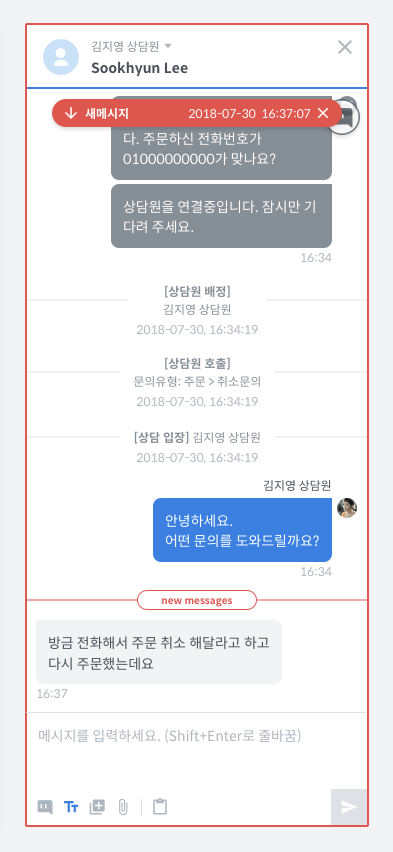
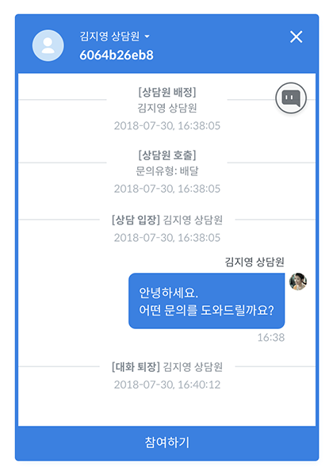
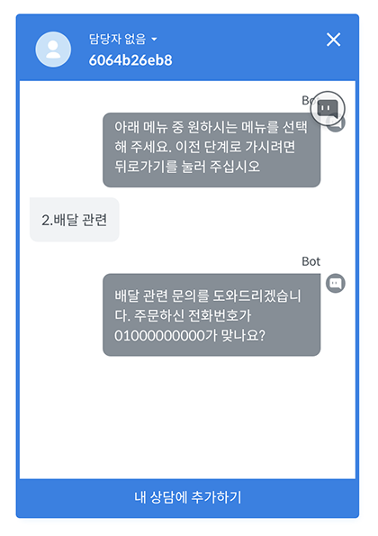

# 채팅창 영역

## 채팅창

## 채팅창 상단

### 고객 아바타

* 고객의 아바타를 표시할 수 있다면 아바타를 표시하고 아바타가 없는 경우 기본 아바타가 표시됩니다.

### 담당 상담원

* 배정된 상담원의 이름이나 이메일 주소가 표시됩니다.
* 상담원 이름을 선택하면 다른 상담원으로 배정할 수 있습니다.

###  고객 이름 \(사용자키\)

* 고객의 이름이나 사용자키가 표시됩니다.

### 창 닫기 / 상담 완료

* X 아이콘 위에 마우스를 올리면 위 이미지와 같이 '창 닫기'로 노출됩니다.
* 창 닫기를 선택하는 경우 대화창이 닫힙니다.
* 대화에 참여중이었다면 대화에서 퇴장하게 됩니다.
* 대화에서 퇴장하는 경우 대화 퇴장 메시지가 나타나는데 상담원에게만 노출되고 고객에게 노출되지는 않습니다.

* X 아이콘 위에 마우스를 올렸을 때, 상담 완료가 가능한 대화라면 '창 닫기'와 함께 '상담 완료'가 노출됩니다.
* '상담 완료'를 누르면 완료된 상담으로 변경되고 고객은 다시 봇과 대화하도록 변경됩니다.
* **상담원이 상담완료를 누른 경우 고객에게 내용이 전달되지 않지만 상담원과 대화중에 갑자기 봇 대화로 변경될 수 있으니 실제 상담이 완료된 경우에만 '상담 완료'를 클릭하셔야 합니다.**
* **다른 플로우로 이동하지 않고 '상담 완료'를 선택한 경우에 고객이 다시 말을 걸면 상담원을 다시 호출하게 됩니다.**
* 상담 완료 후 다른 플로우에서 다시 진행하기를 원하신다면 상담 완료하기 전에 [**플로우 변경 기능**](untitled-2.md#undefined-16)을 사용하여 고객을 다른 플로우로 이동시킵니다. 이 경우 대화가 다른 플로우에서 시작되도록 할 수 있습니다.

## 메시지

### 새로운 메시지

* 새로운 메시지가 도착한 경우, 채팅창 예시 이미지 처럼 새 메시지가 표시됩니다.
* 스크롤을 내려 모든 메시지를 읽거나, 상단의 새 메시지를 클릭하면 새 메시지 표시가 사라집니다.

### 봇 대화

* 봇 대화를 '메시지 예시' 이미지 처럼 숨길 수 있습니다.

## 답변 추천 기능

답변 추천 기능을 설정했다면, 말풍선 오른쪽의 Q 아이콘을 클릭하여 답변 추천 기능을 사용할 수 있습니다.

## 메시지 입력

### 대화에 참여하기

#### 참여하기

* 대화창을 닫아 대화를 나가게 되면, 참여하기 

#### 내 상담에 추가하기

* 내 상담에 추가하기를 선택하면 담당자가 자신으로 배정되고 상담에 참여하게 됩니다.
* 자동 배정을 사용하지 않거나 자동 배정된 상담원이 없는 경우에 표시 됩니다.

#### \[현재 상담원 상담중\] 참여하기

* 다른 상담원이 상담을 진행중인 채팅의 경우 위와 같은 화면을 볼 수 있습니다.
* 다른 상담원과 동시에 상담을 진행할 수 있지만 고객은 몇명의 상담원과 상담을 하는지 알 수 없습니다.

### 챗봇 플로우 중지 / 변경

#### 플로우 중지

* 고객이 챗봇과 대화하는 중에 챗봇 동작을 중지하고 상담을 진행할 수 있습니다.
* **플로우를 선택하고 'Stop'을 클릭해야 챗봇이 중지됩니다.**
* 챗봇과의 대화를 모니터링하다가 상담원이 개입하는 것이 고객의 만족도를 높일 수 있는 경우에 사용하면 좋습니다.

#### 플로우 변경

* 고객과 상담하는 중에 다른 챗봇 플로우로 변경할 수 있습니다.
* **플로우를 선택하고 'Start'를 클릭하면 챗봇이 동작합니다.**
* 고객과 상담하는 중에 고객이 원하는 플로우로 이동하거나 상담에 필요한 정보를 챗봇 플로우에서 입력 받도록 할 때 사용하면 유용합니다.

### 플로우 즐겨 찾기

* 위의 챗봇 플로우 변경 기능을 좀 더 효율적으로 사용할 수 있도록, 자주 사용하는 플로우를 즐겨찾기로 저장할 수 있습니다.
* 즐겨찾기 설정은 팀 내의 다른 사람과는 공유되지 않습니다.

### 텍스트 입력

* 텍스트를 입력하여 전송합니다.
* 텍스트를 입력하고 엔터를 누르거나 종이비행기 아이콘을 클릭하면 메시지가 전송됩니다.
* Shift키를 누른 채로 Enter키를 누르면 줄바꿈을 할 수 있습니다.
* 이모티콘 : 자체 제공하지는 않으나 기본 이모지를 복사해서 사용할 수 있으며 카카오톡의 기본 이모티콘은 \(이모티콘명\)을 사용해 보내면 고객에게 전달됩니다

> **카카오톡 이모티콘 예**: \(굿\)\(흑흑\)\(아잉\)\(정색\)\(좋아\)\(힘듦\)\(짜증\)\(수줍\)\(열받아\)\(졸려\)\(찡긋\)\(뽀뽀\)\(신나\)\(감동\)\(하하\)\(쑥스\)\(깜짝\)\(흥\)\(제발\)\(푸하하\)\(멘붕\)\(헉\)\(빠직\)\(허걱\)\(씨익\)\(꺄아\)\(하트뿅\)\(우와\)\(훌쩍\)\(심각\)\(발그레\)\(굿\)\(흑흑\)\(아잉\)\(정색\)\(좋아\)\(힘듦\)\(짜증\)\(수줍\)\(열받아\)\(졸려\)\(찡긋\)\(뽀뽀\)\(신나\)\(감동\)\(하하\)\(쑥스\)\(깜짝\)\(흥\)\(제발\)\(푸하하\)\(멘붕\)\(헉\)\(빠직\)\(허걱\)\(씨익\)\(꺄아\)\(하트뿅\)\(우와\)\(훌쩍\)\(심각\)\(발그레\)

### 파일 전송

* 고객에게 파일을 전송할 수 있습니다.
* 이미지 파일을 전송하면 이미지 말풍선으로 전송되며, 그 외 파일은 다운받을 수 있는 링크로 전송됩니다.
* 다음의 파일 확장자들을 전송할 수 있습니다 **.jpg, .jpeg, .png, .gif, .pdf, .doc, .docx, .xls, .xlsx, .ppt, .pptx**

