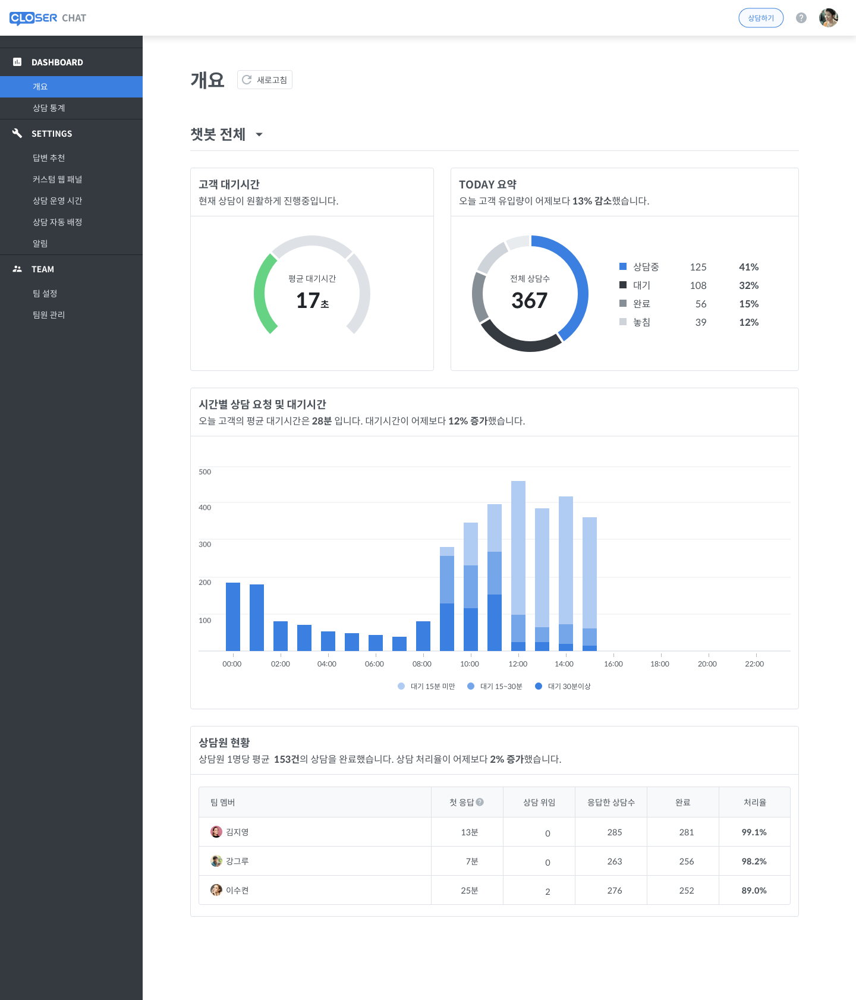

# 통계 \(Dashboard\)

CLOSER Chat 통계는 상담과 관련된 통계를 제공합니다.

## 개요 화면

* 개요에서는 오늘의 통계를 확인할 수 있습니다

### 새로고침

실시간으로 데이터가 업데이트 되지 않지만, 새로고침 하여 업데이트 된 데이터를 확인할 수 있습니다

### 팀 전체 통계 &gt; 프로필\(챗봇\)별 통계

'챗봇 전체'를 선택하면 프로필\(챗봇\) 리스트가 나타나고, 선택하면 프로필\(챗봇\)별 통계를 확인할 수 있습니다

### 고객 대기시간

고객이 상담원을 호출하고 상담원이 상담을 시작하기까지 소요되는 시간의 평균 값을 확인할 수 있습니다

### Today 요약

* 전체 상담 중 놓침 / 완료 상담을 확인할 수 있습니다
* **상담중** : 상담원이 고객과 상담중인 상담의 비율입니다
* **대기** : 고객이 상담원 연결을 요청한 상담의 비율입니다
* **완료** : 채팅창에서 상담 완료를 선택하여 상담 완료로 기록된 상담입니다
* **놓침** : 고객이 상담원 연결을 요청하였으나, 상담원과 상담을 진행하지 못하고 취소하거나 대화에서 나간경우에 놓침으로 기록됩니다

### 시간별 상담 요청 및 대기시간

* 시간별로 상담 요청 건수와 대기시간을 확인할 수 있습니다
* 막대 그래프에 마우스를 올리면 자세한 값을 확인할 수 있습니다

### 상담원 현황

상담원 별로 응답 / 위임 / 응답한 상담 수 / 완료 건수를 확인할 수 있습니다

## 상담 통계

상담 통계에서는 지금까지 누적된 통계를 확인할 수 있고, **최대 30일 간의 데이터만 조회**할 수 있습니다

### 새로고침

실시간으로 데이터가 업데이트 되지 않지만, 새로고침 하여 업데이트 된 데이터를 확인할 수 있습니다

### 팀 전체 통계 &gt; 프로필\(챗봇\)별 통계

'챗봇 전체'를 선택하면 프로필\(챗봇\) 리스트가 나타나고, 선택하면 프로필\(챗봇\)별 통계를 확인할 수 있습니다

### 통계 기간 설정

* 조회할 기간을 날짜를 선택하여 설정할 수 있습니다
* **최대 30일 간의 데이터만 조회**할 수 있습니다
* 시작일과 종료일을 동일하게 설정하는 경우 하루의 데이터만 확인할 수 있습니다

### 요일 및 시간별 인입량

* '요일별 인입량' 탭을 선택하면 요일별 데이터를 확인할 수 있습니다
* '시간별 인입량' 탭을 선택하면 시간별 데이터를 확인할 수 있습니다

### 상담 대기 시간

* 고객이 상담원 연결을 요청 후 평균적으로 얼마나 대기했는지 확인할 수 있습니다
* 평균값의 정확도가 높지 않아 중앙값으로 볼 수 있습니다

### 고객 응대율

* 전체 상담 요청 중 상담 완료 비율을 확인할 수 있습니다
* **응대율을 높이기 위해서 실제 상담이 완료된 상담의 경우에, 채팅창에서 상담 완료를 선택해주세요**

### 상담원 현황

상담원 별로 응답 / 위임 / 응답한 상담 수 / 완료 건수를 확인할 수 있습니다

