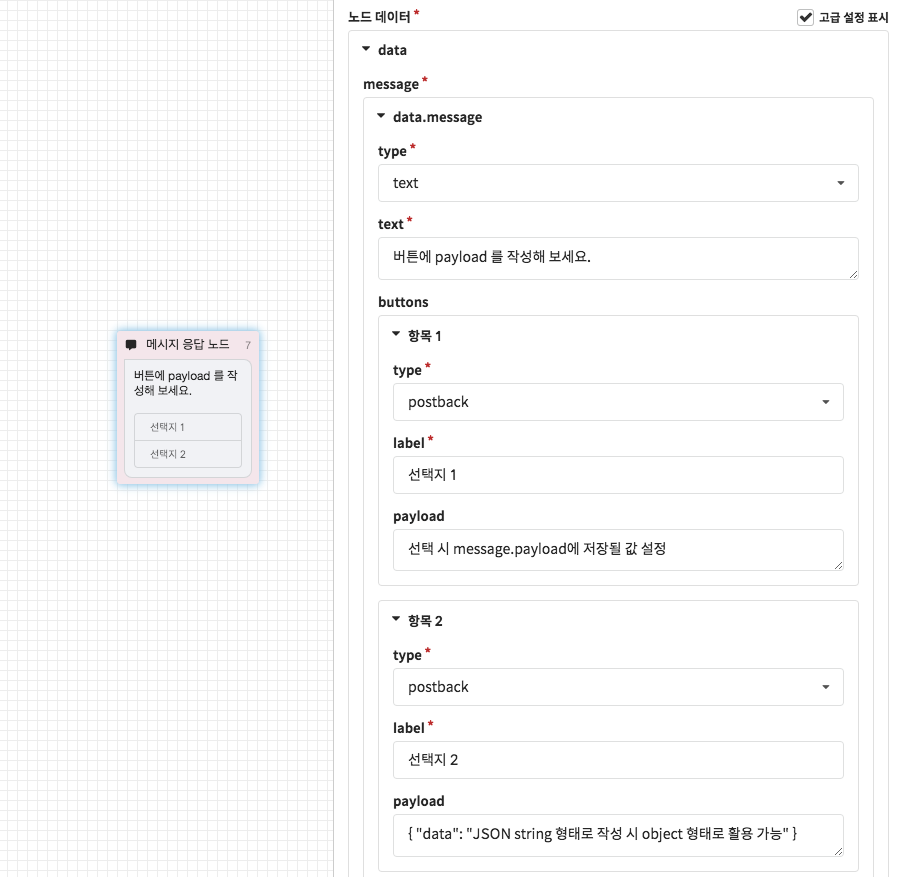
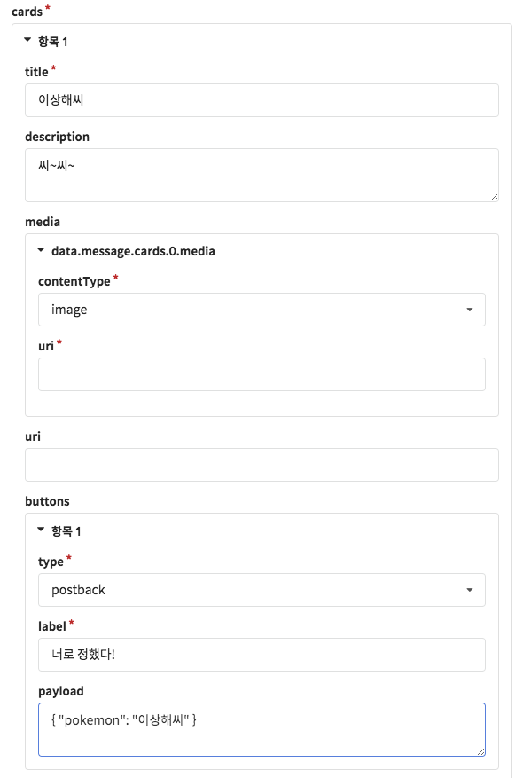

# 포스트백 페이로드 \(Postback Payload\)

## 포스트백 페이로드 \(Postback Payload\)

포스트백 버튼에 작성할 수 있는 포스트백 페이로드 기능은 **일방통행형 챗봇 시나리오에서 벗어나 더 자연스러운 챗봇을 제작할 수 있게 도와주는 핵심 기능**입니다. 쉽게 이해하기는 어렵지만, 사용법을 알고나면 모바일 앱의 사용 경험에 버금가는 챗봇을 제작하실 수 있게 됩니다.

`postback` 방식의 버튼은 기본적으로 사용자가 클릭시 버튼의 `label`에 설정된 텍스트와 같은 메시지를 전송하도록 동작합니다. 만약 이 때 해당 노드에서 **해당 메시지를 포함한 조건**으로만 챗봇 시나리오를 작성할 경우, 이미 챗봇이 진행중인 노드가 해당 노드의 위치에서 벗어났을 때에는 챗봇이 적절한 응답을 반환하기 어렵습니다. 이 때, [폴백 플로우](../flow.md#undefined) 에서 어떤 버튼을 눌렀는지 알 수 있도록 포스트백 반환값\(postback payload\)을 활용할 수 있습니다. 

아래는 CLOSER에서 제공하는 포스트백 반환값의 이용방법 및 제약사항입니다.

* 최대 1,000자의 string 값을 설정 가능
* 사용자가 버튼 클릭 시 `message.payload`에 설정한 값이 저장됨
* JSON 형태로 작성된 payload인 경우 message.payload를 object처럼 활용 가능. \(e.g. `{{message.payload.property}}`, `{{message.payload.array[0].property}}` \)


postback payload 기능의 지원 여부와 길이 제한도 메시징 채널마다 차이가 있습니다.  
만약 메신저가 기능을 지원하지 않거나 메신저에서 정해진 길이 제한을 초과한 경우에는 message.payload 값이 생성되지 않습니다. 


설명만으로는 이해하기 쉽지 않기에, 아래에서 제공되는 실제 적용 예제들을 살펴보시고 하나하나 따라해보세요.

## 적용 예제

### 1. 폴백 플로우를 이용한 플로우 이동 \(Flow Navigation\)

Postback payload를 이용하면 고객이 특정 말풍선 버튼을 클릭했을 때 챗봇이 진행중인 위치와 관계없이 특정 플로우로 이동시킬 수 있습니다. 아래 플로우 구성도를 먼저 확인해주세요.
















위 Fallback navigation의 동작 원리는 다음과 같습니다.

1. 챗봇은 적절한 연결을 찾지 못했을 때 항상 Fallback Flow로 이동하게 됩니다. 예시의 플로우 구성에서는 메시지 응답 노드 다음에 연결된 노드가 없기 때문에, 사용자의 다음 메시지 수신 시 다시 Fallback Flow로 진행하게 됩니다.
2. 사용자가 플로우 이동 관련 선택지를 클릭한 경우에는 `message.payload` 값이 존재하게 됩니다.  
   여기서는 postback payload로 JSON 형식의 값을 입력하였기 때문에, Fallback Flow의 진입 노드에서

    `message.payload.flowId`값의 존재 유무를 검사하였을 때 결과가 참이 됩니다.

3. 플로우 연결 노드에서 템플릿 기능을 이용해 `{{message.payload.flowId}}`에 해당하는 플로우로 이동합니다. \(만약 없는 플로우가 지정된 경우에는 오류가 발생하게 됩니다.\) 

예시에서는 간단하게 폴백 플로우에 네비게이션 변경 버튼을 설정했습니다만, 이러한 버튼 \(`flowId`를 포함한 postback button\)은 어떤 플로우에서도 작성하실 수 있기 때문에 이를 응용하면 더 자연스러운 챗봇 네비게이션을 구현하실 수 있습니다. 


플로우의`flowId`는 챗봇 편집화면에서 플로우를 선택했을 때의 URL 주소를 통해 확인하실 수 있습니다.


### 2. 카드형 메시지의 선택 값 구분

커머스형 챗봇을 작성하시는 경우, 위와 같이 동일한 버튼 구성을 갖는 카드들\(캐러셀\)을 출력하게 되는 상황이 자주 발생합니다. 단순히 웹 링크 방식의 버튼을 이용하는 경우에는 문제가 되지 않지만, 챗봇을 통해 대화형 커머스를 구현하기 위해서는 고객이 위 캐러셀에서 어떤 버튼을 선택하였는지 구분할 수 있어야 합니다. 이 때 postback payload를 이용하여 문제를 해결할 수 있습니다.

이번에는 포켓몬스터 게임에서 스타팅 포켓몬을 선택하는 시나리오를 예제로 이러한 문제점을 해결하는 방법을 알아보겠습니다.












## 유의사항

포스트백 페이로드의 지원 여부는 메시징 채널마다 차이가 있으며, 적용 가능 위젯에도 차이가 있습니다. \(포스트백 버튼 / 빠른 답장 버튼\) 따라서 이 기능을 이용한 챗봇을 제작하기 전에 메신저별 지원 여부를 먼저 확인해주시기 바랍니다.

#### 적용 가능 메시징 채널

* 웹사이트: **지원**
* 페이스북: **지원**
* 네이버 톡톡: **지원**
* 카카오톡
  * 오픈빌더: **빠른 답장에서만 지원**
  * 상담톡: **지원** \(빠른 답장 미지원\)
* 라인: **지원**\(300자 한정\)


현재 포스트백 페이로드 기능은 사실상 표준\(De facto standard\)화가 진행되고 있기 때문에, 가까운 시기에 대부분의 메시징 채널에서 지원될 것으로 기대하고 있습니다. 

따라서 CLOSER에서는 실험 중인 기능\(👩🏻‍🔬\)으로 분류하지 않습니다.



현재 카카오톡 오픈빌더에서는 card형 메시지 버튼에서 postback payload \(extra\) 기능을 지원하고 있지 않습니다만, 곧 업데이트 될 예정입니다. \(2019년 2월 7일 기준\)

[https://i.kakao.com/forum/t/buttons-type-block-extra/373](https://i.kakao.com/forum/t/buttons-type-block-extra/373)   
[https://i.kakao.com/forum/t/button-action-block-extra/427](https://i.kakao.com/forum/t/button-action-block-extra/427) 


