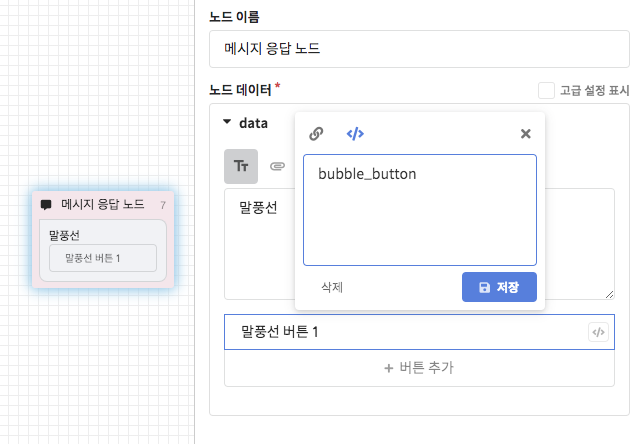
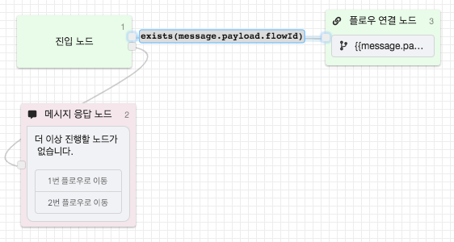
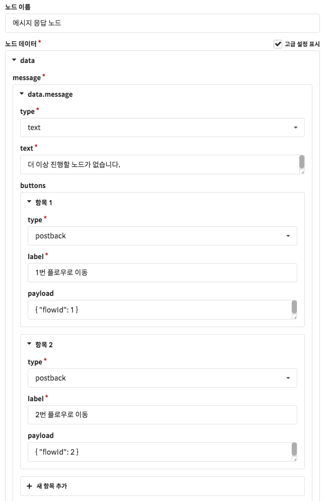
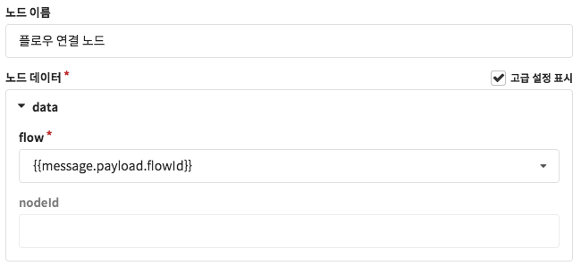
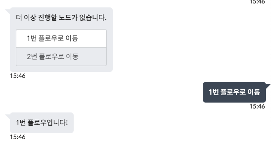
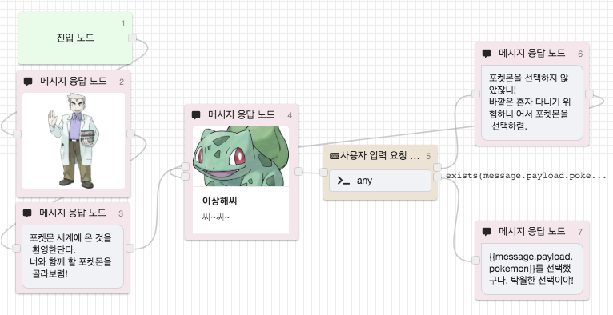
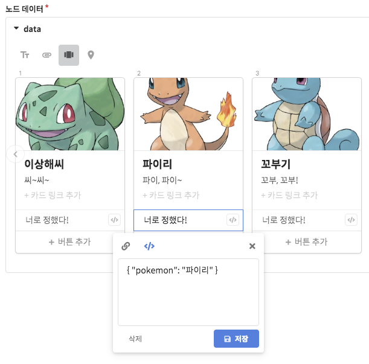
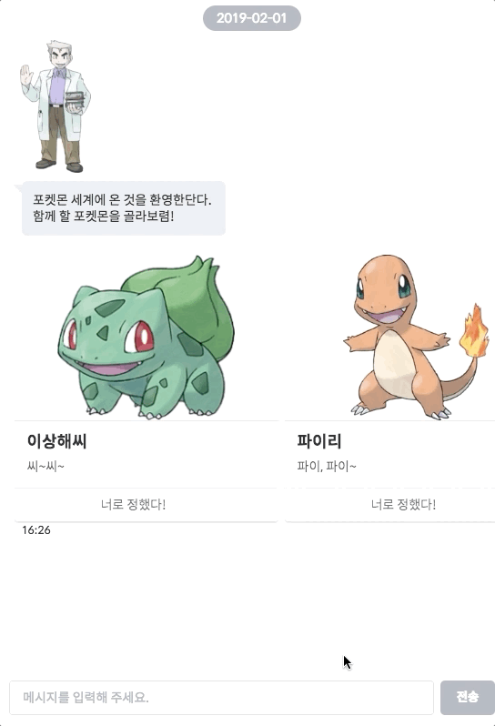

# 포스트백 페이로드 \(Postback Payload\)

## 포스트백 \(Postback\)

포스트백이란 시스템\(챗봇\)이 전달한 데이터를 사용자가 다시 반환한다는 의미를 가진 용어입니다.   
CLOSER에서 설정되는 [**메시지 버튼**](../node/response.md#undefined-2)은 기본적으로 페이로드\(Payload, 전송되는 데이터\) 없는 포스트백 버튼으로, 사용자로 하여금 버튼에 설정된 내용을 그대로 텍스트 메시지로 전송하도록 동작합니다.

포스트백 버튼에 페이로드\(Payload\)를 설정하면 사용자가 어떤 의도를 가지고 어떤 위치에서 버튼을 눌렀는지 구분할 수 있게 됩니다. 기본적으로 빠른 답장 형태의 포스트백 버튼은 맥락을 벗어나면 다시 클릭할 수 없어 큰 걱정이 없지만, **말풍선이나 카드 등에 삽입되는 포스트백 버튼은 맥락을 벗어나도 클릭할 수 있기 때문에** 이를 구분하기 위해서는 페이로드를 설정하는 것이 중요합니다. 

쉽게 이해하기는 어려운 기능입니다만, 사용법을 익히고 나면 모바일 앱 내에서 특정 메뉴를 누르면 특정 화면으로 이동하듯 모바일 앱의 사용 경험에 버금가는 챗봇을 제작하는 것이 가능해집니다.

다음 CLOSER에서 제공하는 포스트백 페이로드의 이용방법 및 제약사항입니다.

* **최대 1,000자** 설정 가능
* 사용자가 버튼 클릭 시 **`message.payload`**를 통해 설정한 값을 획득 가능
* **JSON 형태로 작성된 payload인 경우 message.payload를 object처럼 활용 가능.** \(e.g. `{{message.payload.property}}`, `{{message.payload.array[0].property}}` \)

## 적용 예제

### 1. 폴백 플로우를 이용한 플로우 이동 \(Flow Navigation\)

Postback payload를 이용하면 고객이 특정 말풍선 버튼을 클릭했을 때 챗봇이 진행중인 위치와 관계없이 특정 플로우로 이동시킬 수 있습니다. 아래 플로우 구성도를 먼저 확인해주세요.
















위 Fallback navigation의 동작 원리는 다음과 같습니다.

1. 챗봇은 적절한 연결을 찾지 못했을 때 항상 Fallback Flow로 이동하게 됩니다. 예시의 플로우 구성에서는 메시지 응답 노드 다음에 연결된 노드가 없기 때문에, 사용자의 다음 메시지 수신 시 다시 Fallback Flow로 진행하게 됩니다.
2. 사용자가 플로우 이동 관련 선택지를 클릭한 경우에는 `message.payload` 값이 존재하게 됩니다. 여기서는 postback payload로 JSON 형식의 값을 입력하였기 때문에, Fallback Flow의 진입 노드에서 ****`message.payload.flowId`값의 존재 유무를 검사하였을 때 결과가 참이 됩니다.
3. 플로우 연결 노드에서 템플릿 기능을 이용해 `{{message.payload.flowId}}`에 해당하는 플로우로 이동합니다. \(만약 없는 플로우가 지정된 경우에는 오류가 발생하게 됩니다.\) 

예시에서는 간단하게 폴백 플로우에 네비게이션 변경 버튼을 설정했습니다만, 이러한 버튼 \(`flowId`를 포함한 postback button\)은 어떤 플로우에서도 작성하실 수 있기 때문에 이를 응용하면 더 자연스러운 챗봇 네비게이션을 구현하실 수 있습니다. 


플로우의`flowId`는 챗봇 편집화면에서 플로우를 선택했을 때의 URL 주소를 통해 확인하실 수 있습니다.


### 2. 카드형 메시지의 선택 값 구분

커머스형 챗봇을 작성하시는 경우, 위와 같이 **동일한 버튼 제을 갖는 카드들**\(캐러셀\)을 출력하게 되는 상황이 자주 발생합니다. 단순히 웹 링크 방식의 버튼을 이용하는 경우에는 문제가 되지 않지만, 챗봇을 통해 대화형 커머스를 구현하기 위해서는 고객이 위 **카드들 중에서 몇 번째 카드의 버튼을 선택하였는지** 구분할 수 있어야 합니다. 이 때 postback payload를 이용하여 문제를 해결할 수 있습니다.

이번에는 포켓몬스터 게임에서 스타팅 포켓몬을 선택하는 시나리오를 예제로 이러한 문제점을 해결하는 방법을 알아보겠습니다.












## 유의사항

포스트백 페이로드의 지원 여부와 길이 제한은 메시징 채널마다 차이가 있으며, 적용 가능 위젯에도 차이가 있습니다. \(포스트백 버튼 / 빠른 답장 버튼\) 따라서 이 기능을 이용한 챗봇을 제작하기 전에 메신저별 제약 여부를 먼저 확인해주시기 바랍니다.

#### 적용 가능 메시징 채널

* 웹사이트: **지원**
* 페이스북: **지원**
* 네이버 톡톡: **지원**
* 카카오톡: **지원**
* 라인: **지원**\(300자 한정\)


현재 포스트백 페이로드 기능은 사실상 표준\(De facto standard\)화가 진행되고 있기 때문에, 가까운 시기에 대부분의 메시징 채널에서 지원될 것으로 기대하고 있습니다. 

따라서 CLOSER에서는 실험 중인 기능\(👩🏻‍🔬\)으로 분류하지 않습니다.


