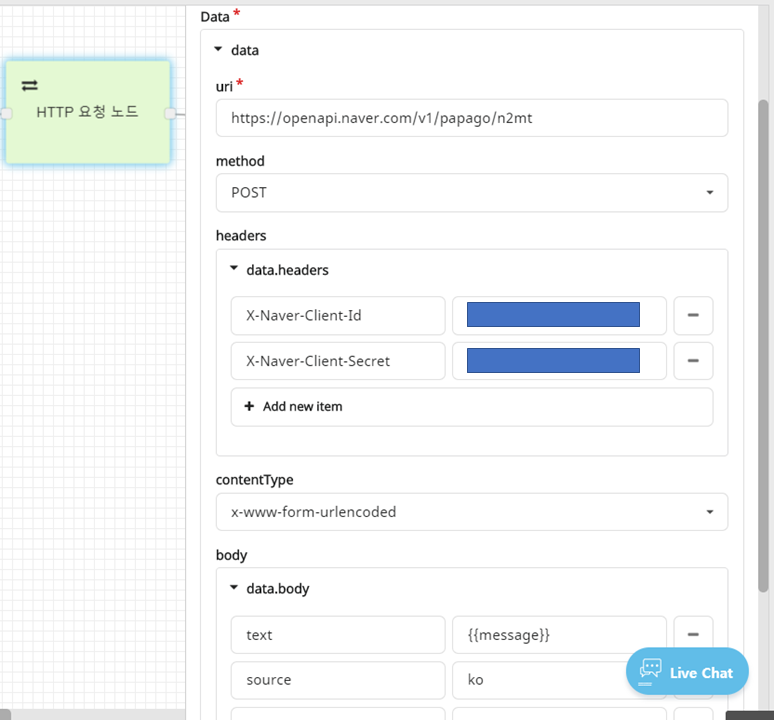

# HTTP 요청 노드

### **HTTP요청 노드\(HTTP Fetch Node\)**

HTTP 요청 노드는 외부 요청에 공개된 API를 이용하여 그 반환값을 CLOSER 챗봇 시나리오에 활용할 수 있도록 도와주는 노드입니다.

* HTTP 요청 중 GET, POST, PUT, DELETE 네 가지 방식을 이용하실 수 있습니다.
* HTTP 요청 Header, Body 등에 이용될 값을 추가할 수 있습니다.
* HTTP 요청 Body의 Content-Type으로는 raw, json, formdata\(x-www-form-urlencoded\) 유형을 활용할 수 있습니다. 

HTTP 요청의 결과는 `fetch` object 를 통해 획득할 수 있습니다.

#### fetch _\(object\)_

HTTP 요청 수행 후 생성되는 반환값을 담고 있는 객체입니다.

| 파라미터 | 타입 | 설명 |
| :--- | :--- | :--- |
| uri | strng | 요청 URI |
| data | object | 서버에서 반환된 데이터 \(json / text 형식\) |
| statusCode | number | 서버에서 반환한 statusCode \(200, 401 등\) |
| status | string | 성공시 'COMPLETED', 실패시 'FAILED' |
| error | Error | 요청 오류 |

* 응답 받은 데이터는 `{{fetch.data}}`와 같이 참조할 수 있으며, JSON타입인 경우 `{{fetch.data.path[2].your.object}}`와 같이 접근이 가능합니다.
* 아래는 네이버가 제공하는 파파고 영어번역API 연동 설정 예시입니다. \(요청 header로 접근 키 설정, POST data로 form-urlencoded 사용\)

### \*\*\*\* 

