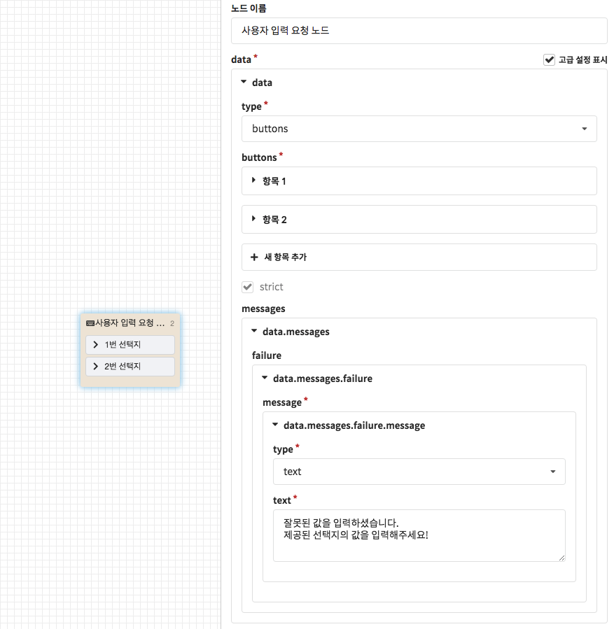
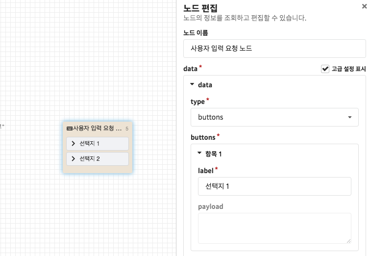

# 사용자 입력 요청 노드

사용자 입력 요청 노드는 **챗봇의 시나리오 진행을 멈추고 사용자의 입력을 대기하는 역할**을 수행하는데, 이는 CLOSER 챗봇 제작에서 굉장히 큰 비중을 차지합니다. 

사용자 응답 노드의 역할에 대해 이해하셨다면 이제 사용자에게 어떠한 입력을 요청할 수 있는지 알아보도록 합시다.

## 사용자 메시지의 종류

메시징 채널에서 사용자가 입력하는 방법은 메신저에 따라 다릅니다만, 크게는 **텍스트**와 **첨부파일**로 나눌 수 있습니다.

* **문자 메시지**
* **첨부파일**
  * 사진
  * 동영상
  * 음성메시지
  * 위치
  * 링크 \(공유된 포스트\)

CLOSER에서 제공하는 사용자 입력 요청 노드는 기본적으로는 사용자의 입력을 대기하는 역할을 수행하지만, 메시징 채널에 따라 **키보드에서 입력 가능한 형태를 제한하거나 해당 메신저의 입력 플러그인을 반영**하기도 합니다. 더 자세한 내용은 하단 문서를 참고해주세요.

## 사용자 입력 요청 방식

### 입력 방식 미지정 \(any\)

* 고객의 입력 방식을 별도로 지정하지 않습니다. 
* 대부분의 메신저에서 텍스트 입력 요청과 동일하게 동작합니다.

### 텍스트 입력 요청 \(text\)

* 고객의 입력 방식을 텍스트 방식으로 지정하여 요청합니다.

### 선택지 입력 요청 \(buttons\)

* 고객의 입력을 선택지 방식으로 요청합니다.
* 대부분의 메시징 채널에서 **빠른 답장\(quick reply\)**형태의 선택지로 변환되며, 빠른 답장을 지원하지 않는 경우에는 포스트백 버튼이나 키보드 버튼의 형태로 제공됩니다.
* 각 메시징 채널 별 지원 여부에 대해서는 [메신저 연동 &gt; 지원 여부 테이블](../../messenger-integrations/#availability-table) 문서를 확인해주세요.

### 숫자 입력 요청 \(number\) 👩🏻‍🔬

* 고객의 입력 방식을 숫자 입력 방식으로 지정하여 요청합니다.
* 메신저에서 키보드 형태를 숫자 패드\(numpad\)로 제한할 수 있는 경우에 숫자 형태의 키보드가 노출됩니다. 
* 대부분의 메신저가 자연어 처리를 수행하는 챗봇을 권장하는 추세라 해당 입력 방식을 적용되는 메신저는 없어지고 있습니다.

### 위치 입력 요청 \(location\) 👩🏻‍🔬

* 고객의 입력 방식을 위치 입력 방식으로 지정하여 요청합니다.
* 메신저에 따라 네이티브 입력 방식과 CLOSER 웹페이지를 이용한 입력방식 두 가지로 나뉘어서 요청을 전송합니다.
* 전달받은 위치는 추후 `{{message.location.latitude}}` , `{{message.location.longitude}}` 로 접근하여 사용할 수 있습니다.

## 고급 기능

### 입력 유형 검증하기 \(strict option\)

* 입력된 메시지의 유형을 검증하기 위해서는 에 나타난 `strict` 옵션을 이용할 수 있습니다.
* strict설정이 활성화된 경우, 요청한 입력 방식과 다른 메시지가 도착한 경우 messages에 설정된 오류 메시지가 반환되며 다음 노드로 진행되지 않습니다. 주로 **특정 선택지 입력을 강제**하고자 할 때 사용하면 유용합니다.

### 입력 값 검증하기 \(value validation\)

사용자가 입력한 값이나 형태를 검증하기 위해서는 [노드 연결 조건](./#undefined-3)을 이용하시거나 [사용자 정의 스크립트 노드](sandbox.md)를 통해 검증하는 방법이 있습니다. 여기서는 간단하게 노드의 연결 조건을 이용하는 방법을 알아보겠습니다.

위 플로우 예시에서는 사용자가 올바른 휴대폰 번호를 입력하였는지 검사하기 위해서 **정규표현식** 조건을 이용하고 있습니다. \(위 조건은 예시로서, 모든 전화번호 패턴을 100% 검증하지는 않습니다.\) 이 외에도 이용 가능한 조건들에 대해서는 [노드 연결 &gt; 이용 가능한 조건 문서](./#undefined-5)를 참고하세요.

### 포스트백 페이로드 \(Postback payload\) 

를 활성화한 경우 선택지 입력 요청의 버튼 항목들에는 `payload` 라는 입력 필드를 발견할 수 있습니다. 이 기능에 대해서는 다음 문서를 참고하세요.



