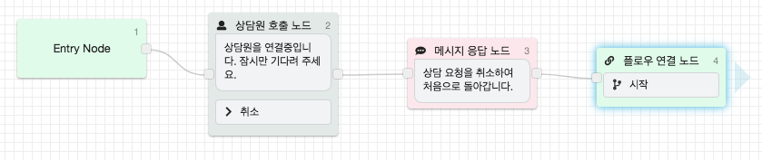
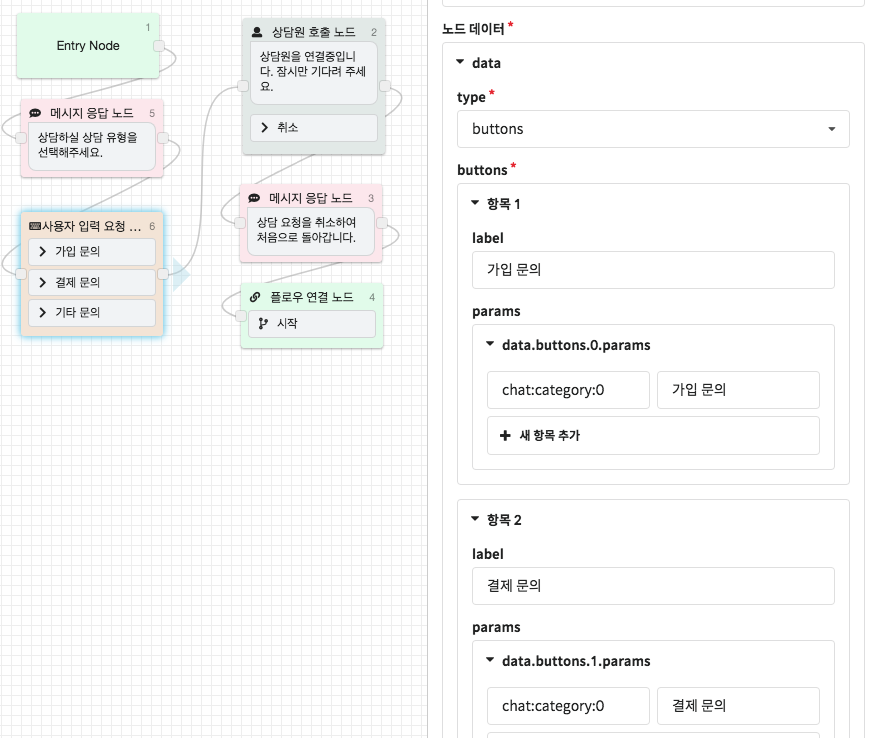

# Step 2. 챗봇에 상담원 호출 추가하기

## 상담원 호출\(기본\)

* 상담원 호출 플로우에 진입하면 바로 상담원을 호출하도록 위와 같이 간단하게 구성할 수 있습니다.
* **상담원 호출 노드의 뒤에는 사용자가 상담 요청을 취소했을 때 이동할 수 있도록 위와 같이 연결해줍니다.**

## 상담 주제 선택 후 상담원 호출

* 위와 같이 상담 주제를 선택 후 상담원을 호출하도록 구성할 수 있습니다.
* 이렇게 설정하면 고객이 어떤 상담을 주제로 상담하려는지 미리 알 수 있고 해당 분야를 전문적으로 상담할 수 있는 상담원에게 배정할 수도 있습니다. 
* 파라미터의 chat:category:0은 Chat에서 대분류를 의미합니다. 자세한 내용은 [**전문 상담원 설정**](../../chat/undefined-1/undefined.md#undefined-14)을 참고하세요.

## 상담 운영시간과 상담 가능한 상담원 확인 후 상담원 호출

* 상담원을 호출하기 전에 미리 상담 운영시간을 설정하여 상담원 호출이 아닌 아예 다른 플로우로 동작하게 할 수 있습니다.
* 이 기능이 필요하시다면 support@closer.ai로 문의해주세요.

