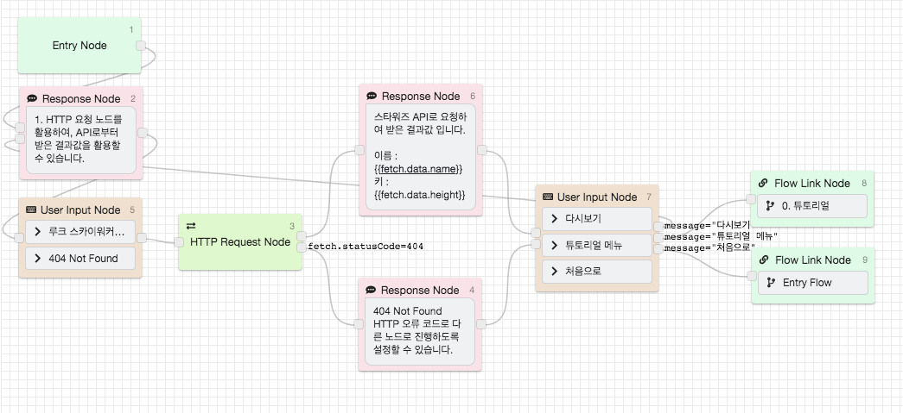
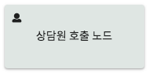

# Step 1. 챗봇 시나리오 구상

CLOSER에서는 여러 상황에 맞는 챗봇을 만들기 위해 다양한 기능을 제공하여, 챗봇을 만들기 전에 어떤 챗봇을 만들지 구상한다면 더 효과적인 챗봇을 만들 수 있습니다.

## 어떤 챗봇을 만들까?

### 챗봇 만들기 체크리스트

* [ ] 자주묻는 질문과 답변을 제공하는 챗봇
* [ ] 상품을 이미지와 함께 소개하는 챗봇
* [ ] 주문/배송 조회 등의 기존 서비스의 기능을 제공하는 챗봇
* [ ] 교환/반품 신청, 고객 문의 등을 제공하는 챗봇
* [ ] 방문/상품 등을 예약하는 기능을 제공하는 챗봇
* [ ] 사용자가 입력한 의도를 분석하여 그에 맞는 답변을 제공하는 챗봇
* [ ] 채팅 상담을 제공하는 챗봇

### 챗봇의 깊이\(Depth\)

시작 메뉴를 깊이 0으로 보고, 메뉴를 한번 선택하여 진입했을 때의 깊이를 1로 설정합니다.

깊이가 너무 깊으면 사용성에 어려움이 있을 수 있고, 너무 낮으면 많은 정보를 제공하기 어려울 수 있습니다.  
적절한 깊이로 챗봇을 설계하여 봇 에디터로 챗봇을 만들어 보세요.

### 어떤 메신저에서 챗봇을 서비스할것인가?

Builder &gt; 메신저 연동하기 &gt; 메신저별 특징을 참고해주세요.

채팅상담이 불가능한 메신저가 있고, 사용자 입력 버튼의 갯수와 글자 길이가 제한되는 등의 조건이 있는 메신저가 있습니다.  
사용자 입력 버튼의 글자 길이가 제한되는 메신저에서 제한 길이를 넘어가는 경우에 사용자가 버튼을 눌렀을 때 챗봇이 버튼 입력을 인식하지 못할 수도 있습니다.

### 체크리스트를 참고하여 챗봇 구상하기

위에서 체크리스트를 확인하셨다면, 어떤 내용을 언제 사용자에게 제공할지 엑셀 등을 활용하여 구상해놓으시면 봇 에디터로 챗봇을 만드실 때 도움이 될 수 있습니다. 물론 바로 봇 에디터로 작업하셔도 됩니다.

아래 CLOSER Builder에서 자주 사용하는 기능을 참고하셔서 구상하신 챗봇을 어떤 기능을 활용하여 만드실 지 준비해보세요.

## CLOSER Builder에서 자주 사용하는 기능

### 질문과 답변

메시지 응답 노드와 사용자 입력 요청 노드를 연결하면 챗봇 사용자에게 텍스트나 이미지 등을 노출하고 적절한 응답을 받을 수 있도록 할 수 있습니다. 질문과 답변은 이 노드의 연결을 반복하여 간단하게 구현할 수 있습니다.

메뉴 선택 / 자주 묻는 질문 / 상품 소개 등 고객에 정보를 전달하고 버튼을 누르거나 텍스트를 입력받는 흐름을 구성합니다.

### 기존 API 활용하기

HTTP 요청 노드를 사용하여 GET / POST / PUT / DELETE의 요청을 전송하고, 결과를 반환하여 챗봇에서 활용할 수 있습니다.   
배송 조회 / 주문 조회 / 날씨 API 연동 / 번역 API 연동 등 기존 서비스에서 사용하는 API나 오픈 API를 연동하여 챗봇의 기능을 더욱 풍부하게 구성할 수 있습니다.

### 사용자에게 입력받은 내용을 전달받기

#### 구글 스프레드시트에 저장하기

사용자가 입력한 내용을 구글 스프레드시트 노드를 활용하여 구글 스프레드시트 노드에 저장할 수 있습니다.  
사용자의 의견 / 문의 등 사용자의 입력을 받아 구글 스프레드시트에 모아볼 수 있습니다.

#### 이메일로 전달받기

사용자가 입력한 내용이나 미리 지정한 내용을 이메일로 전달받을 수 있습니다.  
문의 등을 챗봇을 통해 이메일로 전달받고 이메일에서 바로 답장할 수 있도록 구성할 수 있습니다.

#### 카카오 알림톡으로 전달받기

* 카카오 알림톡으로 전달받을 수 있습니다.
* 카카오 알림톡은 유료기능으로 전송 건당 비용이 발생합니다.
* 유료기능은 카드 등록 후 사용하실 수 있습니다.
* 카카오 알림톡은 문자 메시지와 같이 자유로운 형식으로 보낼 수 없어, '카카오 알림톡 템플릿 등록'이 선행되어야합니다.
* 알림톡 템플릿 등록이 필요하시다면 support@closer.ai로 요청해주세요.

### 자연어 입력 받기

자연어 처리 노드를 활용하여 사용자에게 입력 받은 문장을 분석하여 의도에 맞는 답변을 제공할 수도 있습니다.

### 상담원과 상담 채팅 진행

CLOSER Chat을 활용하면 챗봇을 활용한 채팅 상담을 쉽게 구현할 수 있습니다. 상담원 호출 노드에서 사용자가 상담원을 호출하여 채팅 상담을 진행할 수 있습니다.  
CLOSER로 채팅 상담 서비스하기를 참고해주세요.

