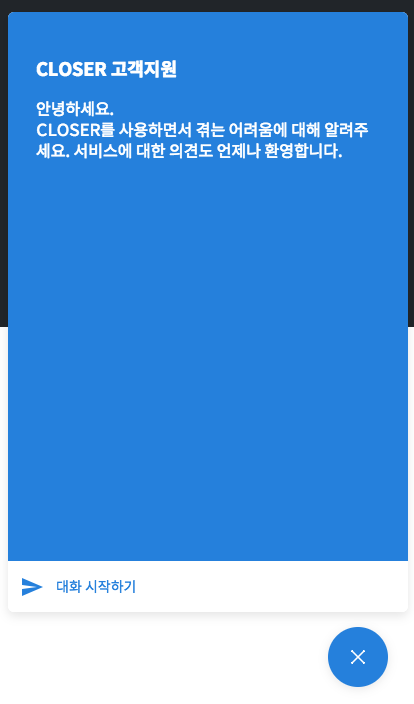

# 개요

CLOSER는 쉽고 빠르게 챗봇을 만들어 고객응대를 자동화하고, 상담원이 보완해 완성도를 높일 수 있는 편리하고 효율적인 채팅상담 솔루션 입니다.

## Builder

빌더를 활용해 쉽고 빠르게 봇을 만들 수 있습니다.

## Chat

챗봇과 고객의 대화를 모니터링 하다가 언제든 참여해 답변의 완성도를 높일 수 있습니다.

## Platform

CLOSER를 사용하는데 필요한 공통 설정을 할 수 있습니다.

## 고객지원

* Platform과 Builder에서 우측 하단의 아이콘을 클릭하시면 **CLOSER 고객지원 챗봇**을 통해 문의하실 수 있습니다.
* support@closer.ai 로 문의사항을 남겨주시면 영업일 기준 2일 내에 답변드리도록 하겠습니다.

