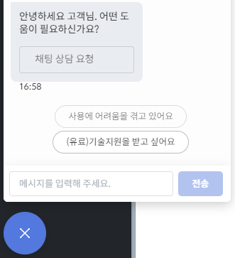
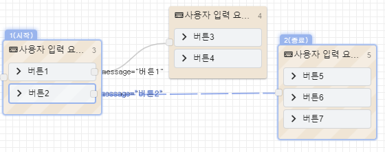
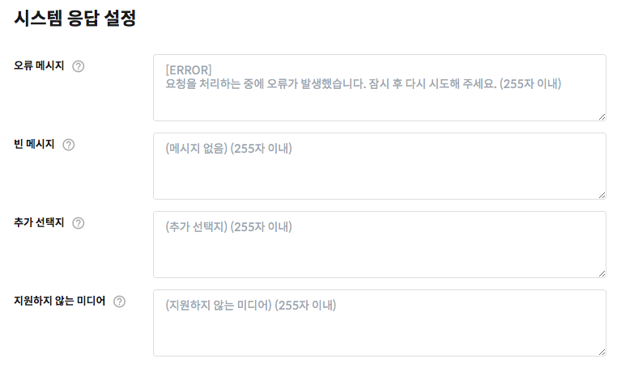

# 자주묻는 질문

## 챗봇 제작 

### Q. 챗봇 제작을 의뢰할 수 있나요?

시나리오 구현에 어려움을 겪고 계신가요? 유료 기술지원 상품을 이용하시면 전문가가 챗봇 플로우를 직접 제작해 드립니다. 비용은 개발 난이도에 따라 책정됩니다. 빌더 좌측하단 채팅창에서 ‘\(유료\) 기술지원’ 항목을 선택해 상담원에게 문의해 보세요. 

### Q. 메신저에 연동하니 테스트할때와 다르게 메시지가 잘려서 나와요

각각의 메시징 채널은 서로 다른 정책과 제약사항이 적용되기 때문에 글자수나 카드, 버튼, 메시지 버블 수, 이미지 크기와 비율 등이 다르게 전송될 수 있습니다. [메신저별 제약사항](builder/messenger-integrations/limitations.md)을 확인해 보세요

### 

### Q. 챗봇에서 계속 \(메시지 없음\) 또는 \(Empty Message\) 응답만 나와요

카카오톡과 같은 일부 메시징 채널에서는 사용자 입력에 대해 **답변을 필수로 반환**하여야 하고, 그렇지 않으면 오류로 처리됩니다. 때문에 CLOSER 챗봇에서는 답변이 존재하지 않을 경우 **빈 메시지\(메시지 없음\)** 응답을 생성하여 반환합니다.

1\) 1개 이상의 메시지 응답 노드를 이용해 답변을 생성하지 않고 사용자 입력 요청노드에 진입한 경우 반환할 답변이 없어 빈 메시지가 반환 됩니다.

2\) 만약 시나리오에 답변을 작성하셨음에도 불구하고 빈 메시지만 나오는 상황이 반복된다면 작성하신 [폴백 플로우](builder/chatbot/flow.md#fallback-flow)를 확인해주세요.

폴백 플로우가 위와 유사하게\(진행할 노드가 없는 형태\) 구성되어 있다면, 챗봇은 "처음" 또는 "취소" 응답을 제외하고는 제대로 된 답변을 생성할 수 없게 됩니다. 챗봇은 진행할 노드를 찾을 수 없기 때문에 다시 폴백 플로우로 돌아오게 되며, 사용자가 어떠한 입력을 해도 동일한 빈 메시지 응답이 반복되게 됩니다.

이러한 경우에는 폴백 플로우를 아래와 같이 수정함으로써 문제를 해결할 수 있습니다.


빈 메시지는 [봇 설정 &gt; 시스템 응답 설정 메뉴](builder/manage/bot-settings.md#undefined-1)에서 변경하실 수 있습니다.


### Q. 오류 메시지를 수정할 수 있나요? 

오류 메시지는 시나리오가 잘못되었거나 노드에 필요한 데이터가 부족한 상태에서 실행될 때 발생합니다. 이 메시지 또한 [봇 정보 설정 &gt; 시스템 응답 설정](builder/manage/bot-settings.md#undefined-1) 메뉴에서 수정하실 수 있습니다.

### **Q. 사용자가 이미지를 보낸 경우 어떻게 확인하나요?** 

고객이 보낸 메시지가 **이미지**인 경우, 다음 조건을 만족합니다.

* `message.type === "media"`
* `message.media.contentType === "image"`

일반적으로 `message.media.contentType === "image"` 조건만 검사하면 `message.type === "media"`조건은 기본적으로 만족하기 때문에, message.media.contentType만 검사하셔도 충분합니다.

다음은 실제 적용 예시와 동작 예시입니다.

### **Q. 자연어를 이해하는 챗봇을 만들고 싶어요**  

원하시는 자연어 처리 도구가 REST API를 지원한다면, [HTTP 요청 노드](builder/chatbot/node/fetch.md)를 통해 CLOSER와 연동하실 수 있습니다. 자연어 처리 도구에서 제공하는 결과를 CLOSER에서 이용해 보세요[.](https://sini-company.slack.com/archives/C010AA83M7V/p1585912951001500)\*\*\*\*

이용 가능한 외부 자연어 처리 도구 몇 가지를 소개해드립니다.

* Google Dialogflow: [https://dialogflow.com/](https://dialogflow.com/)
* Watson Assistant: [https://www.ibm.com/watson/kr-ko/developercloud/conversation.html](https://www.ibm.com/watson/kr-ko/developercloud/conversation.html)
* Naver Cloud Platform Chatbot: [https://www.ncloud.com/product/aiService/chatbot](https://www.ncloud.com/product/aiService/chatbot)
* Google Natural Language API: [https://cloud.google.com/natural-language/](https://cloud.google.com/natural-language/docs/basics?hl=ko)
* Amazon Comprehend: [https://aws.amazon.com/ko/comprehend/](https://aws.amazon.com/ko/comprehend/)

\*\*\*\*

### **Q. 외국어 챗봇도 지원하나요?**  

챗봇의 시나리오는 봇 빌더상에서 어떤 언어로도 구성할 수 있습니다. 해당 외국어를 챗봇이 얼마나 잘 이해할 수 있는지는 설계한 시나리오 및 사용하시는 자연어처리 엔진에 달려 있습니다. 

챗봇과는 별개로, CLOSER Builder 와 Chat 서비스는 현재 한국어와 영어를 지원합니다. 

### Q. DATE\(\) 템플릿 함수를 사용할 때 현재 시간과 다른 시간이 출력돼요. 

CLOSER의 구동 환경에서는 기본적으로 **GMT\(UTC+0\) timezone**이 사용됩니다. 따라서 Date 함수를 이용할 때 timezone을 입력하지 않을 경우 시간이 의도한대로 출력되지 않는 경우가 존재합니다. 

이러한 경우 다음과 같이 DATE 함수에 `"Asia/Seoul"` \(timezone\) 값을 입력해보세요.

> `{{DATE(params.value, "YYYY년 MM월 DD일 HH시 mm분", "Asia/Seoul")}}`

[**DATE 함수 이용방법**](builder/chatbot/advanced/template-syntax/#date-value-format-timezone)을 잘 확인해보시면 위와 같이 출력 형태도 변경하는 것이 가능합니다.

### Q. HTTP 요청 노드에서 Cannot use private IP address for request url 오류가 발생해요. 

HTTP 요청 노드에서는 등록된 도메인\(예: http://closer.ai\) 또는 공인 IP 주소로만 요청을 보낼 수 있습니다.

공인 IP란 인터넷에 공개되어 접근 가능한된 IP 주소이며, 사설 IP란 고객님의 네트워크에서만 접근 가능한 주소입니다. 예를 들어, `192.168.0.1`, `172.30.255.255`등의 IP 주소는 외부에서 접근할 수 없는 사설 IP 주소에 해당합니다. 

만일 고객님의 IP 주소가 사설 주소에 해당한다면, 서버 호스팅 업체를 통해 작성하신 서버 어플리케이션을 업로드하시거나 로컬에서 인터넷에 서버를 올릴 수 있는 개발 도구들을 이용해 보세요.  


공인 IP와 사설 IP의 차이가 더 궁금하신가요? 다음 페이지를 확인해보세요.

* \(정보통신기술용어해설\) Private IP Address, Public IP Address  [http://ktword.co.kr/abbr\_view.php?m\_temp1=2260](http://ktword.co.kr/abbr_view.php?m_temp1=2260) 


### Q. PDF 파일은 첨부할 수 없나요?

네, 메시지 응답노드에는 이미지 파일만 첨부할 수 있습니다.  챗봇에서 다른 형식의 파일을 제공하려면 AWS S3등의 외부 서버에 파일을 업로드 한 뒤에 [링크 버튼](https://guide.closer.ai/builder/chatbot/node/response#link-button)으로 제공해 보하보세요.

## 카카오톡 오픈빌더 

### **Q. 챗봇이 제대로 동작하지 않아요!** 

오픈빌더 챗봇이 정상적으로 동작하지 않는 현상으로는 다음과 같은 원인들이 있습니다.

* 웰컴 블록/폴백 블록에 **스킬데이터 사용**으로 **CLOSER 스킬**이 설정되지 않은 경우
* 오픈빌더 챗봇에 **다른 스킬** 혹은 **다른 시나리오**가 연동되어 있는 경우
* 오픈빌더 챗봇 수정 후 **배포** 를 수행하지 않은 경우
* 오픈빌더 챗봇에 **카카오톡채널\(플러스친구\) 계정 연결**이 올바르지 않은 경우

저희가 제공해드리는 [연동 안내 문서](https://bit.ly/2w6h69h)를 차근차근 살펴보신 후, 위의 사항들에 해당하는 것은 없는지 다시 한 번 확인해보세요.

### **Q.  웰컴 메시지\(웰컴 블록\)가 나타나지 않아요!** 

카카오톡 오픈빌더 챗봇에서 환영메시지는 **카카오톡 계정/채널 프로필당 최초 1회만 동작합니다**. 이는 카카오톡에서 설정된 정책으로, 이미 챗봇과 대화를 시작한 이후에 웰컴 블록을 설정하신 경우 테스트가 어려운 점 양해 부탁드립니다.

> 웰컴블록은 플러스친구와 연계된 챗봇 상태에서, 외부 챗봇 사용자가 비친구 상태에서 '채팅’으로 플친챗봇에게 말을 걸거나, 또는 '친구추가’를 했을 경우에 단 한 번 출력되는 greeting 성격의 인사 말풍선으로 봐주시면 됩니다.
>
> 다시 말해, 플러스친구 추가를 했을때 웰컴블록이 딱 한 번 실행되고, 그 이상은 다시 친추를 하더라도 밖으로 웰컴 메시지가 출력되지 않습니다. 웰컴블록을 이미 받은 유저의 챗봇 대화 창에서는 새로 배포된 웰컴블록을 받을 수 없는 점을 확인 부탁드립니다.
>
> [https://i.kakao.com/forum/t/topic/574](https://i.kakao.com/forum/t/topic/574)

만약 웰컴 메시지 동작을 확인하고 싶으신 경우에는 다음과 같은 방법을 이용해 보세요:

* 다른 카카오톡 계정을 이용하여 대화 테스트
* 다른 카카오톡 채널에 챗봇을 연동하여 대화 테스트 

위와 같은 조건으로 재시도해도 웰컴 메시지가 동작하지 않는다면, **오픈빌더 웰컴 블록**에 **CLOSER 스킬응답 사용**이 설정되어있는지 확인해주세요. 

### **Q. 기존에 사용하던 오픈빌더 시나리오를 재사용할 수 있나요?**  

CLOSER를 원활히 사용하기 위해서는 오픈빌더 챗봇에서 발생하는 모든 대화를 CLOSER가 확인할 수 있도록 **폴백 블록과 웰컴 블록으로만** CLOSER 스킬 응답을 사용하도록 설정되어야 합니다. 그렇지 않은 경우 CLOSER 챗봇은 현재 진행중인 대화의 맥락을 파악하지 못하게 되어 부자연스러운 대화를 반환할 수 있습니다. 때문에 기존에 작성하신 오픈빌더 시나리오는 CLOSER에 다시 작성하여 이용하시는 것을 권장드립니다. 

그럼에도 불구하고 기존 시나리오를 병행하고 싶으신 경우에는 "특정 키워드"에 한해 동작하는 시나리오만 남겨두신 후, 상용화 전 충분한 테스트를 거친 후에 이용해보세요. 이에 대한 더 자세한 정보는 아래의 [Q. 다른 챗봇 솔루션 \(네이버 클라우드 플랫폼, Google DialogFlow 등\)에 CLOSER를 연동할 수 있나요? ](faq.md#q-google-dialogflow-closer) 에 대한 답변에서 확인하실 수 있습니다.

### Q. CLOSER Chat에서 "해당 메신저는 상담을 진행할 수 없습니다" 라고 나와요. 

카카오톡 오픈빌더를 통해 챗봇을 연동하신 경우, 상담을 진행하기 위해서는 카카오톡채널 관리자센터의 **1:1 채팅 기능**을 이용하셔야 합니다. 기능을 활성화하신 이후에는 관리자센터 웹페이지 혹은 모바일 어플리케이션을 통해서 고객과 상담을 진행하실 수 있습니다.

* 카카오톡채널 관리자센터: [https://center-pf.kakao.com/](https://center-pf.kakao.com/)
* 카카오톡채널 관리자용 모바일 어플리케이션: [안드로이드](https://play.google.com/store/apps/details?id=com.kakao.yellowid&hl=ko), [아이폰](https://apps.apple.com/kr/app/%EC%B9%B4%EC%B9%B4%EC%98%A4%ED%86%A1-%EC%B1%84%EB%84%90-%EA%B4%80%EB%A6%AC%EC%9E%90/id990571676)


CLOSER Chat을 통해 카카오톡 1:1 상담을 진행하고자 하는 경우에는 [카카오톡 상담톡](faq.md#kakao-bizmessage) 제품을 확인해주세요.


## 카카오톡 상담톡 

### Q. 상담톡이 무엇인가요? 

상담톡은 카카오톡에서 유료 기업 고객 대상으로 **고객센터를 구축할 수 있도록 제공하는 API** 상품입니다. 

기본적으로 **카카오톡채널 관리자센터의 1:1채팅 기능**을 이용하여 상담을 진행하실 수도 있지만, 카카오톡 홈페이지\(또는 전용 어플리케이션\) 에서만 상담을 진행할 수 있고 기능이 제한적이어서 규모있는 고객센터를 운영하기에는 적합하지 않습니다. 

상담톡 API를 활용한 전문 채팅상담 시스템을 활용하시면 제작하신 챗봇과 레거시 시스템과 연동하여 효율적인 채팅 고객센터 운영이 가능해 집니다.

더 자세한 정보는 [카카오톡 상담톡 페이지](builder/messenger-integrations/kakao.md#undefined) 또는 카카오톡 비즈메시지 홈페이지를 참고해주세요.

* [https://business.kakao.com/info/bizmessage/](https://business.kakao.com/info/bizmessage/)  

### Q. 상담톡 이용 요금이 어떻게 되나요? 

상담톡은 BUSINESS 요금제 이상에서 사용할 수 있으며, 일일 활성 채팅방당 100원의 비용이 발생합니다. \(과금 기준은 대부분의 딜러사가 동일합니다.\) 

일일 활성 채팅방 집계 기준은 다음과 같습니다.

* 매일 오전 04시부터 다음날 오전 03시 59분까지 \(한국 시간 기준\) 대화가 발생한 채팅방\(사용자\) 수

### Q. 상담톡을 연동했더니 카카오톡 관리자센터의 1:1 대화 기능이 사라졌어요. 

상담톡을 사용할 경우에는 더이상 관리자센터에서 제공하는 1:1채팅 기능을 이용할 수 없게 됩니다. 이를 원치 않으실 경우 상담톡 연동 해제를 요청해주세요. 

## 커스텀 채널 연동 

### Q. 웹페이지 연동 시 개발자 도구에서 오류\(경고 메시지\)가 표시돼요. 

1. 브라우저 개발자 도구를 열었을때 확인할 수 있는 노란색 오류 메시지는 [웹 접근성](https://seulbinim.github.io/WSA/accessibility.html) 또는 [웹 표준](https://developers.google.com/web/tools/chrome-devtools/accessibility/reference)에 위반되는 사항이 있을 경우 경고성 메시지로 발생합니다. 사용자 상호작용이 빈번한 웹 어플리케이션에서는 이러한 메시지가 자주 발생하지만, 최신 브라우저 환경에서는 크게 문제되지 않습니다. 
2. [Cookie](https://developer.mozilla.org/ko/docs/Web/HTTP/Cookies)는 [LocalStorage](https://developer.mozilla.org/ko/docs/Web/API/Web_Storage_API) \(웹 브라우저 기술\)을 지원하지 않는 IE10 이하 환경에서 세션 데이터 보관 등을 위해 [Polyfill](https://developer.mozilla.org/ko/docs/Glossary/Polyfill) 형태로 사용되고 있습니다. 여기에 모던 브라우저에서 추가된 최신 보안 정책\([SameSite](https://developer.mozilla.org/en-US/docs/Web/HTTP/Headers/Set-Cookie/SameSite) 등\)은 적용되어 있지 않아 해당 경고 메시지가 출력됩니다. 
3. 소스맵\([Source Map](https://developer.mozilla.org/en-US/docs/Tools/Debugger/How_to/Use_a_source_map)\)은 웹앱 배포 시 최적화되어 빌드한 파일과 원본 파일을 연결해주는 파일로, 개발 시 디버깅 목적으로 사용되는 파일입니다. 이 파일은 실제 배포본에서는 접근할 수 없기 때문에어 해당 경고 메시지가 발생합니다. 실제 어플리케이션 동작에는 영향을 미치지 않습니다.

### Q. 다른 챗봇 솔루션 \(네이버 클라우드 플랫폼, Google DialogFlow 등\)에 CLOSER를 연동할 수 있나요? 

다른 챗봇 솔루션과 CLOSER를 연동하는 방법은 다음 2가지 경우가 예상됩니다.

1. CLOSER에서 작성한의 특정 플로우만 외부 챗봇 솔루션에 연동하기
2. CLOSER에서 챗봇 시나리오를 작성하고, 자연어 처리는 외부 챗봇 솔루션을 이용하기

**1의 시나리오는 CLOSER를 통해 달성하기 어렵습니다.**  
  
CLOSER는 챗봇 시나리오 관리 도구입니다. 원활한 챗봇 시나리오 진행을 위해서는 **대화의 맥락을 CLOSER가 관리**할 수 있어야 합니다. 만약 대화의 맥락을 관리하는 주체가 CLOSER가 아닌 외부 서비스가 되어버리면 CLOSER에서 작성한 시나리오는 의도치 않은 답변을 반환할 가능성이 높습니다.  
  
**2의 시나리오는 챗봇 솔루션의 API 공개 여부에 따라 다릅니다.**  
  
이용하시는 챗봇 솔루션에서 **자연어 분석 또는 답변 생성 API** 가 제공된다면 CLOSER의 [HTTP 요청 노드](builder/chatbot/node/fetch.md) 또는 [사용자 정의 스크립트 노드](builder/chatbot/node/sandbox.md)를 통해 자연어를 처리하는 시나리오를 작성하실 수 있습니다. 

### Q. 모바일 애플리케이션에 연동 가능한가요? \(커스텀 채널 연동\) 

CLOSER 챗봇 연동은 다음 두 가지 방법을 통해 가능합니다.

1. Javascript SDK를 이용하는 방식
2. REST API를 통해 WebSocket 통신을 직접 구현하는 방식

CLOSER SDK는 현재 javascript 형식으로만 제공되고 있습니다. 따라서 모바일 어플리케이션에서 CLOSER SDK를 이용하시기 위해서는 각각의 플랫폼에서 Javascript Bridge Interface \(e.g. Webview 등\)을 이용하여 javascript SDK와 통신하여야 합니다.

CLOSER 채팅 연동은 기본적으로 WebSocket 으로 구현되어 있고, Javascript SDK는 간편한 사용을 위한 래퍼 라이브러리에 불과합니다. 따라서 Javascript 사용이 어려운 경우 WebSocket 주소 및 인증 토큰 발급 API를 통해 직접 통신 채널을 열고 메시지를 주고받을 수 있습니다. \(이 때 WebSocket 통신에 필요한 스키마는 별도로 제공해드립니다.\)


CLOSER SDK는 엔터프라이즈 고객 대상으로 제공됩니다.  
문의사항이 있으실 경우 [support@closer.ai](mailto:support@closer.ai) 로 메일 보내의주세요.


### Q. 상담원용 앱은 없나요? 폰으로 푸시 알림을 받을 방법은 없나요? 

현재 상담원용 모바일 앱은 없습니다. 대신, [HTTP 요청 노드](builder/chatbot/node/fetch.md)를 이용하여 외부 푸시 메시징 서비스 API \(SMS 또는, 슬랙 알람 등\)을 연동하는 방법으로 알림을 구현하실 수 있습니다.

## 요금 정책 

### Q. 무료 사용량을 넘기면 어떻게 되나요? \(유료 요금제에서 광고 제거 옵션이 무엇인가요?\) 

무료 사용량이 넘어갈 경우에도 챗봇이 중지되지는 않습니다. 대신 메시지 하단에 브랜드 홍보 문구\(powered by closer.ai\)가 포함되어 전송됩니다. 무료 사용량 이하에서는 브랜드 홍보 문구가 표시되지 않습니다.

### Q. 무료 사용량은 언제 초기화 되나요?

이용량은 월 단위로 누적되며 매월 1일에 초기화 됩니다

### Q. **요금 정책에서 사용자 수의 기준이 무엇인가요?** 

사용자 수는 **1달 동안 챗봇과 1회 이상 메시지를 주고받은 고유한 사용자 수**를 나타냅니다. 예를 들어 A라는 사용자가 1주일간 챗봇을 이용하여도 사용자 수는 1이고, B라는 사용자가 나타나 새로 챗봇을 사용한 경우 사용자 수는 2가 됩니다.

### Q. Chat 에서 상담계정 추가는 무엇인가요? 

챗봇의 대화를 모니터링 하거나 직접 대화에 참여할 수 있는 실시간 채팅상담 서비스인 CLOSER Chat은 상담계정을 추가하지 않아도 **본인 계정에 한하여 무료**로 이용이 가능합니다. 이용자 수가 늘어나 **여러명의 상담원이 필요한 경우**, **상담계정을 추가로 초대**할 수 있습니다. 

## 기타 

### **Q. 데이터를 우리 서버에 쌓을 수 있나요?**  

네. CLOSER는 Webhook으로 봇/사용자/상담원의 메시지와 이벤트를 전달하기 때문에, 목적에 맞는 API를 개발해 연동하시면 원하시는 데이터베이스를 구축해 분석하시거나 통계 대쉬보드를 만드실 수 있습니다.

더 자세한 사항은 다음 페이지를 참고해주세요.



