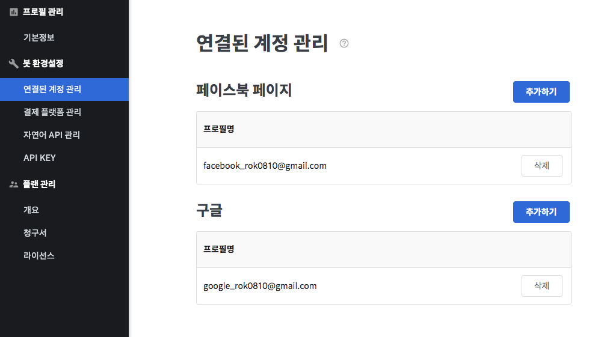

# 연결된 계정 관리

> [https://app.closer.ai/app/settings/external](https://app.closer.ai/app/settings/external)

연결 계정 관리 메뉴에서는 외부 서비스 연동 시 이용할 계정들을 관리할 수 있습니다.  
현재 각 서비스별 이용 용도는 다음과 같습니다.

* **페이스북** : [페이스북 페이지 연동](../../builder/chatbot/advanced/messenger-integrations/)
* **구글**: ****[구글 스프레드시트 노드](../../builder/chatbot/node/gsheet.md) 

