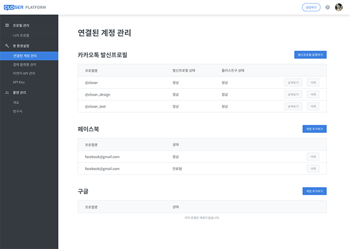

# 연결된 계정 관리

CLOSER 프로필에 연결된 계정을 관리하는 페이지 입니다.  
카카오톡 발신프로필, 페이스북, 구글의 계정을 CLOSER에 연결하여 관리합니다.

## 카카오톡 발신프로필 {#kakao-sender-profile}


**카카오톡의 알림톡, 상담톡을 사용하려면 카카오톡 발신프로필을 등록해야 합니다.**


* 발신프로필 등록하기를 통해 카카오톡 발신프로필 계정을 만들고 등록할 수 있습니다. 이미 발신프로필이 있을 경우 기존 발신프로필을 등록할 수 있습니다.
* 등록되어있는 프로필 목록을 볼 수 있습니다.


카카오톡 발신프로필 등록은 카카오 상담톡 벤더 업체인 \(주\)씨엔티테크와 제휴하여 제공하고 있습니다.  
다른 곳에서 이미 발신프로필을 설정하신 경우 support@closer.ai로 문의해주세요.


## 페이스북 {#facebook}

* CLOSER 프로필을 페이스북 페이지에 연결할 때 필요한 기능입니다.
* 페이스북 계정을 두 개 이상 연동하시려면 하나를 등록하신 후 페이스북에서 로그아웃 하시고 다른 계정으로 로그인하면 여러 계정을 연동할 수 있습니다.

## 구글 {#google}

* 챗봇에 구글 시트를 연동하려면 필요한 기능힙니다.
* 추가하기를 눌러 구글 계정과 연동하면 챗봇에 구글 시트를 연결할 수 있습니다.

